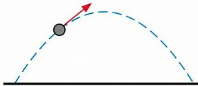
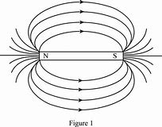

= eco 2020-5-2
:toc:

---

== Not quite all there

(eco 2020-5-2 / Briefing / The post-covid economy: Not quite all there )

The 90% economy that lockdowns *will leave behind*

It *will not just be* smaller, it *will feel strange*

Apr 30th 2020 |

IN THE 1970s Masahiro Mori, a professor at the Tokyo Institute of Technology, *observed that* there was something disturbing(a.) about robots which *looked* almost, but not quite, *like* people. Representations in this “uncanny(a.) valley” *are* `表` close enough to lifelike(a.) *for* `主` their shortfalls(n.) and divergences(n.) from the familiar `谓` *to be* particularly disconcerting(a.). Today’s Chinese economy *is exploring* a similarly unnerving(a.) new terrain. And the rest of the world *is following in* its uncertain steps.

Whatever the drawbacks of these new lowlands, they *are assuredly preferable to* the abyss of lockdown. `主` Measures *taken to reverse* the trajectory of the pandemic around the world `谓` *have brought with them* remarkable economic losses.

Not all sectors of the economy *have done terribly*. New subscriptions to Netflix *increased* at twice(ad.) their usual rate in the first quarter of 2020, with most of that growth *coming* in March. In America, the sudden stop of revenue from Uber’s ride-sharing service in March and April *has been partially cushioned* by the 25% increase of sales from its food-delivery unit, according to 7Park Data, a data provider.

Yet the general pattern *is* grim. Data from Womply, a firm which *processes transactions*(n.) on behalf of 450,000 small businesses across America, *show that* businesses in all sectors *have lost* substantial revenue. Restaurants, bars and recreational businesses *have been badly hit*: revenues *have declined* some two-thirds since March 15th. Travel and tourism *may suffer* the worst losses. In the EU, where tourism *accounts for* some 4% of GDP, the number of people travelling by plane *fell* from 5m to 50,000; on April 19th less than 5% of hotel rooms in Italy and Spain *were occupied*.

*According to* calculations *made* on behalf of The Economist by Now-Casting Economics, a research firm that *provides* high-frequency economic forecasts to institutional investors, the world economy *shrank* by 1.3% year-on-year in the first quarter of 2020, *driven by* a 6.8% year-on-year decline in China’s GDP. The Federal Reserve Bank of New York *draws on* measures such as jobless claims *to produce* a weekly index of American economic output. It *suggests that* the country’s GDP *is currently running* about 12% lower *than* it was a year ago (see chart 1).

These figures *fit with* attempts by Goldman Sachs, a bank, *to estimate* the relationship *between* the severity of lockdowns *and* their effect on output. It *finds, roughly, that* an Italian-style lockdown *is associated with* a GDP decline of 25%. Measures *to control* the virus while either *keeping* the economy *running reasonably smoothly*, as in South Korea, or *reopening* it, as in China, *are associated with* a GDP reduction in the region of 10%. That *chimes with* data which *suggest that* if Americans *chose to avoid* person-to-person proximity of the length of an arm or less, `主` occupations *worth approximately* 10% of national output `谓` *would become* unviable.

The “90% economy” (thus *created*) *will be*, by definition, *smaller than* that which came before. But its strangeness *will be* more than a matter of size. There *will undoubtedly be* relief, fellow feeling, and *newly felt or expressed* esteem(n.) *for* those who *have worked* to keep people safe. But there *will also be* residual(a.) fear, pervasive uncertainty, a lack of innovative fervour(n.) and deepened inequalities. The fraction of life that is missing *will colour*(v.) people’s experience and behaviour in ways that *will not be offset*(v.) by the happy fact that `主` most of what matters `系` *is* still available and *ticking over*. In a world where the office is open *but* the pub is not, `主` qualitative(a.) differences(n.) in the way (life feels) `系` *will be* [at least] as significant as the drop in output.

The plight of the pub *demonstrates that* the 90% economy *will not be* something *that can be fixed by fiat*. `主` *Allowing* pubs -- and other places of social pleasure -- *to open* `谓` *counts for(v.) little* if people *do not want to visit* them. Many people *will have to leave the home* in order to work, but they *may well feel less comfortable doing so* to have a good time. A poll by YouGov *on behalf of* The Economist *finds that* {over a third of Americans *think* it *will be* “several months” before it will be safe to reopen businesses as normal} -- *which suggests that* if businesses *do reopen* some, at least, may *stay away*.

Ain’t nothing but tired

`主` Some indication (that the spending effects(n.) of a lockdown *will persist* even after it is over) `谓` *comes* from Sweden. Research by Niels Johannesen of Copenhagen University and colleagues *finds that* aggregate-spending patterns in Sweden and Denmark over the past months *look similarly reduced*, even though Denmark *has had* a pretty strict lockdown while official Swedish provisions *have been exceptionally relaxed*. This *suggests that* personal choice, *rather than* government policy, *is* the biggest factor behind the drop. And personal choices *may be* harder to reverse.

Discretionary(a.) spending(n.) by Chinese consumers -- the sort (that *goes on* things economists *do not see as* essentials) -- *is* 40% off its level a year ago. Haidilao, a hotpot chain, *is seeing* a bit more than three parties(n.) per table per day -- an improvement, but still lower than the 4.8 registered last year, according to a report by Goldman Sachs published in mid-April. Breweries *are selling* 40% less beer. STR, a data-analytics firm, *finds that* just one-third of hotel beds in China *were occupied* during the week ending April 19th. Flights *remain* far from full (see chart 2).

This less social world *is not* necessarily bad news for every company. UBS, a bank, *reports that* a growing number of people in China *say that* the virus *has increased* their desire *to buy* a car -- presumably *in order to avoid* the risk of infection on public transport. The number of passengers on Chinese underground trains *is* still about a third below last year’s level; surface traffic congestion *is* as bad now as it was then.

*Wanting* a car, though, *will not mean* being able to *afford* one. Drops in discretionary(a.) spending *are not entirely driven* by a residual(a.) desire for isolation. They also *reflect the fact that* some people *have* a lot less money in the post-lockdown world. Not `主` all those who *have lost jobs* `谓` *will quickly find* new ones, *not least because* there *is* little demand for labour-intensive services such as leisure(n.) and hospitality(n.). Even those in jobs *will not feel* secure, the Chinese experience *suggests*. Since late March `主` the share of people (*worried about* salary cuts) `谓` *has risen slightly*, to 44%, *making it* 双宾 their biggest concern for 2020, according to Morgan Stanley, a bank. Many *are now recouping* the loss of income that they *suffered* during the most acute phase of the crisis, or *paying down* debt. All this *points to* high saving rates in the future, *reinforcing* low consumption.

A 90% economy *is*, on one level, an astonishing achievement. *Had* the pandemic *struck* even two decades ago, only a tiny minority of people *would have been able to work* or *satisfy* their needs. *Watching* a performance of Beethoven on a computer, or *eating* a meal from a favourite restaurant at home, *is not the same as* the real thing -- but it is not bad. The lifting of the most stringent lockdowns *will also provide* respite(n.), both emotionally and physically, since the mere experience of *being told* what you can and cannot do *is* unpleasant. Yet [in three main ways] a 90% economy *is* a big step *down from* what came before the pandemic. It *will be* more fragile; it *will be* less innovative; and it *will be* more unfair.

*Take* fragility *first*. The return to a semblance of normality *could be* fleeting(a.). Areas which *had apparently controlled* the spread of the virus, *including* Singapore and northern Japan, *have imposed or reimposed* tough restrictions *in response to* a rise in the growth rate of new infections. If countries which *retain* relatively tough social-distancing rules *do better at* staving(v.) off a viral comeback, other countries *may feel* a need to follow them (see Chaguan). With rules in flux(n.), it *will feel* hard *to plan* weeks ahead, *let alone* months.

*Can’t start* a fire

The behaviour of the economy *will be* far less predictable. No one *really knows* `主` for how long firms *facing* zero revenues, or households who *are working* reduced hours or not at all, `谓` *will be able to survive financially*. Businesses *can keep going temporarily*, either *by burning cash* or *by tapping(v.) grants*(n.) and credit lines(n.) *set up by* government -- but these *are unlimited*(a.) neither in size nor duration. What is more, a merely illiquid(a.) firm *can quickly become* a truly insolvent(a.) one 因为 as its earnings *stagnate*(v.) while its debt commitments(n.) *expand*. `主` A rise in corporate(a.) and personal bankruptcies, long after the apparently acute phase of the pandemic, `系` *seems likely*, though governments *are trying to forestall* them. [In the past fortnight] bankruptcies in China *started to rise* relative to last year. On April 28th HSBC, one of the world’s largest banks, *reported* worse-than-expected results, in part because of higher credit losses.

Furthermore, the pandemic *has upended* norms and conventions about how economic agents *behave*. In Britain `主` the share of commercial tenants(n.) who *paid* their rent on time `谓` *fell* from 90% to 60% in the first quarter of this year. A growing number of American renters *are no longer paying* their landlords. Other creditors *are being put off*, too. In America, close to 40% of business-to-business payments from firms in the spectator-sports and film industries *were* late in March, *double* the rate a year ago. Enforcing contracts *has become* more difficult 表原因 with many courts *closed* and social interactions at a standstill. This is perhaps the most insidious(a.) means(n.) by which weak sectors of the economy *will infect* otherwise moderately healthy ones.

In an environment of uncertain property rights and unknowable income streams(n.), potential investment projects *are not just* risky(a.) -- they *are* impossible *to price*(v.). A recent paper by Scott Baker of Northwestern University and colleagues *suggests that* economic uncertainty *is* at an all-time high. That *may go [some way] to explaining* the results of a weekly survey from Moody’s Analytics, a research firm, which *finds that* businesses’ investment intentions *are substantially lower* even than during the financial crisis of 2007-09. An index which *measures* American nonresidential(a.) construction activity (9-12 months ahead) *has also hit* new lows.

The collapse in investment *points to* the second trait of the 90% economy: that it *will be* less innovative. The development of liberal capitalism over the past three centuries *went hand in hand with* a growth in the number of people *exchanging ideas* in public or quasi-public spaces. Access to the coffeehouse, the salon or the street protest *was* always a partial process, *favouring* some people *over* others. But a vibrant(a.) public sphere *fosters* creativity.

Innovation *is not impossible* in a world with less social contact. There *is* more than one company *founded* in a garage *now worth* $1trn. During lockdowns, companies *have had to innovate quickly* -- just *look at* how many firms *have turned their hand* to making ventilators, if *with* mixed success 成败参半. A handful(n.) of firms *claim that* working from home *is* [so] productive [that] their offices *will stay closed [for good]*.

Yet these productivity bonuses(n.) *look likely to be heavily outweighed*(v.) by drawbacks. Studies *suggest* the benefits of working from home *only materialise* if employees *can frequently check in* at an office in order to solve problems. *Planning* new projects *is* especially difficult. Anyone who *has tried to bounce(v.) ideas around* on Zoom or Skype *knows that* spontaneity(n.) is hard. People *are often using* bad equipment with poor connections. Nick Bloom of Stanford University, one of the few economists *to have studied* working from home *closely*, *reckons that* there *will be* a sharp decline in patent applications in 2021.

Cities *have proven particularly* fertile(a.) ground for innovations which *drive* long-run growth. If Geoffrey West, a physicist who *studies* complex systems, *is* right *to suggest that* doubling(v.) a city’s population *leads to* all concerned(a.) *becoming* on aggregate 15% richer, *then* the emptying-out of urban areas *is* bad news. MoveBuddha, a relocation website, *says that* searches for places(n.) in New York City’s suburbs *are up* almost 250% *compared with* this time last year. A paper from New York University *suggests that* richer, and thus presumably more educated, New Yorkers -- people (*from whom* a disproportionate(a.) share of ideas *may flow*) -- *are particularly likely to have left* during the epidemic.

Something *happening somewhere*

Wherever or however people *end up working*, the experience of living in a pandemic *is not conducive(a.) to* creative thought. How many people *entered* lockdown *with* a determination *to immerse themselves in* Proust or George Eliot, only *to find* themselves *slumped* in front of “Tiger King”? When mental capacity *is taken up* by worries about whether or not *to touch* that door handle or whether or not *to believe* the results of the latest study on the virus, focusing *is* difficult. Women *are more likely to take care of* home-schooling and entertainment of bored children (see article), *meaning* their careers *suffer* more than men’s. Already, research by Tatyana Deryugina, Olga Shurchkov and Jenna Stearns, three economists, *finds that* the productivity of female economists, as *measured by* production of research papers, *has fallen* relative to male ones since the pandemic *began*.

The growing gender divide(n.) in productivity *points to* the final big problem with the 90% economy: that *it is unfair*. Liberally regulated economies (*operating* at full capacity) *tend to have* unemployment rates of 4-5%, *in part because* there *will always be* people temporarily unemployed 当...时 as they *move* from one job to another. The new normal *will have* higher joblessness. This *is not just because* GDP will be lower; the decline in output *will be particularly concentrated in* labour-intensive industries *such as* leisure and hospitality, *reducing* employment *disproportionately*. America’s current unemployment rate, real-time data *suggest*, *is* between 15-20%.

The lost jobs *tended to pay badly*, and *were more likely to be performed* by the young, women and immigrants. Research by Abi Adams-Prassl of Oxford University and colleagues *finds that* an American who *normally earns* less than $20,000 a year *is* twice [*as*] likely to have lost their job [*due to* the pandemic] *[as]* one (*earning* $80,000-plus). Many of those unlucky people *do not have* the skills, nor the technology, that *would enable them* to work from home or *to retrain* for other jobs.

*The longer* the 90% economy endures(v.), *the more* such inequalities will deepen(v.). People who *already enjoy* strong professional networks -- largely, those of middle age and higher -- *may actually quite enjoy* the experience of working from home. *Notwithstanding*(prep.) the problems of bad internet and irritating children, it *may be* quite pleasant *to chair* fewer meetings or performance reviews. Junior folk, even if they make it into an office, *will miss out on* the expertise(n.) and guidance of their seniors. Others with poor professional networks, such as the young or recently arrived immigrants, *may find* it difficult or impossible *to strengthen* them, *hindering* upward mobility, *points out* Tyler Cowen of George Mason University.

The world economy (that *went into retreat*(n.) in March 当...时 as covid-19 *threatened* lives) *was* one that *looked sound(a.) and strong*. And the biomedical community *is currently working overtime to produce* a vaccine that *will allow* the world *to be restored to* its full capacity. But estimates *suggest that* this *will take* at least another 12 months -- and, as with the prospects of the global economy, that figure *is* highly uncertain. If the adage that it *takes* two months *to form* a habit holds, the economy (that *re-emerges*) *will be* fundamentally different.

---

== Not quite all there 词汇解说

1. Not quite all there 不完全是这样

1. *leave sb/sth behind* : (1) [ usually passive ] to make much better progress than sb 比…取得好得多的进展；把…抛在后面；超过 /(2) to leave a person, place or state permanently 永久离开（某人、某地或某国） +
-> Britain *is being left behind* in the race for new markets. 英国在开拓新市场方面正被甩在后面。 +
-> She knew that *she had left childhood behind*. 她知道童年已一去不复返了。 +
-> The 90% economy that lockdowns *will leave behind*.

1. disturbing : a.making you feel anxious and upset or shocked 引起烦恼的；令人不安的；引起恐慌的 +
-> there *was* something disturbing about robots which *looked almost, but not quite, like* people. 机器人有一些令人不安的地方，它们看起来几乎和人一样，但又不完全像。(恐怖谷)

1. quite : ( BrE ) to the greatest possible degree 完全；十分；非常；彻底 +
-> quite delicious/amazing/empty/perfect 非常鲜美╱惊人╱空╱出众

1. uncanny :  /ʌnˈkæni/a. strange and difficult to explain 异常的；难以解释的 +
SYN weird +
=> un-,不，非，can,能够，知道。即不知道的，异常的。比较 canny. +
-> *I had an uncanny feeling* I was being watched. 我有种被人监视的奇怪感觉。 +

1. lifelike : a. exactly like a real person or thing 逼真的；生动的；栩栩如生的 +
SYN realistic +
-> *a lifelike statue/drawing/toy* 栩栩如生的雕塑╱绘画；逼真的玩具

1. divergence :  /daɪˈvɜːrdʒəns/  N-VAR A divergence is a difference between two or more things, attitudes, or opinions. 分歧; 差异 +
=> di-, 分开，散开，来自dis-变体。-verge, 转，词源同converge, versus. 即转开，分叉。 +
->  *There's a substantial divergence of opinion* within the party. 党内意见严重分歧。

1. disconcerting : a. ADJ If you say that something is disconcerting, you mean that it makes you feel anxious, confused, or embarrassed. 令人不安的; 令人困惑的; 令人尴尬的 +
-> Representations in this “uncanny valley” *are* close enough to lifelike(a.) *for* `主` their shortfalls *and* divergences(n.) from the familiar `谓` *to be* particularly disconcerting(a.). 这个“恐怖谷”的展现, 非常逼真，以至于它们的缺陷, 和与熟悉事物相比所带来的差异, 特别令人不安。

1. shortfall : n. *~ (in sth)* if there is a shortfall in sth, there is less of it than you need or expect 缺口；差额；亏空

1. unnerving :  /ˌʌnˈnɜːrvɪŋ/ a. ADJ If you describe something as unnerving, you mean that it makes you feel worried or uncomfortable. 使人不安的; 使人不舒服的 +
=> un-,使相反，nerve,神经，勇气。即使失去勇气，紧张。 +
->  *It is very unnerving* to find out that someone you see every day *is carrying* a potentially deadly virus.
发现你每天都见的人携带着可能致命的病毒, 让人不安。 +
-> Today’s Chinese economy *is exploring* a similarly unnerving(a.) new terrain. 今天的中国经济, 正在探索一个同样令人不安的新领域。

1. abyss : /əˈbɪs/ n. ( formal ) ( literary ) a very deep wide space or hole that seems to have no bottom 深渊 +
=> 前缀a-, 没有。词根byss, 底，词源同base, 底，低下。 +
-> *an abyss of ignorance*/despair/loneliness 无知到极点；彻底绝望；无尽的孤寂 +
-> Whatever the drawbacks of these new lowlands, they *are assuredly preferable to* the abyss of lockdown. 不管这些新的低地的缺点是什么，它们肯定比封锁经济的深渊更可取。

1. trajectory : /trəˈdʒektəri/n.  ( technical 术语 ) the curved path of sth that has been fired, hit or thrown into the air （射体在空中的）轨道，弹道，轨迹 +
=> tra-,转移，穿过，-ject,扔，投射，词源同 project,jet.引申词义轨迹，踪迹，弹道等。 +
->  a missile's trajectory 导弹的弹道 +
->  My career seemed to be *on a downward trajectory*. 我的事业似乎在走下坡路。
+
-> `主` Measures *taken to reverse* the trajectory of the pandemic around the world `谓` *have brought with them* remarkable economic losses. 为扭转全球疫情大流行的趋势而采取的措施, 带来了显著的经济损失。 +

1. subscription : n. *~ (to/for sth)* an amount of money you pay, usually once a year, to receive regular copies of a newspaper or magazine, etc.; the act of paying this money （报刊等的）订阅费，订购款，订阅，订购  +
/( BrE ) a sum of money that you pay regularly to a charity, or to be a member of a club or to receive a service; the act of paying this money （向慈善机构的）定期捐款；（俱乐部的）会员费；（服务的）用户费；会员费（或服务费）的交纳

1. twice : ad. double in quantity, rate, etc. 两倍 +
-> At 56 he's *twice* her age. 他56岁，年龄比她大一倍。 +
-> New subscriptions to Netflix *increased* at twice(ad.) their usual rate in the first quarter of 2020.  Netflix的新用户增长速度是平时的两倍.

1. ride-sharing 共乘的, 拼车的

1. cushion : v. to make the effect of a fall or hit less severe （跌倒或碰撞时）起缓冲作用，缓和冲击 / *~ sb/sth (against/from sth)* : to protect sb/sth from being hurt or damaged or from the unpleasant effects of sth 缓和打击 /n. 软垫；坐垫；靠垫 +
-> the sudden stop of revenue from Uber’s ride-sharing service in March and April *has been partially cushioned* by the 25% increase of sales from its food-delivery unit. +
优步的拼车服务的收入, 在3月和4月突然停止的损失, 部分地被其外卖部门销售额增长了25%所缓解.

1. transaction : n. [ C ] ~ (between A and B) a piece of business that is done between people, especially an act of buying or selling （一笔）交易，业务，买卖
- *financial transactions* between companies 公司之间的财务往来
- a firm which *processes transactions*(n.) on behalf of 450,000 small businesses across America.  一家为全美45万家小企业处理交易的公司.

1. recreational : a. connected with activities that people do for enjoyment when they are not working 娱乐的；消遣的 +
=> re-再 + -cre-创造 + -ate动词词尾
- *recreational activities/facilities* 娱乐活动╱设施
- Restaurants, bars and *recreational businesses* have been badly hit. 餐馆、酒吧和娱乐行业遭受重创

1. tourism :  /ˈtʊrɪzəm/  [ U ] the business activity connected with providing accommodation, services and entertainment for people who are visiting a place for pleasure 旅游业；观光业
- Travel and tourism *may suffer* the worst losses. 旅游业可能遭受最严重的损失。

1. high-frequency : N a radio-frequency band or radio frequency lying between 3 and 30 megahertz 高频 ( abbr: HF)

1. institutional : a. [ usually before noun ] connected with an institution 机构的；慈善机构的
- *institutional investors* 机构投资者

1. *According to* calculations *made* on behalf of The Economist by Now-Casting Economics, a research firm that *provides* high-frequency economic forecasts *to* institutional investors, the world economy *shrank* by 1.3% year-on-year in the first quarter of 2020, *driven by* a 6.8% year-on-year decline in China’s GDP.  +
根据向机构投资者提供高频经济预测的研究机构Now-Cast Economics代表《经济学人》进行的测算，在中国GDP同比下降6.8%的推动下，2020年第一季度世界经济同比萎缩1.3%。

1. *draw on/upon sth* : to use a supply of sth that is available to you 凭借；利用；动用
- I'll have to *draw on my savings*. 我只得动用我的存款了。
- The Federal Reserve Bank of New York *draws on* measures such as jobless claims *to produce* a weekly index of American economic output. +
纽约联邦储备银行(Federal Reserve Bank of New York)利用初次申请失业金人数等数据, 来编制美国经济产出的周指数。

1. severity :  /sɪˈverəti/  n. 严重性, 严重程度
- These figures *fit with* attempts by Goldman Sachs, a bank, *to estimate* the relationship *between* the severity(n.) of lockdowns *and* their effect on output. +
这些数据, 与高盛银行估计"停摆严重程度与其对产出影响之间的关系"的尝试, 相吻合。

1. It *finds, roughly, that* an Italian-style lockdown *is associated with* a GDP decline of 25%. Measures *to control* the virus while either *keeping* the economy *running reasonably smoothly*, as in South Korea, or *reopening* it, as in China, *are associated with* a GDP reduction in the region of 10%. +
它发现，粗略地来说, 意大利式的封锁与GDP下降25%有关。在保持经济合理平稳运行的同时来控制病毒的措施，如韩国，或重新开放经济，如中国，都与GDP下降10%有关。

1.  chime : /tʃaɪm/ n. ( of a bell or a clock 钟或时钟 ) to ring; to show the time by making a ringing sound 鸣；敲；报时 +
/ *chime (in) with sth* : ( of plans, ideas, etc. 计划、主意等 ) to agree with sth; to be similar to sth 与…相一致（或相似）
- His opinions chimed in with the mood of the nation. 他的主张与国民的心态相吻合。
- That *chimes with* data which *suggest that* if Americans *chose to avoid* person-to-person proximity(n.) of the length of an arm or less, `主` occupations *worth approximately* 10% of national output `谓` *would become* unviable. +
这与数据不谋而合，数据表明，如果美国人选择避免人与人之间接近手臂或更短的长度，那么大约相当于国民产出10%的职业将变得不可行。 +

1. proximity : /prɑːkˈsɪməti/ n. *~ (of sb/sth) (to sb/sth)* ( formal ) the state of being near sb/sth in distance or time （时间或空间）接近，邻近，靠近 +
=> 来自拉丁语proximus,最近的，来自prope的最高级，来自prope,近的，来自pro的扩大形式，词源同propinquity,approximate.-im,最高级后缀，词源同maximum,ultimate. +
- The area has a number of schools *in close proximity to each other*. 这个地区有许多学校比邻而立。

1. occupation : n. [ C ] a job or profession 工作；职业

1. unviable : /ˌʌnˈvaɪəbl/ adj. （尤指经济上）不能成功的，行不通的
- That *chimes with* data which *suggest that* if Americans *chose to avoid* person-to-person proximity(n.) of the length of an arm or less, `主` occupations *worth approximately* 10% of national output `谓` *would become* unviable. +
这与数据不谋而合，数据表明，如果美国人选择避免人与人之间接近手臂或更短的长度，那么大约相当于国民产出10%的职业将变得不可行。

1. relief : n. [ U ] food, money, medicine, etc. that is given to help people in places where there has been a war or natural disaster （给灾区或交战地区人民提供的）救济，救援物品
- famine relief 饥荒救济物资

1. *fellow feeling* : n. [ UC ] a feeling of sympathy for sb because you have shared similar experiences 遭遇相同而同情；同病相怜；同感

1. esteem :  /ɪˈstiːm/ n.  [ U ] ( formal ) great respect and admiration; a good opinion of sb 尊重；敬重；好评 +
=> 来自拉丁语aestimare, 估计，评估，判定价值，来自aes, 铜，词源同ore, -tim, 砍，切，词源同anatomy. 原指铸造铜币，估计并判定币值，该词义见estimate.同时，引申义尊重，尊敬，即值得一看的，值得考虑的。 +
- She is held *in high esteem* by her colleagues. 她深受同事的敬重。
- The “90% economy” (thus *created*) *will be*, by definition, *smaller than* that which came before. But its strangeness *will be* more than a matter of size. There *will undoubtedly be* relief, fellow feeling, and *newly felt(v.) or expressed*(v.) esteem(n.) *for* those who *have worked* to keep people safe. +
虽然从表面定义上来说, 只产出90%的经济值, 只是数量少于之前. 但它带来的奇特之处, 将不仅仅只在数量大小的问题上, 无疑地, 它还涉及到救济, 同情, 和对那些帮助别人安危的人, 所致以的尊敬之情.

1. residual :  /rɪˈzɪdʒuəl/  a. [ only before noun ] ( formal ) remaining at the end of a process 剩余的；残留的
- There are still *a few residual problems* with the computer program. 电脑程序还有一些残留问题。

1. pervasive :  /pərˈveɪsɪv/  a. existing in all parts of a place or thing; spreading gradually to affect all parts of a place or thing 遍布的；充斥各处的；弥漫的 +
=> 来自pervade,渗透，弥漫。 +
- *a pervasive smell* of damp 四处弥漫的潮湿味儿

1. fervour :  /ˈfɜːrvər/  n. ( BrE ) ( NAmE fer·vor ) [ U ] very strong feelings about sth 热情；热诚；热烈 （等于fervor）
-  She kissed him *with unusual fervour*(n.). 她特别热烈地吻着他。
- But there *will also be* residual(a.) fear, pervasive uncertainty, a lack of innovative fervour(n.) and deepened inequalities. +
 但也会有着残余的恐惧感、不所不在的不确定性、缺乏创新热情, 和加深了的不平等性。

1. colour : /ˈkʌlə(r)/ v. [ VN ] to affect sth, especially in a negative way （尤指负面地）影响 /（用颜料、彩色笔等）为…着色
- This incident *coloured(v.) her whole life*. 这事件影响了她的一生

1. offset : v. [ VN ] *~ sth (against sth)* to use one cost, payment or situation in order to cancel or reduce the effect of another 抵消；弥补；补偿 +
=> off,离开，set,建立，开始。其原义为出发，后用于指抵消，补偿。 +
- Prices have risen *in order to offset(v.) the increased cost of materials*. 为补偿原料成本的增加, 而提高了价格。

1. *tick over* : ( BrE ) ( usually used in the progressive tenses 通常用于进行时 ) (1) ( of an engine 发动机 ) to run slowly while the vehicle is not moving 空转；慢速运转 /(2) ( of a business, a system, an activity, etc. 企业、系统、活动等 ) to keep working slowly without producing or achieving much （没有进展地）徐缓运作 / *tick n. （尤指钟表的）滴答声* +
-  Just *keep things ticking(v.) over* while I'm away. 在我外出期间，维持现状就行。
- The fraction of life that is missing *will colour*(v.) people’s experience and behaviour in ways that *will not be offset*(v.) by the happy fact that `主` most of what matters `系` *is* still available and *ticking over*. +
然而, 生命逝去的这部分事实, 将以某种方式永远改变人们的经历和行为, 而这不会被另一个令人安慰的事实所抵消 -- 即大多数重要的事物, 依然存在着，并仍然在缓缓地向前发展(生活依然在继续)。

1. qualitative :  /ˈkwɑːlɪ-teɪtɪv/  a. [ usually before noun ] connected with how good sth is, rather than with how much of it there is 质量的；定性的；性质的
- *qualitative analysis/research* 定性分析╱研究
- There are *qualitative(a.) differences* between the two products. 这两种产品存在着质的差别。
- In a world where the office is open *but* the pub is not, qualitative(a.) differences(n.) in the way (life feels) *will be* [at least] as significant as the drop in output. +
在一个办公室开放而酒吧不开放的世界里，生活方式上所能感受到的质的差异, 将至少与产出的下降一样重要。

1. plight : n.[ sing. ] a difficult and sad situation 苦难；困境；苦境 +
=> 来自古法语pleit,情况，来自拉丁语plicare,卷入，卷进，词源同ply,complex.后主要用于指坏 的情况，引申词义苦难，困境。词义部分受到上一词义的影响。 +
- the plight of the homeless 无家可归者的艰难困苦
- The plight of the pub *demonstrates that* the 90% economy *will not be* something *that can be fixed by fiat*. `主` *Allowing* pubs -- and other places of social pleasure -- *to open* `谓` *counts for(v.) little* if people *do not want to visit* them. +
酒吧的困境表明，90%的经济产出, 不是法律给个规定就可以解决的。如果人们不想去酒吧，那么允许酒吧和其他社交娱乐场所开张, 就没什么意义了。

1. fiat : /ˈfiːɑːt/ n. [ CU ] ( formal ) an official order given by sb in authority （当权者的）法令，命令，谕 +
=> 来自拉丁语facere的被动语态，词源同fact, feat, 即谕令，使做，使完成。 +

1. count : v.  *~ (for sth)* ( not used in the progressive tenses 不用于进行时 ) to be important 重要 +
SYN matter
- The fact that she had apologized *counted for nothing with him*. 她已道歉，但他认为这是没有用的。
- Every point in this game *counts*(v.). 这场比赛每一分都很重要。
- `主` *Allowing* pubs -- and other places of social pleasure -- *to open* `谓` *counts for(v.) little* if people do not want to visit them. 如果人们不想去酒吧，那么允许酒吧和其他社交娱乐场所开张, 就没什么意义了。

1. Many people *will have to leave the home* in order to work, but they *may well feel less comfortable doing so* to have a good time. +
(经济复工后,)餐饮界的许多人为了工作不得不离开家，但顾客在享受时, 很可能觉得这样做心理有点不太舒服。

1. poll : n. ( also oˈpinion poll ) [ C ] the process of questioning people who are representative of a larger group in order to get information about the general opinion 民意测验；民意调查
- A poll by YouGov *on behalf of* The Economist *finds that* over a third of Americans *think* it *will be* “several months” before it will be safe to reopen businesses as normal -- *which suggests that* if businesses *do reopen* some, at least, may *stay away*. +
YouGov代表“经济学人”进行的一项民意调查发现，超过三分之一的美国人认为, 要“几个月后”才能像往常一样安全地来重新开业 -- 这表明，如果企业真的重新开业，至少有些客户可能会远离它们。

1. Ain’t : prep. 不是（等于are not，am not）
- *Ain’t nothing* but tired.  并非其他, 只是累了

1. indication : n. *~ (of sth/of doing sth) /~ (that...)* a remark or sign that shows that sth is happening or what sb is thinking or feeling 表明；标示；显示；象征
- *There are clear indications that* the economy is improving. 有明显的迹象显示经济已开始好转。
- `主` Some indication (that the spending effects of a lockdown *will persist* even after it is over) `谓` *comes* from Sweden. +
有一些来自瑞典的迹象表明，即使在lockdown封锁结束后，封锁所带来的"对支出的影响(the spending effects)", 仍将持续发生作用.

1. aggregate : a. [ only before noun ] ( economics 经sport 体 ) /ˈæɡrɪɡət/  made up of several amounts that are added together to form a total number 总数的；总计的
- *aggregate demand*/investment/turnover 总需求╱投资╱成交量

1. aggregate-spending patterns "支出总额"的模式

1. provision : n. [ C ] a condition or an arrangement in a legal document （法律文件的）规定，条款 / [ UC ] ~ for sb/sth preparations that you make for sth that might or will happen in the future （为将来做的）准备
- *Under the provisions of the lease*, the tenant is responsible for repairs. 按契约规定，房客负责房屋维修。
- aggregate-spending patterns in Sweden and Denmark over the past months *look similarly reduced*, even though Denmark *has had* a pretty strict lockdown while official Swedish provisions *have been exceptionally relaxed*. This *suggests that* personal choice, *rather than* government policy, *is* the biggest factor behind the drop. And personal choices *may be* harder to reverse. +
尽管丹麦实行了相当严格的封锁，而瑞典官方的规定却格外宽松, 但瑞典和丹麦过去几个月的总支出的模式现象, 看起来却同样都减少了. 这表明，是个人选择，而不是政府政策，是下降背后的最大因素。而个人选择可能更难逆转。

1. discretionary :  /dɪˈskreʃəneri/ a. [ usually before noun ] ( formal ) decided according to the judgement of a person in authority about what is necessary in each particular situation; not decided by rules 自由决定的；酌情行事的；便宜行事的 +
=> dis-, 分开，散开。-creet, 区分，词源同crisis, critic, discern. 即区分好坏善恶的，慎重的。 +
- You may be eligible for *a discretionary grant* for your university course. 读大学课程可能会有资格获得学校自行决定是否发放的助学金。

1. *go on sth* : ( used in negative sentences and questions 用于否定句和疑问句 ) to base an opinion or a judgement on sth 以…为依据；根据…来判断
- The police *don't have much to go on*. 警方没多少依据。
- Discretionary(a.) spending(n.) by Chinese consumers -- the sort (that *goes on* things economists *do not see as* essentials) -- *is* 40% off its level a year ago. +
中国消费者的可自由支配支出 -- 被经济学家认为不是很重要的那种 -- 比一年前的水平下降了40%。

1. hotpot : [ C ] ( NAmE ) a small electric pot that you can use to heat water or food 小电热锅（可烧水或热饭）; 火锅；焖罐（内装炖的肉、土豆、洋葱等）

1. party :[ C ] ( formal ) one of the people or groups of people involved in a legal agreement or argument （契约或争论的）当事人，一方
- The contract can be terminated *by either party* with three months' notice. 合同的任何一方如提前三个月通知，均可终止本合同。
- Haidilao, a hotpot chain, *is seeing* a bit more than three parties(n.) per table per day -- an improvement, but still lower than the 4.8 registered last year. +
火锅连锁店海底捞(Haidilao)每天每桌聚会的人数略高于3人 -- 这是一个改善，但仍低于去年登记的4.8人。

1. brewery :  /ˈbruːəri/  n. a factory where beer is made; a company that makes beer 啤酒厂；啤酒公司
- Breweries *are selling* 40% less beer. 啤酒厂的啤酒销量减少了40%。

1. remain : v.to continue to be sth; to be still in the same state or condition 仍然是；保持不变
- Train fares are likely *to remain unchanged*. 火车票价很可能会保持不变。
- Flights *remain* far from full. 航班仍然远远没有满员

1. congestion : /kənˈdʒestʃən/  n. the state of being crowded and full of traffic （交通）拥塞；塞车 /
( medical 医 ) the state of part of the body being blocked with blood or mucus 充血；淤血
- *traffic congestion* and pollution 交通拥塞和污染
- congestion of the lungs 肺淤血
- medicine to relieve *nasal congestion* 治疗鼻塞的药
- surface traffic congestion *is* as bad now as it was then. 地面的交通堵塞, 现在和以前一样严重。

1. *Wanting* a car, though, *will not mean* being able to *afford* one. Drops in discretionary(a.) spending *are not entirely driven* by a residual(a.) desire for isolation. +
然而，想要拥有一辆车, 并不意味着买得起。"可自由支配支出"的下降, 并不完全是由"想要与他人隔离开来"的残余愿望造成的。(还由于封锁带来的工作收入下降)

1. leisure :  /ˈliːʒər/ n. [ U ] time that is spent doing what you enjoy when you are not working or studying 闲暇；空闲；休闲 +
=> 来自拉丁语licere,许可，允许，词源同licit,license.引申词义许可做自己的事，有空，空闲，休闲。词义演变比较school,sport. +
- leisure activities/interests/pursuits 业余活动

1. hospitality : n. the hospitality industry (= hotels, restaurants, etc.) 招待性行业（如旅馆、饭店等） /friendly and generous behaviour towards guests 好客；殷勤 +
=>  -hospit-客人 + -al名词词尾 + -ity名词词尾
- Not `主` all those who *have lost jobs* `谓` *will quickly find* new ones, *not least because* there *is* little demand for labour-intensive services such as leisure(n.) and hospitality(n.).  +
并非所有失业的人都能很快找到新工作，尤其是因为,现在对劳动密集型服务的需求很少, 如休闲业和招待性行业。

1. *not least* : especially 特别；尤其

1. recoup :  /rɪˈkuːp/  v. [ VN ] to get back an amount of money that you have spent or lost 收回（成本）；弥补（亏损） +
SYN recover +
=> 来自法语 recouper,砍下，来自 re-,向后，往回，-coup,砍，切，词源同 coup,coupon,cope.原义 为减少成本，弥补损失，后用于指收回成回。 +
- We hope *to recoup our initial investment* in the first year. 我们希望我们的前期投资在第一年就能赚回来。
- Many *are now recouping* the loss of income that they *suffered* during the most acute phase of the crisis, or *paying down* debt. +
许多人现在正在弥补他们在经济危机最严重阶段遭受的收入损失，或偿还债务。

1. *pay down* : PHRASAL VERB If you *pay down a debt*, or pay down part of a debt, you give someone part of or all of the money that you owe them. 偿还

1. All this *points to* high saving rates in the future, *reinforcing* low consumption. 所有这些, 都指向了未来的高储蓄率，强化了低消费。

1. astonishing : a. very surprising; difficult to believe 令人十分惊讶的；使人大为惊奇的；难以置信的
SYN amazing +
=> as来自前缀ex- 变体，此处表强调。词根ton, 雷，拟声词，同thunder. 指如被雷击。
- She ran 100m *in an astonishing 10.9 seconds*. 她以惊人的10.9秒速度跑完了100米。

1. *Had* the pandemic *struck* even two decades ago, only a tiny minority of people *would have been able to work* or *satisfy* their needs. +
如果大流行发生在20年前，那么只会有极少数人能够得到工作, 或满足他们的需求。

1. respite :  /ˈrespɪt/ n. *~ (from sth)* a short break or escape from sth difficult or unpleasant 暂停；暂缓 /a short delay allowed before sth difficult or unpleasant must be done 短暂的延缓；喘息 +
=> 来自拉丁语 respectus,考虑，思考，来自 re-,再，-spect,看，词源同 despite,retrospect.比喻用法，即再看再研究，引申词义暂停，暂缓。
-  The drug brought(v.) *a brief respite* from the pain. 药物暂时缓解了疼痛。
- His creditors agreed to give him *a temporary respite*. 他的债权人同意给他一个喘息的机会。
- The lifting of the most stringent lockdowns *will also provide* respite(n.), both emotionally and physically, since the mere experience of *being told* what you can and cannot do *is* unpleasant. +
对最严格封锁的解除, 会在情感和身体上提供放松的机会，因为仅仅是被告知你能做什么和不能做什么的经历, 就会令人不愉快。 +

1. semblance : n. ~ of sth ( formal ) a situation in which sth seems to exist although this may not, in fact, be the case 表象；假象；外观；外貌 +
=> 来自古法语 sembler,看起来，来自（异化自）拉丁语 simulare,模仿，词源同 same,similar.引 申诸相关词义。
- The ceasefire brought about *a semblance of peace*. 停火协定带来了表面的和平。

1. fleeting : a. [ usually before noun ] lasting only a short time 短暂的；闪现的
- a fleeting moment of happiness 转瞬即逝的幸福时刻
- *Take* fragility *first*. The return to a semblance of normality *could be* fleeting(a.). 表面上的正常状态的恢复, 可能是转瞬即逝的。

1. *stave sth off* :  /steɪv/  to prevent sth bad from affecting you for a period of time; to delay sth 暂时挡住（坏事）；延缓，推迟（某事物） /stave : n. a strong stick or pole 棍；棒；木柱
- *to stave off* hunger 暂时解饿
- If countries which *retain* relatively tough social-distancing rules *do better at* staving(v.) off a viral comeback, other countries *may feel* a need to follow them. +
如果那些保持着相对严格的社会距离规则的国家, 在阻止病毒卷土重来方面做得更好，name其他国家就可能会觉得有必要遵循这些规则.

1. viral :/ˈvaɪrəl/  a. like or caused by a virus 病毒的；病毒性的；病毒引起的
- a viral infection 病毒性感染

1. flux :  /flʌks/ n. [ U ] continuous movement and change 不断的变动；不停的变化 +
=> -flux-流 → flux
- Our society is *in a state of flux* . 我们的社会在不断演变。
- With rules in flux(n.), it *will feel* hard *to plan* weeks ahead, *let alone* months. 随着规则的变化，要提前几周制定计划将会很困难，更不用说几个月了。 +

1. *LET ALONE* : used after a statement to emphasize that because the first thing is not true or possible, the next thing cannot be true or possible either 更不用说
- There isn't enough room for us, *let alone* any guests. 连我们都没有足够的空间，更不用说客人了。

1. household : all the people living together in a house 一家人；家庭；同住一所房子的人
- *low-income/one-parent, etc. households* 低收入、单亲等家庭

1. *keep going* : (1) to make an effort to live normally when you are in a difficult situation or when you have experienced great suffering （在身处困境或遭难时）尽力维持下去，坚持活下去
- You just *have to keep yourself busy* and *keep going*. 你只要让自己忙起来，就能坚持下去。

1. tap : v.  *~ (into)* sth to make use of a source of energy, knowledge, etc. that already exists 利用，开发，发掘（已有的资源、知识等）
- We *need to tap the expertise* of the people we already have. 我们需要利用我们现有人员的专业知识。

1. credit line 信用额度

1. Businesses *can keep going temporarily*, either *by burning cash* or *by tapping(v.) grants*(n.) and credit lines(n.) *set up by* government -- but these *are unlimited*(a.) neither in size nor duration. +
企业可以通过烧钱, 或利用政府设立的补助和信贷额度, 暂时维持运营，但这些都是不受信贷规模和期限限制的。

1. illiquid :  ADJ (of an asset) not easily convertible into cash (资产)不易做现金兑换的

1. insolvent : a. not having enough money to pay what you owe 无力偿付债务的；破产的
SYN bankrupt +
=>  in-不,无 + -solv-解开,放松 + -ent形容词词尾 → 无法解决的
- The company *has been declared insolvent*(a.). 这家公司被宣布破产了。

1. stagnate :  /ˈstæɡneɪt/ v. to stop developing or making progress 停滞；不发展；不进步 /to be or become stagnant 因不流动而变得污浊 +
=> 来自拉丁语 stagnare,停滞，静止，来自 stagnatum,静水，死水，可能来自 PIE*stag,滴，慢渗， 词源同 instill,distill,stalactite,stalagmite.
- Profits *have stagnated*. 利润原地踏步。
- What is more, a merely illiquid(a.) firm *can quickly become* a truly insolvent(a.) one 因为 as its earnings *stagnate*(v.) while its debt commitments(n.) *expand*. +
更重要的是，一个仅仅是缺乏流动性的公司, 可以迅速变成一个真正破产的公司，因为它的收入停滞不前，而它的债务支出扩大。

1. commitment : n.  ~ (of sth) (to sth) agreeing to use money, time or people in order to achieve sth （资金、时间、人力的）花费，使用 /~ (to sb/sth)~ to do sth a promise to do sth or to behave in a particular way; a promise to support sb/sth; the fact of committing yourself 承诺；许诺；允诺承担；保证 +
=> com-共同 + -mit-送,派 → 放在一起,一起送 + -ment名词词尾
- *the commitment of resources* to education 对教育的资源投入

1. corporate : a. connected with a corporation 公司的
- corporate finance/planning/strategy 公司的财务╱计划╱战略

1. forestall :/fɔːrˈstɔːl/  v.  to prevent sth from happening or sb from doing sth by doing sth first 预先阻止；在（他人）之前行动；先发制人 +
=> fore-,在前。stall, 停止，阻止。
- `主` A rise in corporate(a.) and personal bankruptcies, long after the apparently acute phase of the pandemic, `系` *seems likely*, though governments *are trying to forestall* them. +
在疫情流行进入最显著的严重阶段, 很长一段时间后，企业和个人破产事件, 似乎仍有可能增加，尽管各国政府努力预先阻止其发生。

1. upend : v. [ VN ] to turn sb/sth upside down 翻倒；倒放；使颠倒
- The bicycle *lay upended* in a ditch. 自行车翻倒在一条小水沟里。
- Furthermore, the pandemic *has upended* norms and conventions about how economic agents *behave*. 此外，疫情的大流行还颠覆了经济主体行为的规范和惯例做法。

1. convention : n. [ CU ] the way in which sth is done that most people in a society expect and consider to be polite or the right way to do it 习俗；常规；惯例
- social conventions 社会习俗

1. tenant : n. a person who pays rent for the use of a room, building, land, etc. to the person who owns it 房客；租户；佃户
- In Britain `主` the share of commercial tenants(n.) who *paid* their rent on time `谓` *fell* from 90% to 60% in the first quarter of this year. +
在英国，按时支付租金的商户比例, 从今年第一季度的90%下降到60%。

1. landlord : a person or company from whom you rent a room, a house, an office, etc. 业主；地主；房东
- A growing number of American renters *are no longer paying* their landlords(n.).

1. creditor : n. a person, company, etc. that sb owes money to 债权人；债主；贷方
-  Other creditors *are being put off*, too. 其他的债权人也被取消会晤。

1. *PUT SB OFF* : (1) to cancel a meeting or an arrangement that you have made with sb 取消，撤销（与某人的会晤或安排）
- It's too late *to put them off* now. 现在已来不及取消与他们的安排了。
+
*PUT STH OFF* : to change sth to a later time or date 推迟；延迟
SYN postpone delay
- We've had to *put off our wedding* until September. 我们只得把婚期推迟到九月。

1. business-to-business : ( abbr. B2B ) done between one business and another rather than between a business and its ordinary customers 企业对企业的

1. spectator-sport 吸引大量观众的体育运动
- In America, close to 40% of business-to-business payments from firms in the spectator-sports and film industries *were* late in March, *double* the rate a year ago. +
在美国，在观众众多的体育业和电影行业中的 企业对企业的付款中，有近40%是在3月底支付的，是一年前的两倍。

1. standstill : [ sing. ] a situation in which all activity or movement has stopped 停止；停顿；停滞
- The security alert *brought the airport to a standstill* . 安全警戒使机场陷入停顿状态。
- Enforcing contracts *has become* more difficult 表原因 with many courts *closed* and social interactions at a standstill. 由于许多法院关闭，社会交互陷入停滞，执行合同变得更加困难。

1. insidious : /ɪnˈsɪdiəs/ a. ( formal disapproving ) spreading gradually or without being noticed, but causing serious harm 潜伏的；隐袭的；隐伏的 +
=> in-,进入，使，-sid,坐，词源同sit,sedentary.即坐在里边的，引申词义潜伏的。
- *the insidious effects* of polluted water supplies 供水系统污染的潜在恶果
- This is perhaps the most insidious(a.) means by which weak sectors of the economy *will infect* otherwise moderately(ad.) healthy ones. +
这可能是最具有潜伏危害性的方式，它会令经济体中的虚弱部门, 会感染原本还算健康的部门。

1. moderately : /ˈmɑːdərətli/  ad. to an average extent; fairly but not very SYN reasonably 一般地；勉强地
- a moderately successful career 还算成功的事业

1. property rights 产权

1. income streams 收入流;收入来源

1. risky (a.)有危险（或风险）的
- In an environment of uncertain property rights 产权 and unknowable income streams(n.)收入流;收入来源, potential investment projects *are not just* risky(a.)有危险（或风险）的 -- they *are* impossible *to price*(v.)给…定价.

1. all-time : of any time （用于比较或表示好坏程度）空前的，创纪录的，一向的
- economic uncertainty *is* at an all-time high. 经济的不确定性正处于历史最高水平。

1. some way 在一定程度上,在某种程度上
- That *may go [some way] to explaining* the results of a weekly survey 每周调查 from Moody’s Analytics.  这或许可以在一定程度上可以解释穆迪分析公司(Moody ' s Analytics)的一项每周调查结果.

1. intention : n. : ~ (of doing sth)~ (to do sth)~ (that...) what you intend or plan to do; your aim 打算；计划；意图；目的
- businesses’ investment intentions *are substantially lower* even than during the financial crisis of 2007-09. 企业的投资意愿比2007-09年的金融危机期间，还要大大降低。

1. nonresidential : /'nɔn,rezi'denʃəl/ ADJ not suitable or allocated for residence 非居住的
- An index which *measures* American nonresidential(a.) construction activity (9-12 months ahead) *has also hit* new lows.  +
用来衡量"9-12个月前美国非住宅建筑业务活动"的指数, 也触及新低。

1. trait : a particular quality in your personality （人的个性的）特征，特性，特点
- The collapse in investment *points to* the second trait of the 90% economy: that it *will be* less innovative. +
投资崩溃, 展现出了这个只有90%的经济体的第二个特点:创新能力将会下降。

1. go hand in hand : if two things *go hand in hand* , they are closely connected and one thing causes the other 密切关联；相连带 / if two people are hand in hand , they are holding each other's hand 手拉手 +
- Poverty and poor health *often go hand in hand*. 贫困和健康不良常有连带关系。

1. quasi : /ˈkweɪzaɪ,ˈkweɪsaɪ,ˈkwɑːzi/ ADV as if; as it were 似乎; 宛如;准的；类似的
- The development of liberal capitalism over the past three centuries *went hand in hand with* a growth in the number of people *exchanging ideas* in public or *quasi-public(a.) spaces*. +
在过去三个世纪里，自由资本主义的发展, 与在公共场所或准公共场所交流思想的人数的增长, 密切相关。

1. partial : a. not complete or whole 部分的；不完全的
- It was only *a partial solution* to the problem. 那只是部分地解决了这个问题。

1. favour : v. to treat sb better than you treat other people, especially in an unfair way 优惠；特别照顾；偏袒
- Access to the coffeehouse, the salon or the street protest *was* always a partial process, *favouring* some people *over* others. +
进入咖啡馆、沙龙, 或街头抗议, 总是其中的一部分，有些人比其他人更受欢迎。

1. vibrant : a. full of life and energy 充满生机的；生气勃勃的；精力充沛的

1. foster: to encourage sth to develop 促进；助长；培养；鼓励 /( especially BrE ) to take another person's child into your home for a period of time, without becoming his or her legal parents 代养，抚育，照料（他人子女一段时间） +
=> 来自food,喂养，食物。 +
- The club's aim is *to foster better relations* within the community. 俱乐部的宗旨是促进团体内部的关系。
- But a vibrant(a.) public sphere *fosters* creativity. 但一个充满活力的公共领域, 可以培养创造力。

1. garage : /ɡəˈrɑːʒ,ɡəˈrɑːdʒ/  车库；汽车修理厂
- There *is* more than one company *founded* in a garage(n.) *now worth* $1trn.

1. ventilator :  /ˈventɪleɪtər/  a piece of equipment with a pump that helps sb to breathe by sending air in and out of their lungs 通气机；呼吸器 +

1. mixed success 成败参半

1. handful :  (n.)少数人（或物）;一把（的量）；用手抓起的数量
- A handful(n.) of firms *claim that* working from home *is* [so] productive [that] their offices *will stay closed [for good 永久地,永恒地]*. +
一些公司声称，在家办公的效率非常高，以至于他们的办公室将会永远关闭。

1. bonus : /ˈbəʊnəs/ 奖金 /N-COUNT A bonus is something good that you get in addition to something else, and which you would not usually expect. 额外收获
- Being able to walk to work is *an added bonus* of the new job. 能够步行去上班是这份新工作额外的好处。

1. outweigh :  to be greater or more important than sth 重于；大于；超过
- The advantages *far outweigh* the disadvantages. 利远大于弊。
- Yet these productivity bonuses(n.) *look likely to be heavily outweighed*(v.) by drawbacks. 然而，这些额外带来的生产率"红利", 似乎被其缺点严重地抵消了。

1. materialize :  /məˈtɪriəlaɪz/ v. ( usually used in negative sentences 通常用于否定句 ) to take place or start to exist as expected or planned 实现；发生；成为现实 /to appear suddenly and/or in a way that cannot be explained 突然显现；神奇地出现 +
=> 来自material,物质，-ize,使。即使成为客观的物质和事实，引申词义使实现，发生。
- The promotion he had been promised *failed to materialize*. 答应给他晋升的许诺未能实现。
- The train *failed to materialize* (= it did not come) . 列车始终没有来。
- Studies *suggest* the benefits of working from home *only materialise*(v.) if employees *can frequently check in* at an office in order to solve problems. +
研究表明，只有当员工能够经常到办公室解决问题时，在家办公的好处才会体现出来。

1. bounce : v. *~ ideas (off sb)/(around)* to tell sb your ideas in order to find out what they think about them （向某人）试探地透露（主意） /bounce : if sth bounces or you bounce it, it moves quickly away from a surface it has just hit or you make it do this （使）弹起，弹跳；反射
- *He bounced ideas off colleagues* everywhere he went. 他在同事中逢人便试探地大讲他的想法。
-

1. spontaneity :  /ˌspɑːntəˈneɪəti/ n. [ U ] the quality of being spontaneous 自发性；自然 +
=> 来自拉丁语 spontaneus,自由意志的，自发的，来自短语 sua sponte,自我意志，自愿，来自 sua
- He had *the spontaneity of a child*. 他有孩子般的自然举动。
- Anyone who *has tried to bounce(v.) ideas around* on Zoom or Skype *knows that* spontaneity(n.) is hard. +
任何尝试在Zoom或Skype上来进行想法交流的人都知道，做起来很不自然。

1. patent :/'pætnt/  n. [ CU ] an official right to be the only person to make, use or sell a product or an invention; a document that proves this 专利权；专利证书
- Nick Bloom of Stanford University, one of the few economists *to have studied* working from home *closely*, *reckons that* there *will be* a sharp decline in patent applications in 2021. +
斯坦福大学的尼克·布鲁姆（Nick Bloom）是为数不多的研究在家中工作的经济学家之一，他认为2021年专利申请量将急剧下降.

1. fertile : a. ( of land or soil 土地或土壤 ) that plants grow well in 肥沃的；富饶的
- a fertile region 富饶的地区
- Cities *have proven* particularly fertile(a.) ground *for* innovations which *drive* long-run growth. 事实证明，城市为"创新"提供了特别肥沃的土壤。 而创新能推动经济的长期增长.

1. long-run : adj. 长期的；（公债等）长久才能兑现的

1. aggregate : /ˈæɡrɪɡət/   a.[ only before noun ] ( economics 经sport 体 ) /ˈæɡrɪɡət/  made up of several amounts that are added together to form a total number 总数的；总计的 / n. [ C ] a total number or amount made up of smaller amounts that are collected together 总数；合计
- *aggregate demand/investment/turnover* 总需求╱投资╱成交量
+
*on aggregate* : ( sport 体 ) ( BrE ) when the scores of a number of games are added together （各次比赛相加的）总分
- They *won* 4–2 *on aggregate*. 他们以总分4:2获胜。
- If Geoffrey West, a physicist who *studies* complex systems, *is* right *to suggest that* doubling(v.) a city’s population *leads to* all concerned(a.) *becoming* on aggregate 15% richer, *then* the emptying-out of urban areas *is* bad news. +
如果研究复杂系统的物理学家杰弗里-韦斯特(Geoffrey West)的观点是正确的，即城市人口翻倍会导致所有相关人群的财富总和增加15%，那么城市人口的外流就是个坏消息。

1. relocation :n.  重新安置,迁徙
- MoveBuddha, a relocation website, *says that* searches for places(n.) in New York City’s suburbs *are up* almost 250% *compared with* this time last year.  +
搬家网站MoveBuddha称，与去年同期相比，纽约市郊区的住房搜索量上升了近250%。

1. presumably :  /prɪˈzuːməbli/  used to say that you think that sth is probably true 很可能；大概；想必是 +
=> pre-前,先 + -sum-拿,买 + -e
-  I couldn't concentrate, *presumably because* I was so tired. 我的精神集中不起来，大概是太累了吧。
- A paper from New York University *suggests that* richer, and thus presumably more educated, New Yorkers -- people (*from whom* a disproportionate(a.) share of ideas *may flow*) -- *are particularly likely to have left* during the epidemic. +
纽约大学(New York University)的一篇论文表明，纽约人中的更富有者, 也因此可能是高学历者, 他们中可能会产生与普通人不成比例的其他想法, 因此也更可能在疫情期间离开纽约城中心(到郊区去住).

1. disproportionate : a. *~ (to sth)* too large or too small when compared with sth else 不成比例的；不相称的；太大（或太小）的
- The area contains(v.) *a disproportionate number of* young middle-class families. 此地年轻的中产阶级家庭特别多。

1.  flow :v. [ + adv./prep. ] to be felt strongly by sb 被强烈感到 /to develop or be produced in an easy and natural way 流畅
- Fear and excitement *suddenly flowed over me*. 我突然感到又恐惧又兴奋。
- *Conversation flowed freely* throughout the meal. 席间大家一直谈笑甚欢。

1. conducive :  /kənˈduːsɪv/  a. *~ to sth* : making it easy, possible or likely for sth to happen 使容易（或有可能）发生的 +
=> con-, 强调。-duc, 引导，词源同duct, duke.
- Chairs in rows *are not as conducive(a.) to discussion* as chairs arranged in a circle. 椅子成排摆放, 不如成圈摆放便于讨论。
- Make your bedroom *as conducive(a.) to sleep as possible*.
把你的卧室尽可能地布置得有助于睡眠。
- Wherever or however people *end up working*, the experience of living in a pandemic *is not conducive(a.) to* creative thought. +
无论人们最终在哪里或以何种方式工作，在疫情大流行中生活的体验, 都不利于创造性思维的诞生。

1. only : conj. ( informal ) except that; but 不过；但是；可是
- I'd love to come, *only* I have to work. 我很想去，但是我要上班。
- How many people *entered* lockdown *with* a determination *to immerse themselves in* Proust or George Eliot, only *to find* themselves *slumped* in front of “Tiger King”? +
多少人决心在疫情禁闭期间, 沉浸在普鲁斯特(Proust)或乔治·艾略特(George Eliot)的作品中，结果却发现自己倒在了纪录片《虎王》(Tiger King)面前?

1. slump : [ + adv./prep. ] to sit or fall down heavily 重重地坐下（或倒下）
- The old man *slumped down in his chair*. 老先生一屁股跌坐到椅子上。 +
]

1.  mental capacity 智能；心智容量
- When mental capacity *is taken up* by worries about whether or not *to touch* that door handle or whether or not *to believe* the results of the latest study on the virus, focusing *is* difficult. +
当心智注意力, 都被是否要触摸门把手, 或是否要相信病毒的最新研究结果的担忧占据时，你要想集中注意力于某个其他事情上, 是困难的。

1. home-schooling : n. [ U ] the practice of educating children at home, not in schools （儿童的）在家教育
- Women *are more likely to take care of* home-schooling and entertainment of bored children (see article), *meaning* their careers *suffer* more than men’s.

1. Already, research by Tatyana Deryugina, Olga Shurchkov and Jenna Stearns, three economists, *finds that* the productivity of female economists, as *measured by* production of research papers, *has fallen* relative to male ones since the pandemic *began*. +
三位经济学家Tatyana Deryugina、Olga Shurchkov和Jenna Stearns的研究已经发现，自流感大流行开始以来，女性经济学家的生产率(以研究性论文的产量来衡量)相对于男性经济学家有所下降。

1. divide : n. *~ (between A and B)* a difference between two groups of people that separates them from each other 不同；差异；分歧 /( especially NAmE ) a line of high land that separates two systems of rivers 分水岭；分水线
- the North/South divide 南北分歧
- The growing gender divide(n.) in productivity *points to* the final big problem with the 90% economy: that *it is unfair*. +
性别差异导致的生产率方面的不断扩大，指向了90%的经济体的最后一个大问题:它带来了不公平。

1. Liberally regulated economies (*operating* at full capacity) *tend to have* unemployment rates of 4-5%, *in part because* there *will always be* people temporarily unemployed 当...时 as they *move* from one job to another.  +
自由监管的经济体, 在满负荷运转时，失业率往往达到4-5%，部分原因是当人们从一份工作换到另一份工作时，总会有人暂时失业。

1. The new normal *will have* higher joblessness. This *is not just because* GDP will be lower; the decline in output *will be particularly concentrated in* labour-intensive industries *such as* leisure and hospitality, *reducing* employment *disproportionately*. +
新常态将导致更高的失业率。这不仅仅是因为GDP会更低;产出的下降将特别集中在休闲和酒店等劳动密集型行业，从而在各个行业中不成比例地减少就业。

1. suggest : v. *~ sth (to sb)* to put an idea into sb's mind; to make sb think that sth is true 使想到；使认为；表明
- The symptoms *suggest* a minor heart attack. 症状显示这是轻微心脏病发作。
-  America’s current unemployment rate, real-time data *suggest*, *is* between 15-20%. 实时数据表明，美国目前的失业率在15-20%之间。

1. perform : v. [ VN ] to do sth, such as a piece of work, task or duty 做；履行；执行
- She *performs an important role* in our organization. 她在我们的组织中发挥着重要的作用。
- The lost jobs *tended to pay badly*, and *were more likely to be performed* by the young, women and immigrants.  失去工作的人往往薪水很低，而且更有可能是年轻人、妇女和移民。

1. an American who *normally earns* less than $20,000 a year *is* twice [*as*] likely to have lost their job [*due to* the pandemic] *[as]* one (*earning* $80,000-plus). +
一个正常年收入低于2万美元的美国人因疫情流行而失业的可能性, 是一个年收入超过8万美元的人的两倍。

1. Notwithstanding : ( formal ) ( also used following the noun it refers to 亦用于其所指名词之后 ) without being affected by sth; despite sth 虽然；尽管
- *Notwithstanding* some major financial problems, the school has had a successful year. 虽然有些重大的经费问题，这所学校一年来还是很成功。
- *The longer* the 90% economy endures(v.), *the more* such inequalities will deepen(v.). People who *already enjoy* strong professional networks -- largely, those of middle age and higher -- *may actually quite enjoy* the experience of working from home. *Notwithstanding*(prep.) the problems of bad internet and irritating children, it *may be* quite pleasant *to chair* fewer meetings or performance reviews.  +
90%的经济状况持续的时间越长，这种不平等就会越加深。那些已经拥有强大的职业网络的人——主要是中年以上年龄的人——实际上可能很享受在家工作的体验。尽管会遇到糟糕的互联网连接, 和恼人的在家的孩子们的问题，但他们在由此带来的较少的开会, 和业绩评估上, 可能会感觉相当愉快.

1. *miss out (on sth)* : to fail to benefit from sth useful or enjoyable by not taking part in it 错失获利（或取乐等）的机会
- Of course I'm coming -- I don't want to *miss out on* all the fun! 我当然要来—我可不想错失好玩的机会。
- Junior folk, even if they make it into an office, *will miss out on* the expertise(n.) and guidance of their seniors. +
初级员工，即使他们进入了办公室，也会错过前辈的专业知识指导。

1. expertise :  /ˌekspɜːrˈtiːz/  n. *~ (in sth/in doing sth)* expert knowledge or skill in a particular subject, activity or job 专门知识；专门技能；专长

1. hinder : /ˈhɪndər/ v.[ VN ] ~ sb/sth (from sth/from doing sth) to make it difficult for sb to do sth or sth to happen 阻碍；妨碍；阻挡 +
=> hind,后面的，-er,比较级后缀。即更后面的，引申词义拉后腿，后由形容词变为动词，引申词义妨碍，阻挡。
- a political situation *that hinders economic growth* 妨碍经济发展的政治局面
- Others with poor professional networks, such as the young or recently arrived immigrants, *may find* it difficult or impossible *to strengthen* them, *hindering* upward mobility, *points out* Tyler Cowen of George Mason University. +
乔治梅森大学(George Mason University)的泰勒-考恩(Tyler Cowen)指出，其他专业人脉较差的人，比如年轻人或刚到美国的移民，可能会发现很难或不可能加强他们的人脉，从而阻碍他们向上流动。

1. sound : a. in good condition; not damaged, hurt, etc. 完好的；健康的；无损伤的；未受伤的 /good and accurate, but not excellent 不错的；实实在在的 /*severe 严厉的；重的*
- We arrived home *safe and sound* . 我们安然无恙地到了家。
- sound(a.) piece of writing 一篇不错的文章
- to give sb *a sound beating* 痛打某人一顿
- The world economy (that *went into retreat*(n.) in March 当...时 as covid-19 *threatened* lives) *was* one that *looked sound(a.) and strong*.  +
随着2019冠状病毒病对生命的威胁，世界经济在今年3月陷入衰退，但它看上去健康而强劲。

1. overtime : n. time that you spend working at your job after you have worked the normal hours 加班；加班的时间
- to do/work overtime 加班
- And the biomedical community *is currently working overtime to produce* a vaccine that *will allow* the world *to be restored to* its full capacity. +
目前，生物医学界正在加班加点地生产疫苗，以使世界恢复到其最大能力。

1. vaccine  /vækˈsiːn/  a substance that is put into the blood and that protects the body from a disease 疫苗；菌苗 +
=> 来自拉丁语 vacca,母牛，可能来自拟声词

1. adage :  /ˈædɪdʒ/  n. a well-known phrase expressing a general truth about people or the world 谚语；格言 +
=> 前缀ad-, 去，往。词根ag, 做。催人奋进的话。
- If the adage that it *takes* two months *to form* a habit holds, the economy (that *re-emerges*) *will be* fundamentally different. +
如果“养成一种习惯需要两个月”这句格言成立，那么重新出现的经济, 将从根本上发生变化。

