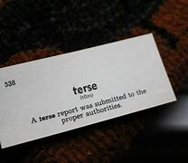
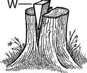

= eco 2020-06-20
:toc:

---

== Why China bullies(v.)欺负;恐吓；伤害；胁迫  词汇解说

(2020-6-20 / China / Chaguan: Why China bullies)

It *sees* a world *distracted 转移（注意力）；分散（思想）；使分心 by covid-19*, and *[too]* economically weak *[to] hold it back* 拦阻；阻挡

Jun 18th 2020 |

- *hold sb/sth back* : (1) to prevent sb/sth from moving forward or crossing sth 拦阻；阻挡 +
-> The police *were unable to hold back the crowd*. 警察阻拦不住人群。 +
(2) to prevent the progress or development of sb/sth 妨碍进展 +
-> Do you think that mixed-ability classes *hold back the better students*? 你认为把不同能力的学生混合在一起的班级, 会妨碍较高水平学生的进步吗？

CHINA *IS OFTEN called* a country *in thrall(n.)受…控制；深受…影响 to nationalism* 民族主义. The reality *is more complex* than that, and *more cynical* 认为人皆自私的；愤世嫉俗的;悲观的；怀疑的. *For proof* 证据；证明;检验；证实, *look at* the remarkable calm(n.)平静的时期；宁静的状态 (so far, at least) *that has reigned*(想法、情感或氛围)盛行；成为最显著的 since June 15th, when Chinese and Indian troops *fought(v.) their deadliest 最致命的 border skirmish*(n.)小规模战斗；小冲突；（尤指）遭遇战 in almost half a century. *On a sweltering 闷热的；热得难受的 afternoon* in Beijing, nearly three days after that Himalayan clash, `主` *a couple 两人；两件事物;几个人；几件事物 of* bored （对某人╱事物）厌倦的；烦闷的-looking police `系` *were* the only sign of *extra security* around *India’s embassy* 大使馆；（统称）使馆官员.

- 中国常被称为是个受民族主义影响, 深厚的国家。... 一对看上去面带厌倦的警察, 是印度大使馆, 在其周围加强安全措施的唯一迹象。

- *IN (SB'S/STH'S) THRALL  /θrɔːl/  | IN THRALL TO SB/STH* : ( literary ) controlled or strongly influenced by sb/sth 受…控制；深受…影响 +
=> 来自古英语 thrael,奴仆，来自 Proto-Germanic*thragilaz,跑腿者，来自 PIE*tragh,拉，拖，跑， 词源同 track,tractor.引申词义奴役，役使。 +
image:../../+ img_单词图片/t/THRALL.jpg[100,100]

- proof : n. ~ (of sth/that...) information, documents, etc. that show that sth is true 证据；证明 /  the process of testing whether sth is true or a fact 检验；证实 +
=> 来自prove的名词形式，拼写比较believe,belief. +
-> Can you provide any *proof of identity* ? 你能提供什么身份证明吗？ +
-> Is the claim *capable of proof*? 这个说法能证明是正确的吗？

- reign :  /reɪn/ v. ( literary ) ( of an idea, a feeling or an atmosphere 想法、情感或氛围 ) to be the most obvious feature of a place or moment 盛行；成为最显著的 / *~ (over sb/sth)* to rule as king, queen, emperor , etc. 统治；当政；为王；为君 +
-> At last *silence reigned*(v.) (= there was complete silence) . 最后，万籁俱寂。 +
-> Queen Victoria *reigned from 1837 to 1901*. 维多利亚女王自1837年至1901年在位。

- skirmish => 来自 PIE*sker,砍，劈，词源同 scar,shear.-ccia,小词后缀，含 讽刺义，词源同 capoccia,小头领。

China’s state-run media *had [by then] issued(v.) terse(a.)简要的；简短生硬的 reports*(n.) of a violent border incident. Lots of internet users *reposted(v.)转帖,转发 news items* 新闻条目 about dead Indian soldiers. *There was only limited grumbling(n.) about* the failure of official Chinese sources 中国官方消息来源 *to reveal* details of casualties （战争或事故的）伤员，亡者，遇难者 *suffered by* the Chinese army. Indeed, some netizens 网民 *treated the story as a joke*, *mocking* India’s soldiers *as* feeble 虚弱的；衰弱的;无效的；缺乏决心的；无力的.

- terse  /tɜːrs/ using few words and often not seeming polite or friendly 简要的；简短生硬的 +
=> 来自拉丁语 tersus,干净的，整洁的，来自 tergere,刮，摩擦，擦拭，可能来自 PIE*ter,转，刮， 摩擦，词源同 turn,detergent.引申词义简要的，简短的。 +

- feeble : a. very weak 虚弱的；衰弱的  +

*Compare that* muted(a.)静静的；减轻声音的;(情感、意见等)含糊不清的；表达不明确的 response with the rage(n.)暴怒；狂怒 (*provoked* 激起；引起；引发;挑衅；激怒；刺激 last October by the manager of an American basketball team, Daryl Morey of the Houston Rockets), when he *retweeted* the slogan: “*Fight for* freedom, *stand with* Hong Kong”, *in support of* anti-government protests in that territory. Millions of Chinese *demanded* Mr Morey’s sacking 解雇. [Within two days] Chinese broadcasters *announced that* they *would not show* 展览；陈列；上映；演出 Rockets games.

- muted : a. ( of sounds 声音 ) quiet; not as loud as usual 静静的；减轻的 /
( of emotions, opinions, etc. 情感、意见等 ) not strongly expressed 含糊不清的；表达不明确的 / ( of colours, light, etc. 色彩、光亮等 ) not bright 暗淡的；不明亮的 +
-> They spoke *in muted voices*. 他们轻声说着话。 +
-> The proposals received only *a muted response*. 这些提案没有得到明确的回应。 +
-> a dress *in muted shades of blue* 暗蓝色调的连衣裙 +

Chinese nationalism *is often compared to a tiger* which Communist Party bosses *have fed for years* -- and which *they are now condemned  迫使…接受困境（或不愉快的状况）;宣判；判处（某人某种刑罚） to ride*(n.), for fear of *being eaten* if they *dismount* 下（马、自行车、摩托车）. In reality, popular nationalism *resembles* 看起来像；显得像；像 a deep, man-made reservoir 水库；蓄水池, *created* by the damming-up （在河上）筑坝 and channelling （经过通道）输送，传送(水, 光等) of long-existing forces. Most of the time, Chinese leaders *can restrain(v.)（尤指用武力）制止，阻止，管制;抑制；控制 or unleash(v.)发泄；突然释放；使爆发;解除束缚 public rage [at will* 随意；任意]. [Only in the biggest crises] *do* they *feel constrained*(a.)不自然的；强迫的；过于受约束的 *to open* the floodgates 防洪闸门；泄水闸门 *to ease*（使）宽慰；减轻；缓解 dangerous pressure.

- 只有在最严重的危机中，他们才会被迫打开闸门, 以缓解"危险的压力"。

- condemn : [ VN ] [ usually passive ] *~ sb to sth* : to force sb to accept a difficult or unpleasant situation 迫使…接受困境（或不愉快的状况）/ ~ sb (to sth) to say what sb's punishment will be 宣判；判处（某人某种刑罚） +
-> They *were condemned to* a life of hardship. 他们不得不过着艰难的生活。 +
-> *He was condemned to death* for murder and later hanged. 他因凶杀罪被判处死刑后被绞死。

- dam : v. [ VN ] *~ sth (up)* : to build a dam across a river, especially in order to make an artificial lake for use as a water supply, etc. （在河上）筑坝

- constrained : a. ( formal ) not natural; forced or too controlled 不自然的；强迫的；过于受约束的 +
-> constrained emotions 受压抑的情感

*Public grievances 不平的事；委屈；抱怨；牢骚 are especially strong* when America, Japan or other much-condemned countries *are involved*. *Chaguan 茶馆 was a reporter* in Beijing in May 1999 when NATO warplanes *bombed(v.) China’s embassy* in Belgrade, *killing* three journalists. Chinese leaders *dismissed 不予考虑；摒弃；对…不屑一提;驳回；不受理 American promises*(n.) that *this was an accident*, and [for four days] *let* students *hurl 猛扔；猛投；猛摔 rocks at* the American and British embassies. *Violence was controlled* like *water from a tap* 水龙头；旋塞. `主` *Smashing* （哗啦一声）打碎，打破，破碎 windows and diplomats’ parked cars `谓` *was allowed*. But when youngsters 年轻人；少年；儿童 *tried to burn(v.) the American embassy’s flag* with *a flaming 燃烧的；冒火焰的 rag* 抹布；破布 on *a long bamboo 竹；竹子 pole*  柱子；杆子；棍；杖, Chaguan *watched* paramilitary 辅助军事的；准军事的 police *beat them back*. “Traitors 背叛者；叛徒；卖国贼!” *howled* （因疼痛、愤怒、开心等）大声叫喊; (风)怒号；呼啸 the crowd.

Often *dismissed 不予考虑；摒弃；对…不屑一提 [by Chinese] as* poor and chaotic 混乱的；杂乱的；紊乱的,无秩序的, India *is not* in the *rogue’s  骗子；恶棍；流氓;无赖；捣蛋鬼 gallery* （艺术作品的）陈列室，展览馆；画廊 of *imperialist 帝国主义者；帝国统治拥护者 bullies*(n.) that China’s young *learn about at school*. Vitally 极为,生死攸关地, `主` *two-way 双行的；双向的;(人际交流)相互的；彼此的；有来有往的 trade* with India `系` *is rather modest* 些许的；不太大（或太贵、太重要等）的: 11 countries *are larger trade partners* for China. All those factors *leave* Chinese rulers(n.) *free* 能随自己意愿的；随心所欲的 *to downplay* 对…轻描淡写；使轻视；贬低 a crisis with India. For even *when China appears(v.) reckless* 鲁莽的；不计后果的；无所顾忌的, it *is calculating* rewards 奖励；回报；报酬 and risks.

- vitally : /ˈvaɪtəli/ : ad. extremely; in an essential way 极其；绝对 +
-> Education *is vitally important* for the country's future. 教育对国家的未来是至关重要的。

- 印度经常被中国人看作是贫穷的和混乱的, 而不屑一顾. ;因此, 它并不列在中国年轻人在学校里学到的帝国主义流氓(画廊)清单里。重要的是，中国与印度的双边贸易相当有限：中国的贸易伙伴中, 比印度更大的还有11个国家。所有这些因素, 都令中国统治者可以随意看轻与印度的危机。即使中国显得好像鲁莽，它也计算着回报和风险。

Opportunistic 机会主义的 yes, reckless no

- 是机会主义，不是鲁莽
- opportunistic : /ˌɑːpərtuːˈnɪstɪk/ ADJ If you describe someone's behaviour as *opportunistic*, you are critical of them because they *take advantage of* situations *in order to gain money or power*, without thinking about whether their actions are right or wrong. 机会主义的

A revealing 透露内情的;揭露真相的；发人深省的 paper *published* last year by Ketian Zhang of George Mason University, in Virginia, *charts* 记录，跟踪（进展或发展）;绘制（区域）的地图 how China *has been throwing its weight around* 仗势欺人；盛气凌人 in its region. *Titled* “Cautious 小心的；谨慎的 Bully: Reputation 名誉；名声, Resolve 决心；坚定的信念 and *Beijing’s Use of Coercion*(n.)强迫；胁迫 in the South China Sea”, it *tests* claims(n.) that `主` China’s willingness 愿意,意愿,乐意 to use force `谓` *is explained* by *its growing military strength* or the *assertiveness 魄力，自信;过分自信,果断,自我坚定 of its leaders*. Actually, China *used(v.) its armed forces [more]* in 1990s, when they were weak, the paper *notes*. Today China *prefers to use* its coastguard 海岸警卫队（在美国隶属于军队）, its *maritime  海的；海事的；海运的；船舶的 militia* 民兵组织；国民卫队 and other agencies *to bully* neighbours. *China was rather aggressive*(a.)好斗的；挑衅的；侵略的；富于攻击性的;气势汹汹的；声势浩大的；志在必得的 under Hu Jintao, the country’s *distinctly 明显地；无疑地，确实地 cautious leader* in 2002-12. *Drawing on* 凭借；利用；动用 Chinese archives 档案; 档案馆 and interviews with officials, Ms Zhang *offers* a “cost-balancing theory” of decision-making 决策: that *China uses(v.) coercion*(n.)强迫；胁迫 “when the need *to establish a reputation* [for *resolve is high* /and *the economic cost is low*]”. Thus *China was quiet* 轻声的；轻柔的；安静的;克制的；稳重的；不张扬的 in the South China Sea in the early 2000s, when *it wanted a free-trade deal* with the Association 协会；社团；联盟 of South-East Asian Nations. Later *it became assertive*(a.)坚定自信的；坚决主张的 [after *deciding that* this group 指东南亚国家联盟 *needed* Chinese trade *more than* the other way round] -- and *had to be deterred 制止；阻止；威慑；使不敢 from* seeking(v.) international help in the South China Sea. China especially likes(v.) *to inflict(v.)使遭受打击；使吃苦头 asymmetric 不对称的，不对等的 economic pain*, as when *it banned(v.) imports of bananas from the Philippines* during *a territorial 领土的 dispute* in 2012, *devastating 彻底破坏；摧毁；毁灭 Filipino farmers* 农场主；农人 but *barely hurting its own consumers*.

-  *throw your weight about/around* : ( informal ) to use your position of authority or power in an aggressive way in order to achieve what you want 仗势欺人；盛气凌人

- deter ： v. *~ sb (from sth/from doing sth)* to make sb decide not to do sth or continue doing sth, especially by making them understand the difficulties and unpleasant results of their actions 制止；阻止；威慑；使不敢

- 张欣参考了中国的档案资料和对官员的采访，提出了一种决策的“成本平衡理论”：“当树立决心声誉的必要性很高，而经济成本较低时”，中国就会使用强制手段。因此，在21世纪初，当中国希望与东南亚国家联盟(ASEAN)达成自由贸易协议时，中国在南中国海保持沉默。后来，在让定这个集团比其他地区更需要中国的贸易后，它就变得自信起来 -- 必须阻止他们在南中国海问题上寻求国际帮助。中国尤其喜欢造成不对称的经济痛苦，比如2012年领土争端期间，中国禁止从菲律宾进口香蕉，给菲律宾农民带来了毁灭性的打击，但对本国消费者几乎没有伤害。

That pattern *continues*. Recent Chinese boycotts 拒绝购买（或使用、参加）；抵制 *have targeted* things *like* Australian beef or Houston Rockets games, but *not* more vital 必不可少的；对…极重要的 commodities. All this *casts another light on* 使（问题等）较容易理解 China’s assertiveness 自信,过分自信,果断,自我坚定 during this pandemic year, and the notion that *China is taking advantage of* a world (*distracted* 转移（注意力）；分散（思想）；使分心 by covid-19) *to throw its weight around*. *It is true* that China has been aggressive in recent months. Beyond 超出；除…之外 its readiness 准备就绪;愿意；乐意 to skirmish 小规模战斗；小冲突；（尤指）遭遇战 on the Indian border, *it has decided* to impose(v.) a draconian 德拉古式的；严酷的；残忍的 national-security law *on* Hong Kong, *slapped* （用手掌）打，拍，掴;强制实行；强迫某人做 trade boycotts *on* Australia and other Western nations, and *sent* coastguard 海岸警卫队 ships *to sink* 使下沉；使沉没 or *harass* 侵扰；骚扰;不断攻击（敌人） foreign vessels 大船；轮船 in the contested 有争议的 waters of the South China Sea. *It* is also true* *that* the world is geopolitically distracted(v.)转移（注意力）；分散（思想）；使分心. *It* is hard for governments *to chide 批评；指责；责备 China* [*over* democracy in Hong Kong], say, while *also negotiating to buy* Chinese ventilators  通气机；呼吸器. But *economics matters(v.), too*. 但经济也很重要.

- readiness : /ˈredinəs/ [ U ] *~ (for sth)* the state of being ready or prepared for sth 准备就绪 / [ Using. ] *~ (of sb) (to do sth)* the state of being willing to do sth 愿意；乐意 +
-> Everyone has doubts about *their readiness for parenthood*. 自己是否作好了为人父母的准备，人人都会感到疑虑。 +
-> Over half the people interviewed *expressed their readiness to die for* their country. 半数以上接受采访的人都表示愿意为国献身。

- *slap sth on sb/sth* : ( informal ) to order, especially in a sudden or an unfair way, that sth must happen or sb must do sth 强制实行；强迫某人做 +
-> The company *slapped a ban on* using email on the staff. 公司对员工使用电子邮件发出禁令。

- *slap sth on sth* : ( informal ) to increase the price of sth suddenly 忽然提价 +
-> *They've slapped 50p on the price of* a pack of cigarettes. 他们把一包香烟的价格一下子提高了50便士。

This is a time of *slumping* （价格、价值、数量等）骤降，猛跌，锐减 global demand for China’s goods and *interrupted* supply chains. Chinese officials *are betting 下赌注（于）；用…打赌 on* domestic demand *to drive(v.) their country’s recovery* from covid-19. *To control* the virus, the mainland’s borders *are closed(v.) to almost all foreigners*. Chinese parents *are thinking twice about* 三思而行；慎重考虑后再决定 sending(v.) students to universities in America, Australia and Europe. Chinese officials *growl 发出低沉的怒吼；咆哮;(动物，尤指狗)低声吼叫 that* Hong Kong-based foreign banks *must support the national-security law*, for *they are eminently (强调良好品质)非常；特别；极其 replaceable*.

- *think twice about sth/about doing sth* : to think carefully before deciding to do sth 三思而行；慎重考虑后再决定

- eminently : |ˈemɪnəntli| (formal) (used to emphasize a positive quality 强调良好品质) very; extremely 非常；特别；极其 +
-> She seems *eminently suitable for* the job. 她看来非常适合这个工作。

- 这是一个全球对中国商品需求下滑、供应链中断的时期。中国官员将赌注押在国内需求上，以推动中国从covid-19疫情中复苏。... 中国官员咆哮道，总部设在香港的外资银行必须支持国家安全法，因为它们显然是可以替代的。

All in all  总而言之; 总之; 归根结底, China *feels(v.) less reliant(a.)依赖性的；依靠的 on* other countries *than* it has [for a while]. That same *China is also being unusually assertive*(a.)坚定自信的；坚决主张的. *Follow the logic [through]*, and `主` *having* limited economic ties with China `谓` *may not make other countries safer*. India *is* the latest country *to be confronted with that dilemma* （进退两难的）窘境，困境. It *will not be the last*.

- 总而言之，相比于与过去一段时间以来，中国感觉对其他国家的依赖程度有所降低。同样的, 中国也变得异常自信。遵循这一逻辑，只与中国保持有限的经济联系, 可能不会让其他国家变得更安全。印度是最新一个面临这种困境的国家, 它也不会是最后一个。

---

== Why China bullies

It sees a world distracted by covid-19, and too economically weak to hold it back

Jun 18th 2020 |

CHINA IS OFTEN called a country in thrall to nationalism. The reality is more complex than that, and more cynical. For proof, look at the remarkable calm (so far, at least) that has reigned since June 15th, when Chinese and Indian troops fought their deadliest border skirmish in almost half a century. On a sweltering afternoon in Beijing, nearly three days after that Himalayan clash, a couple of bored-looking police were the only sign of extra security around India’s embassy.

China’s state-run media had by then issued terse reports of a violent border incident. Lots of internet users reposted news items about dead Indian soldiers. There was only limited grumbling about the failure of official Chinese sources to reveal details of casualties suffered by the Chinese army. Indeed, some netizens treated the story as a joke, mocking India’s soldiers as feeble.

Compare that muted response with the rage provoked last October by the manager of an American basketball team, Daryl Morey of the Houston Rockets, when he retweeted the slogan: “Fight for freedom, stand with Hong Kong”, in support of anti-government protests in that territory. Millions of Chinese demanded Mr Morey’s sacking. Within two days Chinese broadcasters announced that they would not show Rockets games.

Chinese nationalism is often compared to a tiger which Communist Party bosses have fed for years—and which they are now condemned to ride, for fear of being eaten if they dismount. In reality, popular nationalism resembles a deep, man-made reservoir, created by the damming-up and channelling of long-existing forces. Most of the time, Chinese leaders can restrain or unleash public rage at will. Only in the biggest crises do they feel constrained to open the floodgates to ease dangerous pressure.

Public grievances are especially strong when America, Japan or other much-condemned countries are involved. Chaguan was a reporter in Beijing in May 1999 when NATO warplanes bombed China’s embassy in Belgrade, killing three journalists. Chinese leaders dismissed American promises that this was an accident, and for four days let students hurl rocks at the American and British embassies. Violence was controlled like water from a tap. Smashing windows and diplomats’ parked cars was allowed. But when youngsters tried to burn the American embassy’s flag with a flaming rag on a long bamboo pole, Chaguan watched paramilitary police beat them back. “Traitors!” howled the crowd.

Often dismissed by Chinese as poor and chaotic, India is not in the rogue’s gallery of imperialist bullies that China’s young learn about at school. Vitally, two-way trade with India is rather modest: 11 countries are larger trade partners for China. All those factors leave Chinese rulers free to downplay a crisis with India. For even when China appears reckless, it is calculating rewards and risks.

Opportunistic yes, reckless no

A revealing paper published last year by Ketian Zhang of George Mason University, in Virginia, charts how China has been throwing its weight around in its region. Titled “Cautious Bully: Reputation, Resolve and Beijing’s Use of Coercion in the South China Sea”, it tests claims that China’s willingness to use force is explained by its growing military strength or the assertiveness of its leaders. Actually, China used its armed forces more in 1990s, when they were weak, the paper notes. Today China prefers to use its coastguard, its maritime militia and other agencies to bully neighbours. China was rather aggressive under Hu Jintao, the country’s distinctly cautious leader in 2002-12. Drawing on Chinese archives and interviews with officials, Ms Zhang offers a “cost-balancing theory” of decision-making: that China uses coercion “when the need to establish a reputation for resolve is high and the economic cost is low”. Thus China was quiet in the South China Sea in the early 2000s, when it wanted a free-trade deal with the Association of South-East Asian Nations. Later it became assertive after deciding that this group needed Chinese trade more than the other way round—and had to be deterred from seeking international help in the South China Sea. China especially likes to inflict asymmetric economic pain, as when it banned imports of bananas from the Philippines during a territorial dispute in 2012, devastating Filipino farmers but barely hurting its own consumers.

That pattern continues. Recent Chinese boycotts have targeted things like Australian beef or Houston Rockets games, but not more vital commodities. All this casts another light on China’s assertiveness during this pandemic year, and the notion that China is taking advantage of a world distracted by covid-19 to throw its weight around. It is true that China has been aggressive in recent months. Beyond its readiness to skirmish on the Indian border, it has decided to impose a draconian national-security law on Hong Kong, slapped trade boycotts on Australia and other Western nations, and sent coastguard ships to sink or harass foreign vessels in the contested waters of the South China Sea. It is also true that the world is geopolitically distracted. It is hard for governments to chide China over democracy in Hong Kong, say, while also negotiating to buy Chinese ventilators. But economics matters, too.

This is a time of slumping global demand for China’s goods and interrupted supply chains. Chinese officials are betting on domestic demand to drive their country’s recovery from covid-19. To control the virus, the mainland’s borders are closed to almost all foreigners. Chinese parents are thinking twice about sending students to universities in America, Australia and Europe. Chinese officials growl that Hong Kong-based foreign banks must support the national-security law, for they are eminently replaceable.

All in all, China feels less reliant on other countries than it has for a while. That same China is also being unusually assertive. Follow the logic through, and having limited economic ties with China may not make other countries safer. India is the latest country to be confronted with that dilemma. It will not be the last.

---

== The pandemic and state finances 词汇解说

( eco 2020-6-20 / United States / State finances: The calamity ahead )

The state-budget train *crash*

Why this *could cost lives* 造成生命损失 and *set back* 使推迟；耽误；使延误 economic recovery

Jun 18th 2020 |

THE START of *the fiscal year* -- July 1st in most states -- *is* usually about 将近；几乎 *as exciting 令人激动的；使人兴奋的 as* a 501(a) tax filing (提起（诉讼）；提出（申请）；送交（备案）) 纳税申报  and *as unpredictable 无法预言的；不可预测的；难以预料的 as* a Saudi 沙特阿拉伯的 weather forecast 天气预报 (sunny again!). Not this time 这一次不会,这次不会. State tax revenues 税收收入 *collapsed* in April, *falling [on average] by half*, according to the Urban Institute, a think-tank. *Demands on spending(n.) soared*(v.) because the states *are responsible for* much of America’s spending(n.) on public health, unemployment and policing. By some calculations, state-budget deficits 赤字；逆差；亏损 *will reach a quarter 四分之一 of revenues* in the coming fiscal year -- or *would do*, if most states *had not bound themselves* by law *to run* balanced budgets. So *instead of* vast deficits 亏损; 赤字, the states *will have to make savage 凶恶的；凶残的；损害严重的 cuts to public services* in the midst of a recession 经济衰退；经济萎缩 and pandemic. Through *no fault 责任；过错；过失 of their own*, their budgets *are out of control* and *are about to hit the buffers* 缓冲物；起缓冲作用的人.

-  因此，在经济衰退和疫情大流行期间, 各州将不得不大幅度削减公共服务，而不是采取巨额赤字政策。虽然不是他们的过错，但他们的预算已经失控，并即将撞向缓冲区。

Two-thirds of state revenues *come from income taxes or sales taxes*. Sales taxes *have been devastated* 彻底破坏；摧毁；毁灭 [by *the closure of shops and restaurants*] and income taxes [by *the rise in unemployment*]. The jobless rate *was* 13.3% in May, according to the Bureau of Labour Statistics, *up from 3.5%* in February. `主` Each percentage-point rise(n.) (in the unemployment rate) `谓` *cuts(v.) state tax revenues* by over $40bn, or 4.5%.

- 失业率每上升一个百分点，州的税收金额就会减少400亿美元，即4.5%。

Revenues *have fallen [so] fast* [that] some states *do not even know* by how much. Of those (that *have reported*) estimates, Louisiana *saw* tax revenues *drop by 43%* in April *compared with* April 2019 (“surreal” 离奇的；怪诞的；梦幻般的；超现实的, the state treasurer （俱乐部或组织的）司库，会计，出纳，财务主管 *called* that). New York’s *were down* by two-thirds and California’s income-tax receipts （企业、银行、政府等）收到的款项，收入 *plunged* 暴跌；骤降；突降;使突然前冲（或下落） 85%. Revenues in April *were doubly depressed*(a.)不景气的；萧条的；经济困难的 because the federal government, with states *following suit* 跟着某人做；仿效某人；照着做;跟牌（跟着别人出同花色的牌）, *moved* tax-filing 纳税申报 day *from April to July*, *causing* uncertainty about when income tax *will be paid*. Revenues *may recover* somewhat. But Ronald Alt of the Federation of Tax Administrators, which *advises* 劝告；忠告；建议; 出主意；提出建议；提供咨询 state governments, *reckons that*, collectively, state tax revenues *will fall by $150bn* between the start of April and the end of June. He *expects* 预料；预期；预计 income taxes *to fall by half* and sales taxes *to fall* by 44%. This decline *is larger* [in nominal 名义上的 terms] *than* during the Great Recession, when state tax revenues *fell by $100bn* [from] peak [to] trough 低谷；（企业或经济的）低潮，萧条阶段;（海浪间的）波谷；（小山间的）槽谷，盆状洼地 in three years.

- surreal : adj.   /səˈriːəl/ ( also less frequent sur·real·is·tic ) very strange; more like a dream than reality, with ideas and images mixed together in a strange way 离奇的；怪诞的；梦幻般的；超现实的 +

- 收入下降如此之快，以至于一些州甚至不知道下降了多少。在已经公布的估计数据中，与2019年4月相比，路易斯安那州4月的税收收入下降了43%(州财政部长称之为“超现实”)。纽约的收入下降了三分之二，加州的所得税收入下降了85%。由于联邦政府和各州纷纷效仿，将报税日从4月移至7月，这给何时缴纳所得税带来了不确定性. 4月份的收入加倍低迷. 收入可能会有所回升。但是，为各州政府提供咨询的税务管理联合会的罗纳德•奥特(Ronald Alt)估计，从4月初到6月底，各州的税收收入总共将减少1500亿美元。他预计, 所得税将下降一半，销售税将下降44%。按名义价值计算，这一降幅超过了“大衰退”(Great Recession)时期。当时，国家税收收入在3年内从峰值降至低谷，降幅达1000亿美元。

State and local governments *spend* slightly less than the federal government, about 17% of GDP, *compared with* a federal share of 20%. But they *are disproportionately 不成比例地 important to* the coronavirus response *because* unemployment insurance, public health and Medicaid 医疗补助制度（美国政府向贫困者提供的医疗保险） (which *provides* health insurance *for* the poor) *are largely organised by states*. Connecticut 康涅狄格州 *usually gets* 3,000-3,500 new unemployment claims a week. In April it *got* 30,000 in a week. In New Jersey, enrolment 入学，注册，登记（人数） in Medicaid *was* nine times higher in April *than* it had been a year earlier.

- 州和地方政府的支出， 略低于联邦政府的支出，约占GDP的17%，而联邦政府的支出占了GDP的20%。但是，由于失业保险、公共卫生和医疗补助(向穷人提供的医疗保险)主要是由各州组织的，因此它们在应对冠状病毒方面有着不成比例地重要性。康涅狄格州通常每周会有3000 - 3500人来申请失业救济。但今年4月，该州一周就收到了3万份申请。在新泽西州，四月份中的医疗补助的注册率， 是一年前的九倍。

For the past nine years, states *have cautiously increased* spending. At the start of 2020, before the pandemic *hit*, states *were expecting* 预料；预期；预计 increases(n.) (in both revenues and spending) of about 2%. Instead, the virus *has driven a wedge* 楔子；三角木 between the two.

- wedge :   /wedʒ/  a piece of wood, rubber, metal, etc. with one thick end and one thin pointed end that you use to keep a door open, to keep two things apart, or to split wood or rock 楔子；三角木 +
-> I don't want to *drive a wedge between* the two of you (= to make you start disliking each other) . 我不想在你们俩中间挑起不和。 +

- 在过去的九年里，各州谨慎地增加了开支。在2020年初，在疫情大爆发之前，各州预计, 财政收入和支出都将增加约2%。然而，病毒在两者之间造成了隔阂(拉大了两者之间的数字距离)。

Lucy Dadayan of the Urban Institute *estimates that* the gap *will be* around $75bn in fiscal 2020 and $125bn in fiscal 2021. The Centre on Budget and Policy Priorities (CBPP) 预算与优先政策中心, another think-tank, *reckons* it *will be* even higher: $120bn in the current fiscal year, $315bn in fiscal 2021 and $180bn in 2022, a grand 壮丽的；堂皇的；重大的 total of $615bn, which *is* six months of current spending. (These forecasts *show* the difference *between* what was expected before the pandemic *and* what is expected now.)

- 城市研究所(Urban Institute)的露西•达达扬(Lucy Dadayan)估计，2020财年和2021财年的预算缺口将分别为750亿美元和1250亿美元。另一个智库——预算与政策优先中心(CBPP)估计，这一数字将更高:本财年为1200亿美元，2021财年为3150亿美元，2022财年为1800亿美元，总计6150亿美元，是6个月的当期支出。(这些预测显示了大流行之前的预期,与现在的预期,之间的差别。)

The range （变动或浮动的）范围，界限，区间 in estimates(n.) *reflects* the difficulty of *forecasting* the impact of the pandemic and expectations 预料；预期；期待 of spending cuts. The exact 精确的；准确的 amounts, however, *matter(v.) less than* the fact that, first, the figures *are large* and, second, that most states *cannot run deficits anyway*, so the numbers *indicate* 表明；显示 the extent 程度；限度;大小；面积；范围 of future spending cuts, *rather than* deficit-financing needs.

- 估计出的值，其浮动区间很大, 这反映出, 要想预测疫情的影响和到底会削减多少开支, 难度很大. 然而，与下面的事实相比，确切的数额其实并不重要: 第一，这些数字很大; 第二，大多数州无论如何都不能执行赤字政策. 因此，这些数字表达的只是未来削减开支的程度，而不是对赤字进行融资的需求量程度。

These cuts *will be mitigated* 减轻；缓和 by states’ financial reserves and by federal help. `主` The rule that states *must balance budgets* `谓` *has made them* fiscally 财政上 conservative 保守的；守旧的. Most *used* the 2010s *to build up* reserves. According to the Pew Charitable Trusts 信托, a nonpartisan 无党派的 think-tank, these *reached* $75bn in 2019, the highest [ever], equal to 8% of spending (or 28 days’ worth). But that *is* just an eighth 八分之一 of CBPP’s forecast of the shortfall 缺口；差额；亏空 in 2020-22. The costs of the pandemic *have swept away* 消灭；彻底消除；完全打消 the benefits of caution.

- mitigate => 来自拉丁语mitigare,成熟，变软，温顺，来自mitis,成熟的，柔软的，-ig,做，词源同agent.引申词义减轻，缓和。

- 这些财政开支上的削减, 会通过各州的财政储备和联邦援助, 来缓解其不利影响。各州必须平衡预算的规定, 使它们在财政上变得保守。大多数州在2010年代建立了财政储备。根据无党派的智库皮尤慈善信托基金的数据，到2019年时, 这一数字达到了750亿美元，是有史以来最高的，相当于支出的8%(或28天的值)。但这只是CBPP(预算和政策优先中心智库)对2020-22年缺口预测的八分之一。对大疫情的支出已经消耗尽了谨慎时期建立的福利金。

The federal government *has also offered help*, but not enough. It *is financing* new unemployment insurance (*introduced* 推行；实施；采用(新产品,法律) during the pandemic) and in March *gave* states an extra $110bn. But the money *may not be used to compensate 补偿；弥补 for* revenue shortfalls 缺口；差额；亏空. And anyway, the (bipartisan  两党的；涉及两党的) National Governors Association 全国州长协会 *reckons* states *need* $500bn. Glenn Hubbard, the former head of George W. Bush’s Council of Economic Advisers, *calls* the extra help “about *as* close to a no-brainer 无需用脑的事；容易的决定 ...*as possible*”. In mid-May the House of Representatives *promised* $500bn. But the bill *stalled* 暂缓；搁置；停顿;（使）熄火，抛锚 in the Senate, where the majority leader, Mitch McConnell, *has said* states *should be allowed to declare(v.) bankruptcy instead* (which *may not be* constitutional 宪法准许的；受宪法限制的；受章程限制的). This *leaves* states *struggling to balance(v.) budgets largely on their own*.

- 5月中旬，众议院承诺提供5000亿美元。但该法案在参议院搁浅，参议院多数党领袖米奇·麦康奈尔表示，应该允许各州宣布破产(这可能不符合宪法)。这使得各州在很大程度上只能靠自己来努力平衡预算。

*Prepare for* pain

With tax increases(n.) politically unfeasible 不可行的；难以实现的 at the moment, states *will have little choice* but *to impose* big spending cuts. Ohio’s governor （美国的）州长;统治者；管辖者；总督 *has instructed* state agencies *to chop their budgets* by 20% in the coming fiscal year. In Washington state, the reduction is 15%. California’s governor and legislators *are deadlocked* 陷入僵局的 over plans for $14bn of spending cuts, but even these *would not be enough* to close(v.) the expected $54bn deficit. Spending cuts *imply* 含有…的意思；暗示；暗指 lay-offs 下岗人员;解雇. The states *have already furloughed （通常因发不出工资而给的）准假 or sacked* 解雇；炒鱿鱼 1.5m workers in March, April and May, twice as many as in 2009-11.

- furlough : /ˈfɜːləʊ/ n. v. ( NAmE ) a period of time during which workers are told not to come to work, usually because there is not enough money to pay them （通常因发不出工资而给的）准假 / permission to leave your duties for a period of time, especially for soldiers working in a foreign country （尤指在国外服役士兵的）休假（许可） +
=> 来自荷兰语。fur-, 同per-,完全的，-lough, 爱，许可，许假，词源同love, leave.

- 由于增税目前在政治上不可行，各州将别无选择，只能大幅削减开支。 ... 加州州长和议员们在140亿美元的开支削减计划上陷入僵局，但即便如此，也不足以消除预期的540亿美元赤字。

Such cuts *will be a drag 累赘；拖累；绊脚石 on growth* when recovery *starts*. *As* Pew’s Josh Goodman *points out*, states *were reining back 严格控制；加强管理;用缰绳勒马 spending*(n.) [years] [after the Great Recession], resulting, *as late as* 2018, in shortages of teachers, and infrastructure spending [at 50-year lows] [as a share of GDP]. The budget (*squeeze* 严格限制，削减，紧缩（资金） now) *will be* greater *than* it was then. And *remember* what programmes *are provided* by states: Medicaid [at a time of covid]; unemployment insurance [at a time of recession]; policing(n.)（用警察）维护治安；治安保卫 [at a time of protest]. In the absence of proper presidential leadership, governors *such as* Maryland’s Larry Hogan and Michigan’s Gretchen Whitmer *have provided* much of what useful guidance (America *has had* during the pandemic). But they, and other governors, *must now brace themselves for* the coming crash.

- drag : [ sing. ] *a ~ on sb/sth* ( informal ) a person or thing that makes progress difficult 累赘；拖累；绊脚石 / [ U ] the force of the air that acts against the movement of an aircraft or other vehicle （作用于飞机或其他运载工具的）空气阻力 +
-> He came to be seen as *a drag on* his own party's prospects. 他逐渐被看成是阻碍自己的党走向未来的绊脚石。

- 当复苏开始时，这样的财政开支削减, 将会拖累经济增长。正如皮尤研究中心的乔希•古德曼(Josh Goodman)指出的那样，在大衰退之后的几年里，各州都在控制支出，导致直到2018年教师短缺，基础设施支出占GDP的比例, 降至50年来的最低水平。现在的预算紧缩, 将比那时更严重。记住各州提供了哪些项目:covid时期的医疗补助计划; 经济衰退时期的失业保险; 在抗议期间维持治安。在缺乏适当总统领导的情况下，马里兰州的拉里•霍根(Larry Hogan)和密歇根州的格雷琴•惠特默(Gretchen Whitmer)等州长, 为美国在疫情大流行期间该如何做, 提供了许多有用的指导。但他们和其他州长, 现在必须为即将到来的危机做好准备。

---

== The pandemic and state finances

The state-budget train crash

Why this could cost lives and set back economic recovery

Jun 18th 2020 |

THE START of the fiscal year—July 1st in most states—is usually about as exciting as a 501(a) tax filing and as unpredictable as a Saudi weather forecast (sunny again!). Not this time. State tax revenues collapsed in April, falling on average by half, according to the Urban Institute, a think-tank. Demands on spending soared because the states are responsible for much of America’s spending on public health, unemployment and policing. By some calculations, state-budget deficits will reach a quarter of revenues in the coming fiscal year—or would do, if most states had not bound themselves by law to run balanced budgets. So instead of vast deficits, the states will have to make savage cuts to public services in the midst of a recession and pandemic. Through no fault of their own, their budgets are out of control and are about to hit the buffers.

Two-thirds of state revenues come from income taxes or sales taxes. Sales taxes have been devastated by the closure of shops and restaurants and income taxes by the rise in unemployment. The jobless rate was 13.3% in May, according to the Bureau of Labour Statistics, up from 3.5% in February. Each percentage-point rise in the unemployment rate cuts state tax revenues by over $40bn, or 4.5%.

Revenues have fallen so fast that some states do not even know by how much. Of those that have reported estimates, Louisiana saw tax revenues drop by 43% in April compared with April 2019 (“surreal”, the state treasurer called that). New York’s were down by two-thirds and California’s income-tax receipts plunged 85%. Revenues in April were doubly depressed because the federal government, with states following suit, moved tax-filing day from April to July, causing uncertainty about when income tax will be paid. Revenues may recover somewhat. But Ronald Alt of the Federation of Tax Administrators, which advises state governments, reckons that, collectively, state tax revenues will fall by $150bn between the start of April and the end of June. He expects income taxes to fall by half and sales taxes to fall by 44%. This decline is larger in nominal terms than during the Great Recession, when state tax revenues fell by $100bn from peak to trough in three years.

State and local governments spend slightly less than the federal government, about 17% of GDP, compared with a federal share of 20%. But they are disproportionately important to the coronavirus response because unemployment insurance, public health and Medicaid (which provides health insurance for the poor) are largely organised by states. Connecticut usually gets 3,000-3,500 new unemployment claims a week. In April it got 30,000 in a week. In New Jersey, enrolment in Medicaid was nine times higher in April than it had been a year earlier.

For the past nine years, states have cautiously increased spending. At the start of 2020, before the pandemic hit, states were expecting increases in both revenues and spending of about 2%. Instead, the virus has driven a wedge between the two.

Lucy Dadayan of the Urban Institute estimates that the gap will be around $75bn in fiscal 2020 and $125bn in fiscal 2021. The Centre on Budget and Policy Priorities (CBPP), another think-tank, reckons it will be even higher: $120bn in the current fiscal year, $315bn in fiscal 2021 and $180bn in 2022, a grand total of $615bn, which is six months of current spending. (These forecasts show the difference between what was expected before the pandemic and what is expected now.)

The range in estimates reflects the difficulty of forecasting the impact of the pandemic and expectations of spending cuts. The exact amounts, however, matter less than the fact that, first, the figures are large and, second, that most states cannot run deficits anyway, so the numbers indicate the extent of future spending cuts, rather than deficit-financing needs.

These cuts will be mitigated by states’ financial reserves and by federal help. The rule that states must balance budgets has made them fiscally conservative. Most used the 2010s to build up reserves. According to the Pew Charitable Trusts, a nonpartisan think-tank, these reached $75bn in 2019, the highest ever, equal to 8% of spending (or 28 days’ worth). But that is just an eighth of CBPP’s forecast of the shortfall in 2020-22. The costs of the pandemic have swept away the benefits of caution.

The federal government has also offered help, but not enough. It is financing new unemployment insurance introduced during the pandemic and in March gave states an extra $110bn. But the money may not be used to compensate for revenue shortfalls. And anyway, the (bipartisan) National Governors Association reckons states need $500bn. Glenn Hubbard, the former head of George W. Bush’s Council of Economic Advisers, calls the extra help “about as close to a no-brainer...as possible”. In mid-May the House of Representatives promised $500bn. But the bill stalled in the Senate, where the majority leader, Mitch McConnell, has said states should be allowed to declare bankruptcy instead (which may not be constitutional). This leaves states struggling to balance budgets largely on their own.

Prepare for pain

With tax increases politically unfeasible at the moment, states will have little choice but to impose big spending cuts. Ohio’s governor has instructed state agencies to chop their budgets by 20% in the coming fiscal year. In Washington state, the reduction is 15%. California’s governor and legislators are deadlocked over plans for $14bn of spending cuts, but even these would not be enough to close the expected $54bn deficit. Spending cuts imply lay-offs. The states have already furloughed or sacked 1.5m workers in March, April and May, twice as many as in 2009-11.

Such cuts will be a drag on growth when recovery starts. As Pew’s Josh Goodman points out, states were reining back spending years after the Great Recession, resulting, as late as 2018, in shortages of teachers, and infrastructure spending at 50-year lows as a share of GDP. The budget squeeze now will be greater than it was then. And remember what programmes are provided by states: Medicaid at a time of covid; unemployment insurance at a time of recession; policing at a time of protest. In the absence of proper presidential leadership, governors such as Maryland’s Larry Hogan and Michigan’s Gretchen Whitmer have provided much of what useful guidance America has had during the pandemic. But they, and other governors, must now brace themselves for the coming crash.

