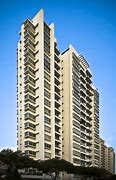

= eco 2020-06-27
:toc:

---

==  Like a ton of bricks 词汇解说

(eco 2020-6-27 / Finance & economics / Commercial property: Like a ton of bricks)

*Is* investors’ love affair 事件；事情 with commercial property *ending*?

After covid-19, the investment world *will become more discriminating* 有识别力的；有辨别力的；有鉴赏力的

Jun 25th 2020 |

- 就像一吨砖头 +
投资者对商业地产的迷恋, 是否已经结束? +
新冠肺炎疫情发生后，投资领域将更加具有鉴别力

THE SECOND week of March *was* a heartbreaking 令人极度伤心的 one for Will Beckett. `主` The boss of Hawksmoor, a chain of steakhouses 牛排餐厅 that *employs*(v.)雇用 700 workers in Britain, `谓` *had been* days(n.) *away from* opening(v.) his first New York outpost 前哨（基地）. [Instead] government-imposed lockdowns *forced* him *to close* all his restaurants *down* （使）停业; （使）停产. The City types 具有某种特征的人；典型 that usually *queue （人、车等）排队等候 for* its sizzling 酷热的;热烈的；激情迸发的热烈的；激情迸发的 cuts(n.) （从动物躯体上）割下的一块肉 *were forced to go without*. So too *were* Mr Beckett’s landlords, after *he told them* he *could not afford to pay(v.) rent* for the second quarter. Most of his peers 身份（或地位）相同的人；同龄人；同辈, he says, *have also yet to square 贿赂；收买；买通 the bill*. Restaurateurs 餐馆老板；餐厅经理 *are likely to miss their payments* for the third quarter too.

- sizzling : v. 发咝咝声 adj. 极热的，酷热的；/ very exciting 热烈的，激情迸发的 +
-> a sizzling love affair 热烈的风流韵事

- cut : n. a piece of meat cut from an animal （从动物躯体上）割下的一块肉 +
-> a lean cut(n.) of pork 一块瘦猪肉

- 3月的第二周对威尔·贝克特来说是令人心碎的一周。霍克穆尔是一家在英国雇佣700名工人的牛排连锁店，他距离开设他在纽约的第一家前哨餐厅只有几天时间了。然而, 政府强制的封锁迫使他停业了所有的餐厅。通常会排队等待其发出咝咝声音牛排的市民, 也被迫放弃前往。同样感到心痛的, 还有贝克特的房东，因为贝克特告诉他, 付不起第二季度的房租了。他说，他的大多数同行也还没有付清房租。餐馆老板可能在第三季度也毫无收入。

Activity *is gradually restarting*. On June 23rd Boris Johnson, Britain’s prime minister, *said* he *would allow* restaurants *to re-open* on July 4th. `主` A moratorium(n.)暂停，中止（尤指经官方同意的） on repossessions(n.)（财产、商品等的）收回 , *introduced* in March, `谓` *has been extended to* September. Yet `social distancing` and `warier 小心翼翼的,谨慎的, cash-strapped 囊中羞涩,没有足够资本的,缺钱的 diners` *will squeeze* eateries’ 餐馆 margins. Jonathan Downey, who *runs street-food markets* in London, says the hospitality （款待客人、顾客等的）食物，饮料，服务；款待 industry 酒店业；服务业 *risks* “rent apocalypse”  大动乱；大灾变,天启.

- moratorium : /ˌmɔːrəˈtɔːriəm/ n. (pl. -riums or -toria)
*~ (on sth)* : a temporary stopping of an activity, especially by official agreement 暂停，中止（尤指经官方同意的） +
=> 来自拉丁语morari,延迟，词源同demur.引申词义暂停，中止。 +
->  The convention called for *a two-year moratorium* on commercial whaling. 会议呼吁两年内暂停商业捕鲸活动。

- repossession : /ˌriːpəˈzeʃn/ n. [ UC ] the act of repossessing property, goods, etc. （财产、商品等的）收回 / [ C ] a house, car, etc. that has been repossessed 被收回的房子（或汽车等） +
=> repossess : re-,向后，往回，possess,拥有，所有。
.. families (*threatened with repossession*) 受到房子将被收回威胁的家庭

- eatery : /ˈiːtəri/ => eat, 吃。-ery, 地点。

- 商业活动正在逐渐恢复。6月23日，英国首相鲍里斯·约翰逊表示，他将允许餐馆在7月4日重新开业。从3月份开始的"暂停收回房屋(商铺?)"的规定, 已延长到9月份。然而，社交距离限制, 和(因疫情而)更加谨慎的，并收入大减的食客, 会压低餐馆的利润。在伦敦经营街头食品市场的乔纳森•唐尼(Jonathan Downey)表示，酒店业面临着“租金末日”的风险。

Most people probably *have more sympathy(n.)同情 for* chefs 厨师；（尤指餐馆、饭店等的）主厨，厨师长 and waiters （餐馆等的）服务员，侍者 *than for* landlords. But many *do not realise that* `主` payments *made to* commercial landlords `谓` *are increasingly channelled （利用某途径）输送资金，提供帮助 towards* their own `pension pots` （某种用途的）容器 or `insurance claims` 保险索赔. The global stock of investible commercial property -- hotels, shops, offices and warehouses -- *has quadrupled*  （使）变为四倍 since 2000, *to* $32trn (see chart 1). More than a third *is owned by* institutional 机构的；慈善机构的 investors, which *piled (许多人)蜂拥至；拥挤到 in*, *lured* 劝诱；引诱；诱惑 by lucrative  赚大钱的；获利多的, solid 可靠的；可信赖的；坚实的;连续的；不间断的；整整的 returns.

- lucrative : /ˈluːkrətɪv/

- solid : a. ( informal ) without a pause; continuous 连续的；不间断的；整整的 +
-> It rained *for two hours solid*(a.) this afternoon. 今天下午连着下了两个小时的雨。

- 大多数人可能更同情厨师和服务员，而不是房东。但许多人没有意识到，支付给商业房东的款项, 正越来越多地流向他们自己的养老金罐或保险索赔上。全球可投资的商业地产的存量--酒店、商店、写字楼和仓库--自2000年以来已经翻了四倍，达到32万亿美元(见表1)。超过三分之一的资产为机构投资者所有，他们被丰厚、稳定的回报吸引, 而蜂拥而入。

Covid-19 *has upended* 翻倒；倒放；使颠倒 the impression of solidity 固态；坚固性；可靠性. Most immediately  立即；马上；即刻, it *has severely impaired*(v.)损害；削弱 tenants’ 房客；租户；佃户 ability *to pay rent*. *It also raises questions about* where shopping, work or leisure *will happen* [once the crisis *abates* （使）减弱，减退，减轻，减少]. Both *are likely to prompt* investors *to become more discriminating* 有识别力的；有辨别力的；有鉴赏力的. Some institutions *may shift* their funds *away from* riskier properties; other investors, meanwhile, *might hunt for* 搜寻；搜索;追踪；追捕 bargains 减价品；便宜货, or *seek to repurpose*(v.)（为适合新用途）对…稍加修改，略微改动 unfashionable 不时兴的；不时髦的；过时的 stock 股份；股票;公债；公债券.

- impair => im-,进入，使，-pair,缩写自pejorative,更坏的，贬低的。即进一步贬低的，引申词义损伤，伤害。

- abate => 前缀a-同ad-. -bate同beat, 指打压下去。

- Covid-19颠覆了人们认为生活会稳定的印象。最直接的影响是，它严重损害了租户的支付能力。它也提出了这个问题:一旦危机消退，人们将在哪里购物、工作或休闲。这两个问题都能促使投资者更多去思考, 变得更具鉴别力。一些机构可能会将资金, 从风险较高的房地产中转移; 与此同时，其他投资者可能会寻找更便宜的投资品, 逢低吸纳，或调整不受欢迎的股票组合。

The infatuation （尤指一时的）热恋，痴迷 with commercial property *began [in earnest]* （更加）严肃地，认真地，坚定地; 郑重其事；当真  after the global financial crisis of 2007-09. Interest rates 利息,利率 *were cut to almost zero* across much of the rich world, *making it harder to generate the safe cash flows* that pension funds and insurers *need to meet(v.)支付；偿付;满足；使满意 future liabilities* 欠债；负债；债务. “Core” property -- often in desirable places and *needing* little refurbishment 翻新; 整修 -- *typically produced* secure annual returns *in the high single digits 高个位数 to low teens* 十几岁（13至19岁之间）, mostly `*in the form of* contractual(a.) 合同的；契约的；按合同（或契约）规定的, often inflation-adjusted 扣除物价上涨(通货膨胀)因素的,是去除通胀后的实际数据, rent payments` (see chart 2). Buying property *allows* investors *to park 停放（车）；放置；寄存 vast sums of money* -- *from* tens of millions *to* billions 数十亿 of dollars -- which they *can forget about* for years (commercial leases （房屋、设备或土地的）租约，租契 *often last(v.) a decade or more*). And the returns *have been less volatile*(a.)(情况)可能急剧波动的；不稳定的；易恶化的 in crises *than* those from public equities 股票 and commodities 商品.

- infatuation : /ɪnˌfætʃuˈeɪʃn/ n. *~ (with/for sb/sth)* very strong feelings of love or attraction for sb/sth, especially when these are unreasonable and do not last long （尤指一时的）热恋，痴迷 +
=> in-,进入，使，fatuous,愚蠢的，傻的。用于指犯傻的，迷恋的，痴迷的。

- earnest  : /ˈɜːrnɪst/ a. very serious and sincere 非常认真的；诚实的；真诚的
.. Despite *her earnest efforts*, she could not find a job. 尽管她已尽心竭力，但是仍然找不到工作。

- *IN EARNEST* :
(1) more seriously and with more force or effort than before （更加）严肃地，认真地，坚定地 +
-> The work on the house *will begin [in earnest]* on Monday. 这栋房子的修建工作将在星期一正式开始。 +
(2) very serious and sincere about what you are saying and about your intentions; in a way that shows that you are serious 郑重其事；当真 +
-> You may laugh *but I'm in deadly earnest* . 你可以笑，不过我可是正经八百的。

- meet : [ VN ] to pay sth 支付；偿付
.. The cost *will be met by the company*. 费用将由公司支付。

- refurbishment :/ˌriːˈfɜːrbɪʃmənt/ N-UNCOUNT The refurbishment of something is the act or process of cleaning it, decorating it, and providing it with new equipment or facilities. 翻新; 整修 +
=> re-,再，重新，furbish,磨光，擦亮。

- 高个位数: 就是比较大个位数,如7% 8% 9%,但不会超过10% +
低个位数: 就是2% 3% 4%之类的

- teens一般是从13开始到19的，teenage也是13-19岁的少年男女.
.. low teens : 13-14
.. mid teens : 15-16
.. high teens : 17-19

- volatile :  /ˈvɑːlətl/  a. ( of a situation 情况 ) likely to change suddenly; easily becoming dangerous 可能急剧波动的；不稳定的；易恶化的  +
/ ( often disapproving ) ( of a person or their moods 人或其情绪 ) changing easily from one mood to another 易变的；无定性的；无常性的  +
/ ( technical 术语 ) ( of a substance 物质 ) that changes easily into a gas (物质)易挥发的；易发散的 +
=> 来自拉丁语 volare,飞，可能来自 will,意愿，引申词义浮动的，挥发的。
.. *a highly volatile situation* from which riots might develop 可能会出现动乱的极不稳定的局势
.. *a volatile exchange rate* 剧烈波动的汇率 +

- 对商业地产的迷恋, 始于2007-09年全球金融危机之后。许多富裕国家的利率几乎降到了零，这使得养老基金和保险公司难以产生安全的现金流, 来支付未来的债务。“核心”房产通常位于理想的地段，而且几乎不需要翻修，通常会产生的年回报率, 从高个位数(8,9%)到低十几位数(13,14%)，并且主要是以合同形式来支付租金的，而且是随着通胀调整的(见表2)。购买房产可以让投资者寄存巨额资金--从数千万美元到数十亿美元--他们可以多年不用在乎这一点(商业租赁通常会持续十年或更长时间)。而且，在危机中，投资房产的回报率的波动性, 要小于公开发行的股票和大宗商品。

[As a result] `主` *both* the numbers of `institutional investors` (*buying up* 全部（或尽量）买下某物；收购 property) *and* the amounts (they *have allocated 拨…（给）；划…（归）；分配…（给） to* it) `谓` *have risen* since 2010 (see chart 3). A chunk  相当大的量;厚块；厚片；大块 *is channelled （利用某途径）输送资金，提供帮助 through* `private property funds`, which *have raised $1.6trn* since 2008, according to `Private Equity Real Estate`, a publication. All together 一起,总共, institutions *hold* about $6trn worth of assets *privately*, and $5trn *through* `listed(a.)使 (公司) 上市; (公司) 上市 vehicles` （赖以表达思想、感情或达到目的的）手段，工具. Property *is typically financed by* helpings(n.) of debt, which *accounts for* just `under half of` the market’s value in America.

- channel : v. *~ sth (through sth)* to send money, help, etc. using a particular route （利用某途径）输送资金，提供帮助

- 因此，自2010年以来，购买房地产的机构投资者数量, 和他们分配给房地产的投资金额, 都有所上升(见表3)。根据出版物“私募股权房地产”(Private Equity Real Estate)的数据，其中一大部分是通过私人房地产基金进行的，自2008年以来，这些基金已经筹集了1.6万亿美元。机构私下持有的资产总额约为6万亿美元，通过上市工具持有的资产总额为5万亿美元。房地产通常是通过债务融资的，在美国，债务只占市场价值的不到一半。

Investors’ appetite *has been met* by a growing supply of assets. Since 2000, `主` businesses *ranging from* burger 汉堡包 chains(n.) *to* banks `谓` *have spun out* （从现有公司中） 剥离出，独立，分立; 拖长; 拉长 trillions of dollars of property (they *used to own*)  *to free up 使可用（于某目的）; 使能腾出时间 cash*, often *leasing 租用，租借，出租（尤指房地产或设备） it back* immediately after *divesting* 使（某人）脱去（衣服）;处理掉；丢弃;使解除；使摆脱. Worldwide, offices and shops *account for* 61% of assets, *though* the share of commercial housing (ie, student housing and condominiums 公寓) and logistics(n.)后勤；物流；组织工作 assets *has been rising*.

- spin : v. *~ (sth) (round/around)* to turn round and round quickly; to make sth do this （使）快速旋转
- *spin sth off* : ( business 商 ) ( especially NAmE ) to form a new company from parts of an existing one 从…脱离出来（组建新公司） +
-> The transportation operation *will be spun off into a separate company*. 运输部门将脱离出来组建为一家独立公司。
- *spin sth out* : to make sth last as long as possible 拉长；拖长 +

- free : v. *~ sb/sth (up)* to make sb/sth available for a particular purpose 使可用（于某目的） / to give sb the extra time to do sth that they want to do 使能腾出时间
.. The government has promised *to free up more resources for education*. 政府保证调拨更多资源用于教育。
.. Winning the prize *freed him* to paint full-time. 获奖使他能腾出时间整天作画。

- divest : v. /daɪˈvest/ *~ sb/yourself of sth* : to remove clothes 使（某人）脱去（衣服） +
=> di-, 不，非，使相反，来自dis-变体。vest, 衣服，袍子。即使脱去衣服。 +
/ *~ yourself of sth* : to get rid of sth 处理掉；丢弃 +
-> The company *is divesting itself of* some of its assets. 公司正在处理掉它的部分资产。 +
/ *~ sb/sth of sth* : to take sth away from sb/sth 使解除；使摆脱 +
-> After her illness *she was divested of* much of her responsibility. 她生病后便给解除了许多责任。

- condominium : /ˌkɑːndəˈmɪniəm/ ( also informal condo ) ( especially NAmE ) an apartment building in which each flat/apartment is owned by the person living in it but the building and shared areas are owned by everyone together; a flat/apartment in such a building 公寓（套房私有，其他地方属业主共有）；一套公寓住房；公寓的单元 +
=> con-, 强调。-dom, 管理，控制，词源同domineer, domesticate. 即共管区域。 +

- 不断增加的资产供应满足了投资者的需求。自2000年以来，从汉堡连锁店到银行，各行各业已经剥离了价值数万亿美元的资产, 来获得现金，通常会在卖出后, 再立即将其租回来。在全球范围内，写字楼和商铺占据了61%的资产，尽管商品房(即学生公寓和公寓)和物流资产的份额一直在上升。

*Shop* till you drop 累倒；累垮;（使）变弱，降低，减少

[By the start of this year] there *were* signs of froth 泡沫. Both offices and industrial properties (warehouses, chiefly) *reached record prices* at the turn of 2020. Retail-property prices *had already peaked* in 2018. `主` Rent growth, however, `谓` *had started to level(v.) off* （停止升降而）保持水平 across most sectors. `All this *depressed* yields` 产量；产出；利润, and `returns *had started to flag*`(v.) 疲乏；变弱；热情衰减.

- *level(v.) off/out* +
(1) to stop rising or falling and remain horizontal （停止升降而）保持水平 +
-> The plane *levelled off at 1 500 feet*. 飞机在1 500英尺的高空保持水平飞行。 +
(2) to stay at a steady level of development or progress after a period of sharp rises or falls （经过急剧的涨落后）保持平稳发展 +
-> *Sales have levelled off* after a period of rapid growth. 销售经过一段时间的快速增长后呈稳定状态。

- 买到你买不动为止 +
今年年初出现了泡沫的迹象。办公楼和工业地产(主要是仓库)在2020年达到了历史最高价格。零售地产(商业地产)的价格已经在2018年见顶。然而，大多数行业的租金增长已开始趋于平稳。所有这些都压低了地产投资上的收益率，地产投资的回报率也开始下降。

Then the pandemic *hit*. *As* investors *panicked*, stockmarkets *tumbled*  （价格或数量）暴跌，骤降 and property markets *froze*. `主` Transaction （一笔）交易，业务，买卖 volumes` in May `谓` *were down* by about `a third` in the West and `two-fifths` in Asia, according to Real Capital Analytics, a data firm. `主` The proportion of offers 出价；报价 that *fell through* 落空；失败；成为泡影 before completion 完成；结束 `谓` *doubled* in Europe and *rose sevenfold* in America. `主` Indices （物价和工资等的）指数(index的复数) (*tracking* `listed trusts` that *invest in* commercial property (*dubbed* 把…戏称为；给…起绰号 REITs 房地产信托投资基金)) `谓` *cratered* 形成坑；消亡 in March. Part of that *might have reflected* `an indiscriminate(a.)随意的；恣意的；不加选择的;不加分析的；不加判断的 sell-off(n.)（证券）抛售 of shares` by investors *rather than* `an ebbing 衰退;退潮 taste` for property. But benchmarks 衡量基准 *have recovered only about* half their losses.

- *fall(v.) through* : to not be completed, or not happen 落空；失败；成为泡影
.. *Our plans fell through* because of lack of money. 我们的计划由于缺钱而落空了。

- REITs : REITs(Real Estate Investment Trusts，房地产投资信托基金)是一种以发行收益凭证的方式汇集特定多数投资者的资金，由专门投资机构进行房地产投资经营管理，并将投资综合收益按比例分配给投资者的一种信托基金。 +
与我国信托纯粹属于私募性质所不同的是，国际意义上的REITs在性质上等同于基金，少数属于私募，但绝大多数属于公募。REITs既可以封闭运行，也可以上市交易流通，类似于我国的开放式基金与封闭式基金。 +
REITs的魅力在于：通过资金的“集合”,为中小投资者提供了投资于利润丰厚的房地产业的机会;专业化的管理人员将募集的资金用于房地产投资组合,分散了房地产投资风险;投资人所拥有的股权可以转让,具有较好的变现性。

- crater : /ˈkreɪtər/ n. 火山口  /（由炸弹爆炸或巨物撞击形成的）坑 +
=> 来自PIE*sker, 转，弯，搅拌，词源同cradle, crib. 原义为搅拌东西的大海碗，后指碗状的火山口。 +

- 然后疫情爆发了。随着投资者的恐慌，股票市场暴跌，房地产市场的交易也被冻结。数据公司Real Capital Analytics的数据显示，5月份, 西方的房地产交易量下降了约三分之一，亚洲下降了五分之二。在欧洲，未能完成的房地产收购比例翻了一番，在美国则上升了7倍。用于追踪上市了的投资于商业地产的信托基金(被称为REITs)的指数, 在3月份出现了暴跌。这在一定程度上可能反映了投资者不分青红皂白地抛售股票，而不是对房地产的兴趣减退。但基准股指仅收复了约一半的失地。

Covid-19 *jolts* 使受到震惊（而采取行动）；唤醒；使觉醒;（使）震动，摇动，颠簸 investors *out of* their complacency 自满；自得；自鸣得意 *in two ways*. First, swarms 一大群，一大批（向同方向移动的人）;一大群（蜜蜂等昆虫） of tenants *have simply stopped paying rent* as the economy *has reeled* 踉跄；摇摇晃晃地挪动；蹒跚; `主` the extent (*to which* losses *will persist*) `系` *is especially uncertain*. Second, it *may speed up* long-term shifts *within the sector*: *from* shops, say, *towards* warehouses. Some types of property *could become less bankable* 可赚钱的；可赢利的.

- jolt : v.  *~ sb (into sth) |~ sb (out of sth)* to give sb a sudden shock, especially so that they start to take action or deal with a situation 使受到震惊（而采取行动）；唤醒；使觉醒 / jolt : to move or to make sb/sth move suddenly and roughly （使）震动，摇动，颠簸 +
=> 可能来自中古英语jollen,击，打，连续猛击。引申词义震动，晃动。
.. His remark *jolted her into action*. 他的话使她猛然醒悟而行动起来。
.. a method of *jolting the economy out of recession* 使经济从衰退中复苏的方法

- Covid-19从两个方面动摇了投资者的自满情绪。首先，由于经济不景气，大批租户干脆停止支付租金; 损失将持续到何种程度, 尤其不确定。其次，它可能加速该行业内部的长期转变:比如从投资于商店向投资于仓库的转变。某些类型的财产可能变得不那么赚钱。

*Start with* delinquency  （常指青年人的）犯罪，违法行为. *As* lockdowns *shuttered* shops and businesses, rent collections *collapsed*. *Less than* half of all tenants in Britain *paid rent [on time]* at the end of March; a quarter of it *was still due*(a.)应缴款（如俱乐部会费）;应支付；应给予；应归于 seven weeks later, says Remit Consulting, a research firm. Hotels *have been worst hit*: with `borders closed` and `travel restricted`, average occupancy(n.)（房屋、土地等的）占用，使用，居住 *fell from 70%* before the pandemic *to a low of 15%* in early April. In America, average revenue per room *shrank by 84%*, *to $16* per night, in April. Stand-alone (公司、组织) 独立的(非接受外来融资的) shops and shopping malls *have also suffered*. `Collection rates` 回款率 *have fallen below 50%* on both sides of the Atlantic.

- delinquency : /dɪˈlɪŋkwənsi/ => de-, 向下，离开。-linqu, 留下，遗弃，词源同leave, relinquish. 即被遗弃的人，缺乏管教的人，后主要指少年犯，不良青少年。

- due : a. [ not before noun ] *~ (to sb)* : owed to sb as a debt, because it is their right or because they have done sth to deserve it 应支付；应给予；应归于
.. Have they been paid the money *that is due(a.) to them*? 他们应得的钱付给他们了吗？

-  collection rate :  it shows the correlation to the portion of collectible receivables to the portion of actual collectible receivables collected. = 实际收到的账款 / 应收账款 +
销售回款率=实际收到销售款/销售总收入*100%

- 从违反法规开始。由于疫情导致商店和企业的关闭，租金大幅下降。3月底，英国只有不到一半的租户按时支付了租金;一家研究公司称，其中四分之一的应缴租金在七周后仍未支付。酒店遭受的打击最为严重:由于边境关闭和旅行限制，平均入住率从疫情前的70%, 下降到4月初15%的低点。在美国，每个房间的平均收入在4月份下降了84%，只有每晚16美元。独立的商店和购物中心也受到了影响。大西洋两岸(美国和西欧)的收款率已经下降到50%以下。

Offices *have proved sturdier* (物品)结实的；坚固的;(人)强壮的；健壮的(比较级). `主` Firms that *rent out* 出租；将…租给 co-working spaces [*on short-term leases* （房屋、设备或土地的）租约，租契] `谓` *have suffered*. `主` Other tenants, *bound by decades-long leases*, `谓` *have continued to pay*. Still, collection rates 回款率 *range between* 57% in Britain *and* 90% in America. `主` Late or missed(a.) rent payments (in the double digits) `系` *are hardly normal*.

- 事实证明，办公室的租赁情况更加稳固。以短期租约的方式出租"共同办公空间"的公司, 遭受了损失。而其他的受数十年租约约束的租户, 仍在继续支付租金。尽管如此，收款率在英国的57%到美国的90%之间。但高达两位数的逾期或未支付租金率, 也很难说是正常的势态。

The resulting lost `rental income` 租金收入 *is likely to have passed through to* missed `mortgage 抵押 payments`. Many banks *report* losses *with a lag and with limited detail*, but `主` `delinquency rates`` 违约率,拖欠率 on commercial-mortgage-backed securities 有价证券;抵押品 (CMBS) 商业抵押贷款支持证券 -- bundles （一）捆，包，扎 of loans *sold(v.) on capital markets* -- `谓` *provide* a barometer  （显示经济、社会、政治变化的）晴雨表，标志，指标. [In America this month] they *exceeded* levels *seen during the financial crisis* (see chart 4). `主` A fifth of `debt payments` 债务支付,债务的偿还 on shopping properties `系` *are late*; `主` a quarter of those due 应缴款（如俱乐部会费） (on “lodgings”)  暂住；寄宿；借宿;租住的房间  -- including student housing, vacant(a.)空着的；未被占用的 since universities closed - `谓` *have also been skipped*.

- CMBS : Commercial Mortgage Backed Securities，指商业房地产抵押贷款支持证券，债权银行以原有的商业抵押贷款为资本，发行证券。

- 由此造成的租金收入损失, 很可能会传导到房地产投资人对抵押贷款的拖欠上。许多银行在进行亏损报告时, 时间已经是滞后的了, 并且提供的细节也有限. 不过, 商业抵押贷款支持证券(CMBS)的拖欠率, 提供了一个晴雨表指标。CMBS就是在资本市场上出售的贷款组合(商业抵押担保证券:将多种商业不动产的抵押贷款重新包装，以债券形式向投资者发行。)。本月在美国，这个违约率, 超过了金融危机期间的水平(见表4)。有五分之一的对商店物业的债务偿还, 被延迟；四分之一的“住宿”到期债务--包括由于大学关闭后而空置的学生公寓--也被跳过。

As activity *resumes*, properties *are adapting*, at some capital expense 费用；价钱. Hotels *are implementing* `contactless check-in` （机场的）办理登机手续, `automatic doors` and `new cleaning routines` 常规；正常顺序;例行程序. Offices *are introducing(v.) temperature checks* and *reducing* pinch points 拥挤处,易堵塞处 at lifts. Brian Kingston, who *runs* `the property 不动产；房地产 arm` of Brookfield, a private-equity firm, *says* it *is reorganising* 重新组织；改组；整顿 `mall layouts`(n.)布局；布置；设计；安排 and `car parks` *to make* kerbside 人行道靠近路缘的部分 pickup(n.)接人；收取物品；提货;轻型货车 *easier*.

- kerbside :  /ˈkɜːrbsaɪd/ n. ( BrE ) ( NAmE curb·side ) [ U ] the side of the street or path near the kerb 人行道靠近路缘的部分

- 随着经济活动恢复，房地产行业也在进行调整，但需要付出一定的成本。酒店正在实施非接触式办理入住手续、自动门和新的清洁程序。办公室正在引入体温检查，并减少电梯的拥挤点。布莱恩·金斯顿(Brian Kingston)经营着一家私募股权公司布鲁克菲尔德(Brookfield)的房地产部门。他说，该公司正在重组商场布局和停车场，以便于在路边接车。

But fresh outbreaks (暴动、疾病等的) 爆发, or lingering (想法、感觉、疾病)继续存留；缓慢消失 fears of infection, *could throttle* 使窒息；掐死；勒死 the return to normality. Cash-poor and fearful, companies *may limit* business travel. Households *may shun* 避开；回避；避免 far-flung 遥远的 holidays *and perhaps even shopping trips 购物出行 at home*. *That is bad news for* hotels, restaurants and shops. Erin Stafford of DBRS Morningstar, a `rating agency` 评级机构, 信用评级机构 , *reckons that*, short of 不足；短缺 a fast recovery, half of America’s independent restaurants *may go under* （商行等）倒闭，垮掉；（项目）中止，失败;（船）沉没；（人）沉入水中.

- linger  : v. /ˈlɪŋɡər/ *~ (on)* : to continue to exist for longer than expected 继续存留；缓慢消失
.. The civil war *lingered on well into the 1930s*. 这次内战到20世纪30年代还拖了好几年。

- throttle : /ˈθrɑːtl/ => 来自 throat,喉咙，-le,表反复或工具格后缀。引申动词词义掐死，勒死，名词词义节流阀等。

- 但是，新的疫情爆发，或者对疫情感染的持续担忧，可能会阻碍经济恢复正常。由于现金短缺和担心的存在，公司可能会限制商务旅行。家庭可能会取消假期远游，甚至在家附近购物。这对酒店、餐馆和商店来说是个坏消息。DBRS晨星(一家评级机构)的艾琳•斯塔福德(Erin Stafford)认为，如果经济不能快速复苏，美国一半的独立餐馆可能会倒闭。

Such effects *will be compounded* 使加重；使恶化;混合；掺和；拌和 as the vast support(n.) provided by governments *is rolled back* 逐渐减少;逐步结束. [Since March] the authorities *have propped up* 支撑 commercial tenants *by paying employees’ wages*, *topping up* 装满，注满（未满的容器）;补足；将…增加到所需的量 business cash reserves 现金储备, *legislating(v.)制定法律；立法 against* eviction 驱逐,收回房舍,令迁出, *backstopping(v.)支持 banks* and *reducing(v.) credit constraints* 限制；限定；约束, 严管. Most measures *are set to expire （因到期而）失效，终止；到期 within months*. Coface, a trade-credit 商业信用；贸易信贷 insurer, *expects* insolvencies(n.)无清偿能力; 破产 *to jump(v.) by a third* worldwide by 2021. Landlords *could find that* rental income *dries up* just as `主` lenders 贷方；[金融]出借人, (tolerant(a.) 忍受的；容忍的；宽容的 *thus far* 迄今；现在为止), `谓` *lose patience*. Without progress on a vaccine 疫苗 or a treatment over the next three to six months, says Michael Van Konynenburg of Eastdil Secured, a bank, “*we’ll start to see* more enforcement 执行，实施；强制 actions”.

- prop : v. *~ sth/sb (up) (against sth)* : to support an object by leaning it against sth, or putting sth under it etc.; to support a person in the same way 支撑 / n.  支柱；支撑物 +
=> 来自pro-,向前，-pag,固定，词源同page,compact. +
.. She *propped herself up* on one elbow. 她单肘撑起身子。

- eviction : /ɪˈvɪkʃn/   N-VAR Eviction is the act or process of officially forcing someone to leave a house or piece of land. 驱逐

- 随着大量由各国政府提供的支持, 逐渐减少，这种影响将更加严重。自今年3月以来，当局通过各种手段来支撑商业租户, 包括支付员工的工资、充实企业的现金储备、立法禁止将租户赶出、对银行进行支持, 并减少它们的信贷约束。大多数这些措施将在几个月内到期。贸易信用保险公司Coface预计，到2021年, 全球破产将上升三分之一。房东将会发现，租金收入正在枯竭，就像迄今尚宽容的放贷者, 会失去耐心一样。Eastdil Secured银行的Michael Van Konynenburg说，如果在未来三到六个月内, 疫苗或疫情治疗方面没有进展，“我们将开始看到更多的强制执法行动”。

Bricks 砖块 and mortal 凡人；普通人; 不能永生的；终将死亡的

Further ahead 进一步展望未, 来再往前看, covid-19 *will also make* some types of commercial property *less of a safe bet 很可能发生的事；有望成功的事；合适的东西 than others*, by *accelerating(v.) trends* (that *were visible*) even before the coronavirus *began to spread*. The most obvious *is* the rise of online shopping. Since February the rich world *has seen a surge* in e-commerce activity. Many shoppers *may choose to stick with 紧跟，不离开（某人，以便得到帮助）;持续；坚持 the speed and convenience* of click-and-deliver. In 2019 a record 9,300 bricks-and-mortar 传统的实体企业,混凝土,实体的,实体店 stores *closed* in America; Coresight Research, a data firm, *says* 15,000 *could fold* this year. JCPenney, a century-old department-store 百货公司；百货商店 chain, *went bust* last month.

- *a good/safe bet* : something that is likely to happen, to succeed or to be suitable 很可能发生的事；有望成功的事；合适的东西
.. Clothes are *a safe bet* as a present for a teenager. 衣服适合作为送给十几岁孩子的礼物。

- 砖和凡人 +
进一步说，covid-19还将加速甚至在冠状病毒开始传播之前, 就已可见的趋势，从而使某些类型的商业地产, 变得不如其他类型的地产安全。最明显的, 就是网上购物的兴起。自2月份以来，发达国家的电子商务, 活动激增。许多购物者可能会选择, 继续使用快捷方便的“点击-送货”的购物方式。2019年，美国有9300家实体店关闭; 数据公司Coresight Research表示，今年的数量可能会翻倍, 达到15000家。拥有百年历史的连锁百货公司JCPenney, 在上个月破产了。

Shopping malls, particularly those in the sticks 边远乡村地区, *could be in trouble*. On top of 除…之外 `the reduced rent` 租金 *caused by shop closures*, `the vacating 搬出，腾出，空出（建筑物、座位等）;辞（职）；让（位） of department stores`, which often *act as* “anchor” 锚;给以安全感的人（或物）；精神支柱；顶梁柱 tenants, *may give other stores the right* to pay(v.) lower rents, or even *to cancel(v.) lease （房屋、设备或土地的）租约，租契 agreements*, says Aditya Sanghvi of McKinsey, a consultancy. A third of America’s 1,100 malls *could end up being demolished* 拆毁，拆除（建筑物）. On June 23rd Intu, which *owns* shopping centres in Britain, *appointed* administrators.

- *the sticks* : [ pl. ] ( informal ) country areas, a long way from cities 边远乡村地区
.. We live out *in the sticks* . 我们住在偏远的乡村。

- 购物中心，尤其是那些位于偏远乡村地区的购物中心，可能会陷入困境。麦肯锡咨询公司的Aditya Sanghvi说，除了因为商店关闭导致的商铺租金下降原因之外，还有百货公司搬出的原因导致. 而百货公司, 往往有着作为“锚租户”的功能, 它们的存在, 能让其他商店从商业地产的持有人手里, 获得更低的租金支出，甚至还有取消租赁协议的权利。美国1100家购物中心中，有三分之一可能会最终被拆除。6月23日，在英国拥有购物中心的Intu, 任命了管理者。

The pandemic’s effect on `office space` *is less clear*. Many workers *may find that* they *quite like* working from their bedrooms or kitchens. Others *say* they *miss* 怀念；思念 the camaraderie 同事情谊；友情 of the office. `Social distancing` *may also force* firms *to spread out 展开；打开; 摊开；使散开 more*, *reversing a trend* that *saw* `office space` per employee *fall by half* in a decade. If the net effect *were* a reduction in `rented space`, it *could cause(v.) havoc* 灾害；祸患；浩劫. Victor Calanog of Moody’s, a `rating agency`, *calculates that* if tenants in New York *gave up even 10% of their space* over the next five years, it *could result in* a halving 使减半; 减为一半 of rents *sought*(v.)寻求；谋求；争取 on vacant properties.

- camaraderie : /ˌkɑːməˈrɑːdəri/ n. [ U ] a feeling of friendship and trust among people who work or spend a lot of time together 同事情谊；友情 +
=> 词源同chamber，comrade,chum, 原指同处一室的人。

-  halve : /hæv/ v. to reduce by a half; to make sth reduce by a half （使）减半 / to divide sth into two equal parts 把…对半分 +
=> half的动词形式
.. The shares *have halved in value* . 股价已经跌了一半。

- 疫情对办公场所的影响尚不清楚。许多员工可能会发现, 他们非常喜欢在卧室或厨房工作。其他人说, 他们怀念办公室里的同事情谊。社交距离的规定, 可能还会迫使公司扩大办公室的空间范围，扭转过去10年里每位员工办公面积减少一半的趋势。如果这个净效应是导致公司对出租空间欲求的减少，它可能会造成严重的破坏。评级机构穆迪的维克多•卡拉诺估计，如果纽约的租户, 在未来五年内放弃哪怕是10%的办公空间租赁，那么空置房产的租金值, 就会下降一半。

Meanwhile, the shift to `remote(a.) shopping and working` *presents(v.)突然出现；显露；产生(机会、答案等) investment opportunities*. Storage 存储；仓库；贮藏所 and distribution 分发；分送 facilities 设施；工具，设备 *remain(v.) geared(v.)使与…相适应；使适合于 towards* `industrial use` *rather than* pick-and-pack 分拣包装（外贸术语）. Brian Chinappi of Actis, a London-based private-equity firm, *says* the crisis *has made it even hungrier for* data centres, which *it is now building in Asia and Africa*.

- *gear sth to/towards sth* : [ usually passive ] to make, change or prepare sth so that it is suitable for a particular purpose 使与…相适应；使适合于
.. The course *had been geared towards* the specific needs of its members. 课程已作调整，以满足学员的特别需要。

- 与此同时，向着"远程购物和工作"的转变趋势, 也带来了投资机会。储存和配送设施, 仍然面向工业用途，而不是面向分拣包装。总部位于伦敦的私募股权公司英联投资的Brian Chinappi说，经济危机使得他们更加渴望拥有数据中心, 它们目前在亚洲和非洲建立中。

The writing on the wall 不祥之兆

`主` *Assessing* 评价，评估 the extent of `potential losses` from the crisis `系` *is hard*. Britain’s financial watchdog （监督公司活动及监护人们权利的）监察人，监察团体 *thinks* `uncertainty on values` *is [so] strong* [that] *it has forced* listed funds *to suspend redemptions* 赎回（股票等）. Analysts 分析者 (*canvassed*  调查（民意）；征求（意见）;详细（或彻底）讨论 by The Economist) *reckon* property values *will fall by less than 20% overall* this year, and rents(n.) by 5-10%. That *compares with* falls of 25% and 10-20%, *respectively*, in 2008-09. But a lot *depends on* how long `rent suspensions` 暂缓；推迟；延期 *last*(v.). MSCI, an index provider, *estimates that* `主` assets *subject to* 使经受；使遭受 a six-month `rent holiday` 免租期 and a recession `谓` *could lose 37% of their worth*. REIT 房地产投资信托基金 prices *suggest* retail properties *could have further to fall*.

-  redemption =>  red-再,回 + -empt-拿,买 + -ion名词词尾

- canvass : v. to ask people about sth in order to find out what they think about it 调查（民意）；征求（意见） / to discuss an idea thoroughly 详细（或彻底）讨论 +
=> 来自canvas, 原指用帆布筛选种子等，后指针对特定人进行游说，拉选票。
.. He *has been canvassing opinion* on the issue. 他一直在征求对这个问题的意见。
.. The proposal *is currently being canvassed*. 目前人们正在详细讨论这个提案。

- 要想评估这场危机的潜在损失程度, 是困难的。英国金融监管机构认为，资产价值的不确定性, 是如此强烈，以至于它都迫使了上市基金暂停赎回。《经济学人》咨询过的分析师估计，今年整体房价将下跌不到20%，租金将下跌5-10%。相比之下，2008-09年的降幅, 分别为25%和10-20%。但, 这在很大程度上还取决于延租时间的长短。指数提供商摩根士丹利资本国际(MSCI)估计，六个月的免租期和经济衰退, 可能导致那些资产缩水37%。房地产投资信托基金的价格表明，零售地产(商铺)价格可能还会进一步下跌。

Booking *losses*

`主` *Figuring out* who *will bear those losses* `系` *is even tricker* 为欺骗的；使人产生错觉的(比较级). Laws *differ*(v.)相异；有区别；不同于;意见相左；持不同看法；不同意 as to 至于，关于；就……而论 *whether* creditors 债权人，贷方 *or* equity holders 股东 *should get preferred 优先的；首选的 treatment*, with `the former` *favoured* in Europe and `the latter` *better protected* in America. Most important, ownership of property assets *is* “a big, complicated web” *that cannot easily be untangled* 解开，松开（结子等）;整理；理清 by outsiders, *says* a consultant. Property vehicles  （赖以表达思想、感情或达到目的的）手段，工具 *are often owned by* large asset managers that *aggregate* pension-fund money *from* all over the world. Despite improvements in disclosures  揭露；透露；公开, private funds *remain opaque*(a.)不透明的. Lenders *are not always best-in-class either*. “Try *getting* a French bank *to reveal* its property-type breakdown 数字细目；分类 for commercial real-estate lending,” says one analyst.

-  breakdown : n. [ Cusually sing. ] detailed information that you get by studying a set of figures 数字细目；分类; A breakdown of something is a list of its separate parts. 细目列表
.. First, let's look at *a breakdown of the costs*. 我们首先看一下成本的详细数字。

- 弄清楚谁会承担这些损失, 就更棘手了。在到底是债权人, 还是股权持有者, 应该得到优先处理这一问题上，法律存在分歧，前者在欧洲更受青睐，后者在美国得到更好的保护。一位顾问说，最重要的是，房地产资产的所有权是“一个庞大而复杂的网络”，不可能会轻易被外人理清楚。房地产工具通常由大型资产管理公司拥有，这些公司汇集了来自世界各地的养老基金的资金。尽管披露有所改善，但私人基金仍不透明。贷方也不总是一流的。“试着让一家法国银行, 公布其物业类型细目中的商业房地产类，”一位分析师说。

*What seems clear is that* banks *are* in a sounder 完好的；健康的；无损伤的；未受伤的(比较级) position *than* during the financial crisis. `Loan-to-value  房产信贷价值比率 ratios` *were below 60%* at the end of 2019, *compared with* 70% in 2007, so *there is* more equity （公司的）股本；资产净值 *to absorb* drops in values, *says* Richard Bloxam of JLL, a property consultancy. Banks’ capital buffers *are bigger*. [In America] CMBSs 商业房地产抵押贷款支持证券 *can catalyse* 催化 `credit crunches` 信贷紧缩；信贷危机, because `property lenders` *often use them as* collateral 抵押物；担保品 *to finance more loans*. But these *account for* 15% of total property debt, *down from over 50%* in 2007. And they *have held up well* so far, *thanks to* purchases by the Federal Reserve. (The Fed’s programme, which *excludes* 不包括；不放在考虑之列 newly issued CMBSs, *expires* on September 30th.)

- *loan-to-value* : N the ratio between the sum of money lent in a mortgage agreement and the lender's valuation of the property involved 房产信贷价值比率 ( abbr: LTV).  +
是指贷款金额和抵押品价值的比例.  如某客户A的房产抵押贷款，抵押房产估值为100万人民币，而银行的信贷政策规定LTV<70%,银行最多可以贷给A客户70万元的贷款。

- 有一点似乎很清楚，银行的处境比金融危机期间更加稳固。房地产咨询公司仲量行(JLL)的Richard Bloxam说，2019年底, 房产信贷价值比率的值, 低于60%，而2007年时则有70%. 因此银行有更多的股本来吸收资产价值的下降。银行的资本缓冲更大。在美国，CMBSs能催化信贷紧缩，因为房地产贷款人经常用它们作为抵押品, 来获得更多的贷款。但这些占了总房地产债务的15%，低于2007年的50%。到目前为止，由于美联储(Federal Reserve)的购买，股市表现良好。(美联储的计划不包括新发行的CMBSs商业房地产抵押贷款支持证券，它将于9月30日到期。)

A more diverse 不同的；相异的；多种多样的；形形色色的 lending universe 宇宙, though, *means* more entities *are exposed to potential losses* -- including institutional investors, which *have piled $235bn into* `specialist private property-debt funds` since 2008. Some funds *are already struggling to repay(v.) the short-term debt* they *have raised* 筹募；征集；召集；组建 *against* long-dated assets. Bigger shocks *may well occur* when `batches of loans` *mature* 到期（应付款）. Britain *faces* a £43bn ($53bn) `commercial-property refinancing 再融资;发行新债取代旧债 wall` in 2020-21; America’s *is worth $2trn* over the next five years.

- 然而，更加多样化的贷款领域, 意味着更多的实体暴露在潜在的损失之下——包括机构投资者，自2008年以来，机构投资者已经向专业的私人房产债务基金, 投入了2350亿美元。一些基金, 已经难以偿还它们以长期资产为抵押而筹集的短期债务。当一批贷款到期时，更大的冲击很可能发生。2020-21年，英国将面临430亿英镑(530亿美元)的商业地产再融资困难;未来5年，美国的资产价值将达到2万亿美元。

Such losses notwithstanding, investors’ love affair with commercial property is unlikely to be at an end. Interest rates in the rich world are close to zero, if not below it, and going nowhere. The spread between real-estate and government-bond yields is still alluring. Private-equity firms’ mountains of dry powder—now worth a third of assets under management, the highest since 2010—will put a floor under values. But those who once blindly piled in are likely to think twice. The result could be a more discerning investment approach. Institutional investors could become more cautious, favouring targets like housing blocks or prime offices that provide long-term secure income; more money seems to be chasing a shrinking pool of “defensive” assets, which could push prices up further and dampen yields. Some will hedge their bets. Alisa Mall of the Carnegie Corporation of New York, a $3.5bn endowment with a 10.5% allocation to property, says it wants to add generalist managers who can invest across sectors and geographies to its portfolio of “sharpshooter” specialists.

Yet others, mostly private real-estate funds, hope to swoop on bargains (most public vehicles are trading below their underlying asset values). Craig Duffy of GLP, a private-equity firm based in Singapore with a vast portfolio of warehouses, says the firm has $7bn of dry powder to deploy, and hopes to raise another $8bn-9bn by the end of 2020. Some will focus on debt at a time when liquidity to stretched borrowers comes at a premium: Skardon Baker of Apollo, a firm that invests in distressed assets, says its European opportunistic fund has deployed €500m in the past 12 weeks.

The big winners will probably be giant firms like Brookfield, which closed a $15bn fund last year, and Blackstone, which raised a record $20.5bn vehicle a few months later. They have war-chests allowing them to command price discounts by buying bundles of assets at once. And they are among the few firms with the development skills needed to turn buildings round. Ever greater demand for their services may allow them to charge hefty fees, on ever bigger sums. Pension funds and insurers are becoming warier of commercial property. But for private-equity barons it remains a giant moneymaker.

---

== Like a ton of bricks

Is investors’ love affair with commercial property ending?

After covid-19, the investment world will become more discriminating

Jun 25th 2020 |

THE SECOND week of March was a heartbreaking one for Will Beckett. The boss of Hawksmoor, a chain of steakhouses that employs 700 workers in Britain, had been days away from opening his first New York outpost. Instead government-imposed lockdowns forced him to close all his restaurants down. The City types that usually queue for its sizzling cuts were forced to go without. So too were Mr Beckett’s landlords, after he told them he could not afford to pay rent for the second quarter. Most of his peers, he says, have also yet to square the bill. Restaurateurs are likely to miss their payments for the third quarter too.

Activity is gradually restarting. On June 23rd Boris Johnson, Britain’s prime minister, said he would allow restaurants to re-open on July 4th. A moratorium on repossessions, introduced in March, has been extended to September. Yet social distancing and warier, cash-strapped diners will squeeze eateries’ margins. Jonathan Downey, who runs street-food markets in London, says the hospitality industry risks “rent apocalypse”.

Most people probably have more sympathy for chefs and waiters than for landlords. But many do not realise that payments made to commercial landlords are increasingly channelled towards their own pension pots or insurance claims. The global stock of investible commercial property—hotels, shops, offices and warehouses—has quadrupled since 2000, to $32trn (see chart 1). More than a third is owned by institutional investors, which piled in, lured by lucrative, solid returns.

Covid-19 has upended the impression of solidity. Most immediately, it has severely impaired tenants’ ability to pay rent. It also raises questions about where shopping, work or leisure will happen once the crisis abates. Both are likely to prompt investors to become more discriminating. Some institutions may shift their funds away from riskier properties; other investors, meanwhile, might hunt for bargains, or seek to repurpose unfashionable stock.

The infatuation with commercial property began in earnest after the global financial crisis of 2007-09. Interest rates were cut to almost zero across much of the rich world, making it harder to generate the safe cash flows that pension funds and insurers need to meet future liabilities. “Core” property—often in desirable places and needing little refurbishment—typically produced secure annual returns in the high single digits to low teens, mostly in the form of contractual, often inflation-adjusted, rent payments (see chart 2). Buying property allows investors to park vast sums of money—from tens of millions to billions of dollars—which they can forget about for years (commercial leases often last a decade or more). And the returns have been less volatile in crises than those from public equities and commodities.

As a result both the numbers of institutional investors buying up property and the amounts they have allocated to it have risen since 2010 (see chart 3). A chunk is channelled through private property funds, which have raised $1.6trn since 2008, according to Private Equity Real Estate, a publication. All together, institutions hold about $6trn worth of assets privately, and $5trn through listed vehicles. Property is typically financed by helpings of debt, which accounts for just under half of the market’s value in America.

Investors’ appetite has been met by a growing supply of assets. Since 2000, businesses ranging from burger chains to banks have spun out trillions of dollars of property they used to own to free up cash, often leasing it back immediately after divesting. Worldwide, offices and shops account for 61% of assets, though the share of commercial housing (ie, student housing and condominiums) and logistics assets has been rising.

Shop till you drop

By the start of this year there were signs of froth. Both offices and industrial properties (warehouses, chiefly) reached record prices at the turn of 2020. Retail-property prices had already peaked in 2018. Rent growth, however, had started to level off across most sectors. All this depressed yields, and returns had started to flag.

Then the pandemic hit. As investors panicked, stockmarkets tumbled and property markets froze. Transaction volumes in May were down by about a third in the West and two-fifths in Asia, according to Real Capital Analytics, a data firm. The proportion of offers that fell through before completion doubled in Europe and rose sevenfold in America. Indices tracking listed trusts that invest in commercial property (dubbed REITs) cratered in March. Part of that might have reflected an indiscriminate sell-off of shares by investors rather than an ebbing taste for property. But benchmarks have recovered only about half their losses.

Covid-19 jolts investors out of their complacency in two ways. First, swarms of tenants have simply stopped paying rent as the economy has reeled; the extent to which losses will persist is especially uncertain. Second, it may speed up long-term shifts within the sector: from shops, say, towards warehouses. Some types of property could become less bankable.

Start with delinquency. As lockdowns shuttered shops and businesses, rent collections collapsed. Less than half of all tenants in Britain paid rent on time at the end of March; a quarter of it was still due seven weeks later, says Remit Consulting, a research firm. Hotels have been worst hit: with borders closed and travel restricted, average occupancy fell from 70% before the pandemic to a low of 15% in early April. In America, average revenue per room shrank by 84%, to $16 per night, in April. Stand-alone shops and shopping malls have also suffered. Collection rates have fallen below 50% on both sides of the Atlantic.

Offices have proved sturdier. Firms that rent out co-working spaces on short-term leases have suffered. Other tenants, bound by decades-long leases, have continued to pay. Still, collection rates range between 57% in Britain and 90% in America. Late or missed rent payments in the double digits are hardly normal.

The resulting lost rental income is likely to have passed through to missed mortgage payments. Many banks report losses with a lag and with limited detail, but delinquency rates on commercial-mortgage-backed securities (CMBS)—bundles of loans sold on capital markets—provide a barometer. In America this month they exceeded levels seen during the financial crisis (see chart 4). A fifth of debt payments on shopping properties are late; a quarter of those due on “lodgings”—including student housing, vacant since universities closed—have also been skipped.

As activity resumes, properties are adapting, at some capital expense. Hotels are implementing contactless check-in, automatic doors and new cleaning routines. Offices are introducing temperature checks and reducing pinch points at lifts. Brian Kingston, who runs the property arm of Brookfield, a private-equity firm, says it is reorganising mall layouts and car parks to make kerbside pickup easier.

But fresh outbreaks, or lingering fears of infection, could throttle the return to normality. Cash-poor and fearful, companies may limit business travel. Households may shun far-flung holidays and perhaps even shopping trips at home. That is bad news for hotels, restaurants and shops. Erin Stafford of DBRS Morningstar, a rating agency, reckons that, short of a fast recovery, half of America’s independent restaurants may go under.

Such effects will be compounded as the vast support provided by governments is rolled back. Since March the authorities have propped up commercial tenants by paying employees’ wages, topping up business cash reserves, legislating against eviction, backstopping banks and reducing credit constraints. Most measures are set to expire within months. Coface, a trade-credit insurer, expects insolvencies to jump by a third worldwide by 2021. Landlords could find that rental income dries up just as lenders, tolerant thus far, lose patience. Without progress on a vaccine or a treatment over the next three to six months, says Michael Van Konynenburg of Eastdil Secured, a bank, “we’ll start to see more enforcement actions”.

Bricks and mortal

Further ahead, covid-19 will also make some types of commercial property less of a safe bet than others, by accelerating trends that were visible even before the coronavirus began to spread. The most obvious is the rise of online shopping. Since February the rich world has seen a surge in e-commerce activity. Many shoppers may choose to stick with the speed and convenience of click-and-deliver. In 2019 a record 9,300 bricks-and-mortar stores closed in America; Coresight Research, a data firm, says 15,000 could fold this year. JCPenney, a century-old department-store chain, went bust last month.

Shopping malls, particularly those in the sticks, could be in trouble. On top of the reduced rent caused by shop closures, the vacating of department stores, which often act as “anchor” tenants, may give other stores the right to pay lower rents, or even to cancel lease agreements, says Aditya Sanghvi of McKinsey, a consultancy. A third of America’s 1,100 malls could end up being demolished. On June 23rd Intu, which owns shopping centres in Britain, appointed administrators.

The pandemic’s effect on office space is less clear. Many workers may find that they quite like working from their bedrooms or kitchens. Others say they miss the camaraderie of the office. Social distancing may also force firms to spread out more, reversing a trend that saw office space per employee fall by half in a decade. If the net effect were a reduction in rented space, it could cause havoc. Victor Calanog of Moody’s, a rating agency, calculates that if tenants in New York gave up even 10% of their space over the next five years, it could result in a halving of rents sought on vacant properties.

Meanwhile, the shift to remote shopping and working presents investment opportunities. Storage and distribution facilities remain geared towards industrial use rather than pick-and-pack. Brian Chinappi of Actis, a London-based private-equity firm, says the crisis has made it even hungrier for data centres, which it is now building in Asia and Africa.

The writing on the wall

Assessing the extent of potential losses from the crisis is hard. Britain’s financial watchdog thinks uncertainty on values is so strong that it has forced listed funds to suspend redemptions. Analysts canvassed by The Economist reckon property values will fall by less than 20% overall this year, and rents by 5-10%. That compares with falls of 25% and 10-20%, respectively, in 2008-09. But a lot depends on how long rent suspensions last. MSCI, an index provider, estimates that assets subject to a six-month rent holiday and a recession could lose 37% of their worth. REIT prices suggest retail properties could have further to fall.

Booking losses

Figuring out who will bear those losses is even tricker. Laws differ as to whether creditors or equity holders should get preferred treatment, with the former favoured in Europe and the latter better protected in America. Most important, ownership of property assets is “a big, complicated web” that cannot easily be untangled by outsiders, says a consultant. Property vehicles are often owned by large asset managers that aggregate pension-fund money from all over the world. Despite improvements in disclosures, private funds remain opaque. Lenders are not always best-in-class either. “Try getting a French bank to reveal its property-type breakdown for commercial real-estate lending,” says one analyst.

What seems clear is that banks are in a sounder position than during the financial crisis. Loan-to-value ratios were below 60% at the end of 2019, compared with 70% in 2007, so there is more equity to absorb drops in values, says Richard Bloxam of JLL, a property consultancy. Banks’ capital buffers are bigger. In America CMBSs can catalyse credit crunches, because property lenders often use them as collateral to finance more loans. But these account for 15% of total property debt, down from over 50% in 2007. And they have held up well so far, thanks to purchases by the Federal Reserve. (The Fed’s programme, which excludes newly issued CMBSs, expires on September 30th.)

A more diverse lending universe, though, means more entities are exposed to potential losses—including institutional investors, which have piled $235bn into specialist private property-debt funds since 2008. Some funds are already struggling to repay the short-term debt they have raised against long-dated assets. Bigger shocks may well occur when batches of loans mature. Britain faces a £43bn ($53bn) commercial-property refinancing wall in 2020-21; America’s is worth $2trn over the next five years.

Such losses notwithstanding, investors’ love affair with commercial property is unlikely to be at an end. Interest rates in the rich world are close to zero, if not below it, and going nowhere. The spread between real-estate and government-bond yields is still alluring. Private-equity firms’ mountains of dry powder—now worth a third of assets under management, the highest since 2010—will put a floor under values. But those who once blindly piled in are likely to think twice. The result could be a more discerning investment approach. Institutional investors could become more cautious, favouring targets like housing blocks or prime offices that provide long-term secure income; more money seems to be chasing a shrinking pool of “defensive” assets, which could push prices up further and dampen yields. Some will hedge their bets. Alisa Mall of the Carnegie Corporation of New York, a $3.5bn endowment with a 10.5% allocation to property, says it wants to add generalist managers who can invest across sectors and geographies to its portfolio of “sharpshooter” specialists.

Yet others, mostly private real-estate funds, hope to swoop on bargains (most public vehicles are trading below their underlying asset values). Craig Duffy of GLP, a private-equity firm based in Singapore with a vast portfolio of warehouses, says the firm has $7bn of dry powder to deploy, and hopes to raise another $8bn-9bn by the end of 2020. Some will focus on debt at a time when liquidity to stretched borrowers comes at a premium: Skardon Baker of Apollo, a firm that invests in distressed assets, says its European opportunistic fund has deployed €500m in the past 12 weeks.

The big winners will probably be giant firms like Brookfield, which closed a $15bn fund last year, and Blackstone, which raised a record $20.5bn vehicle a few months later. They have war-chests allowing them to command price discounts by buying bundles of assets at once. And they are among the few firms with the development skills needed to turn buildings round. Ever greater demand for their services may allow them to charge hefty fees, on ever bigger sums. Pension funds and insurers are becoming warier of commercial property. But for private-equity barons it remains a giant moneymaker.

发达国家的利率即使没有低于零，也接近于零，而且没有任何发展。房地产和政府债券之间的息差仍然诱人。私募股权公司堆积如山的“干粉”——目前已占其管理资产的三分之一，为2010年以来的最高水平——将为其价值提供支撑。但那些曾经盲目涌入的人可能会三思而行。其结果可能是一种更具鉴别力的投资方式。机构投资者可能会变得更加谨慎，偏爱提供长期稳定收入的住宅小区或主要办公楼等目标;更多的资金似乎在追逐缩水的“防御性”资产，这可能进一步推高价格并抑制收益。一些人会对冲他们的赌注。纽约卡耐基基金会(Carnegie Corporation of New York)的艾丽莎•商城(Alisa Mall)表示，希望在其“神射手”专家组合中增加能够跨行业和地域投资的多能型经理人。卡耐基基金会的捐款规模为35亿美元，其中房地产投资占10.5%。
最大的赢家可能是布鲁克菲尔德(Brookfield)和百仕通(Blackstone)这样的大公司。布鲁克菲尔德去年关闭了一只150亿美元的基金，而百仕通几个月后又筹集了创纪录的205亿美元。他们有充足的资金，可以通过一次性购买大量资产获得价格折扣。他们是为数不多的拥有扭转建筑困境所需的开发技能的公司之一。对他们服务的更大需求可能会让他们收取更大金额的高额费用。养老基金和保险公司对商业地产越来越谨慎。但对于私募巨头来说，它仍然是一个巨大的赚钱机器。

