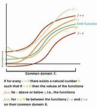

= eco 2020-07-18
:toc:

---

== BeiDou begins 词汇解说

(eco 2020-7-18 / China / Satellite navigation: BeiDou begins)

China’s home-grown(a.)本国（或本地）制造的（或培养的、教育的） `satnav 卫星导航（=satellite navigation） system` *will soon be fully functional* (尤指机器、组织、机构或体系)（能）起作用的，工作的，运转的

*Will* the West *shun*(v.)避开；回避；避免 a system (*so closely linked with* China’s military power)?

Jul 18th 2020 |

- 北斗开始 +
中国自主研制的卫星导航系统, 将很快全面投入使用 +
西方会回避这个与中国军力紧密连系的卫星系统吗?

`THIRTY-FIVE THOUSAND kilometres` above the island of Borneo, the final piece of `a Chinese infrastructure project` *is floating into place* 到位, 在恰当的位置. The satellite *is* the last *to join* the BeiDou navigation system, which *has taken nearly 30 years* to develop(v.) and build(v.). The state-owned firm *that launched it from Sichuan province* on June 23rd *says* the network of BeiDou satellites *will function(v.)起作用；正常工作；运转 fully* around the end of July. China *sees this as* a moment of triumph 巨大成功；重大成就；伟大胜利. It *marks* the end of `the country’s dependence on America` for `provision 提供；供给；给养；供应品 of a vital 必不可少的；对…极重要的 service`: location data.

- dependence : n. *~ (on/upon sb/sth)* : the state of needing the help and support of sb/sth in order to survive or be successful （生存或成功必需的）依靠，依赖，依存

- 在婆罗洲岛上空35,000公里处，中国的一项基础设施项目的最后一部分, 正在准备就绪。这颗卫星是最后一颗加入北斗导航系统的卫星，北斗导航系统的开发和建设, 花费了近30年时间。6月23日, 在四川发射的国有公司称，北斗卫星网络将在7月底全面运行。中国认为这是一个胜利的时刻。这标志着, 这个国家不再依赖美国提供一项至关重要的服务:位置定位数据。

Satellite-navigation systems *work(v.) on a simple principle* 法则；原则；原理. Each spacecraft *uses* radio waves *to beam*  发射（电波）；播送 the time and its position *to* Earth. `主` Devices that *receive* simultaneous transmissions （电子信号、信息或广播、电视节目的）播送，发射，发送，传输 *from* three or more satellites `谓` *can use* tiny differences in these signals *to work out* 计算出，解出（数学题答案） where the user *is*. All location 定位 satellites *broadcast* 播送（电视或无线电节目）；广播;散布，传播（信息等） timing data [*on the same frequencies* 频率], *so that* `主` a location device `谓` *could*, in theory, *lock on to* whichever 任何一个；无论哪个 satellites (*provide* the best signal), *regardless of* whether they belong to America’s Global Positioning System (GPS), Russia’s GLONASS, Europe’s Galileo 伽利略 or China’s BeiDou.

- 卫星导航系统的工作原理很简单。每个航天器都使用无线电波, 向地球发送时间和位置信息。在地面的设备, 就同时从三个或更多的卫星来接收信号, 就可以利用这些信号间的微小差异, 来确定用户的位置。所有的定位卫星, 都以相同的频率发送"时间数据"，因此理论上, 定位设备可以锁定提供最佳信号的卫星，不管它们是美国的全球定位系统(GPS)、俄罗斯的GLONASS、欧洲的伽利略, 还是中国的北斗。

But `主` *depending on* foreigners *for* a technology (*so critical to* national security) `谓` *has long worried* the Communist Party. `主` *Having to rely on* America `谓` *has caused particular anxiety*. GPS *was* the earliest network *to provide* global coverage, so `GPS-enabled devices` *became* the norm 标准，规范;常态；正常行为 *for* use(v.) by Chinese companies, citizens and soldiers. The system *is owned by* America’s government and *operated by* its air force, which *means* American officials *could decide* --  *say*, in a conflict with China -- *to switch off* 关掉，关上(电灯等) or *degrade  降低，削弱（尤指质量） the signals* coming from GPS satellites. `主` The main purpose of building BeiDou, which *is operated by* China’s space administration, `系` *is* `表` *to give(v.) China full control over* a navigation system it can rely on.

- 但依靠外国人来获得一项对国家安全至关重要的技术，长期以来一直令中国共产党感到担忧。不得不依赖美国, 引起了中国特别的焦虑。GPS是最早提供全球覆盖的网络，因此GPS设备成为中国企业、公民和士兵使用的标准。该系统归美国政府所有，由美国空军操作，这意味着美国官员可以决定——比如说，在与中国发生冲突时——关闭或降低来自GPS卫星的信号。由中国航天局运营的北斗系统的主要目的, 是让中国对其可以依赖的导航系统, 拥有完全控制权。

The placement （对物件的）安置，放置 of the final satellite (55 *have been deployed*, though some *are no longer in use*) is symbolic of `a widening rift`(n.)分裂；分歧；严重不和;断裂；裂缝；裂口  between China and the West in many technological domains. This trend *was highlighted* on July 14th by Britain’s decision *to ban* the use of products made by Huawei, a Chinese tech firm, *in* the country’s 5G telecommunications networks (see article).

- 最后一颗卫星(55颗已被部署，尽管其中一些已不再使用)的部署, 标志着中国和西方, 在许多技术领域的分歧正在扩大。7月14日，英国决定禁止在该国的5G电信网络中, 使用中国科技公司华为的产品，这突出了这一趋势。

Work on BeiDou *began in 1993* and *has involved* three phases. The first two *provided coverage* 提供的数量；覆盖范围（或方式） in China *and then across* the rest of the Asia-Pacific region. *As was the case* 正如……的情况 with GPS, `主` building it `谓` *has focused on* military applications. When the second phase *was being tested* in 2013, the Chinese navy *relied on BeiDou data* during exercises in the South China Sea, according to state media 官方媒体. The third phase *provides* global coverage. It *also affords* 提供；给予 more accuracy, and *allows* users *to send* short text messages and `distress 求救信号 signals`.

- 北斗系统的研制工作, 始于1993年，分为三个阶段。前两个阶段先是覆盖中国，然后覆盖整个亚太地区。就像GPS一样，它的开发主要集中在军事应用上。据官方媒体报道，2013年进行第二阶段测试时，中国海军在南中国海的演习中, 使用了北斗数据。第三阶段覆盖全球。它还提供了更多的准确性，并允许用户发送短文本信息和遇险信号。

China *prefers to publicise*(v.)宣传；推广；宣扬；传播 BeiDou’s `commercial applications` 商业应用,商用. On the day of the final satellite’s launch, state television *trumpeted* an array of uses, *from* `precision crop-planting` and `freight （海运、空运或陆运的）货物；货运 tracking` 跟踪 *to* the guiding 给…领路 of `autonomous taxis` (when they *eventually come into service*). Since 2013 the government *has required* `heavy goods vehicles` and `fishing ships` *to be equipped with* BeiDou devices. `主` Most smartphones *sold in China*, except Apple’s, `谓` *can receive* signals from BeiDou’s satellites.

- 中国更喜欢宣传北斗的商业应用。在最后一颗卫星发射的当天，国家电视台大肆宣传了它的一系列用途，从精确的农作物种植和货运跟踪，到引导无人驾驶出租车(当它们最终投入使用时)。自2013年起，政府要求重型货车和渔船配备北斗设备。除苹果外，在中国销售的大多数智能手机, 都能接收到北斗卫星的信号。

The completion of BeiDou *not only eliminates* 排除；清除；消除 dependency on America. It *also puts* China *ahead technologically*. BeiDou’s satellites *are more advanced than* those of GPS. In the Asia-Pacific, BeiDou *claims accuracy to 10cm*, *compared with* 30cm *offered by GPS*. America *began upgrading(v.) its system* in 1997 *with the deployment of* a new generation of satellites *known as GPS-3* in 1997. It *may take* another 15 years *to complete* this roll-out 新产品发布会；新产品的推出. China *took* just five years *to finish* installing(v.) its latest batch 一批 of 30 BeiDou satellites, which *use* technology *as advanced as GPS-3*.

- 北斗系统的建成, 不仅消除了对美国的依赖。它还使中国在技术上领先。北斗卫星比GPS更先进。在亚太地区，北斗声称精度为10厘米，而GPS则为30厘米。美国从1997年开始升级其系统，并在1997年部署了新一代卫星GPS-3。这可能还需要15年才能完成。中国仅用了五年时间, 就安装完成了最新一批30颗北斗卫星，使用的技术与GPS-3一样先进。

---

== BeiDou begins

China’s home-grown satnav system will soon be fully functional

Will the West shun a system so closely linked with China’s military power?

Jul 18th 2020 |

THIRTY-FIVE THOUSAND kilometres above the island of Borneo, the final piece of a Chinese infrastructure project is floating into place. The satellite is the last to join the BeiDou navigation system, which has taken nearly 30 years to develop and build. The state-owned firm that launched it from Sichuan province on June 23rd says the network of BeiDou satellites will function fully around the end of July. China sees this as a moment of triumph. It marks the end of the country’s dependence on America for provision of a vital service: location data.

Satellite-navigation systems work on a simple principle. Each spacecraft uses radio waves to beam the time and its position to Earth. Devices that receive simultaneous transmissions from three or more satellites can use tiny differences in these signals to work out where the user is. All location satellites broadcast timing data on the same frequencies, so that a location device could, in theory, lock on to whichever satellites provide the best signal, regardless of whether they belong to America’s Global Positioning System (GPS), Russia’s GLONASS, Europe’s Galileo or China’s BeiDou.

But depending on foreigners for a technology so critical to national security has long worried the Communist Party. Having to rely on America has caused particular anxiety. GPS was the earliest network to provide global coverage, so GPS-enabled devices became the norm for use by Chinese companies, citizens and soldiers. The system is owned by America’s government and operated by its air force, which means American officials could decide—say, in a conflict with China—to switch off or degrade the signals coming from GPS satellites. The main purpose of building BeiDou, which is operated by China’s space administration, is to give China full control over a navigation system it can rely on.

The placement of the final satellite (55 have been deployed, though some are no longer in use) is symbolic of a widening rift between China and the West in many technological domains. This trend was highlighted on July 14th by Britain’s decision to ban the use of products made by Huawei, a Chinese tech firm, in the country’s 5G telecommunications networks (see article).

Work on BeiDou began in 1993 and has involved three phases. The first two provided coverage in China and then across the rest of the Asia-Pacific region. As was the case with GPS, building it has focused on military applications. When the second phase was being tested in 2013, the Chinese navy relied on BeiDou data during exercises in the South China Sea, according to state media. The third phase provides global coverage. It also affords more accuracy, and allows users to send short text messages and distress signals.

China prefers to publicise BeiDou’s commercial applications. On the day of the final satellite’s launch, state television trumpeted an array of uses, from precision crop-planting and freight tracking to the guiding of autonomous taxis (when they eventually come into service). Since 2013 the government has required heavy goods vehicles and fishing ships to be equipped with BeiDou devices. Most smartphones sold in China, except Apple’s, can receive signals from BeiDou’s satellites.

The completion of BeiDou not only eliminates dependency on America. It also puts China ahead technologically. BeiDou’s satellites are more advanced than those of GPS. In the Asia-Pacific, BeiDou claims accuracy to 10cm, compared with 30cm offered by GPS. America began upgrading its system in 1997 with the deployment of a new generation of satellites known as GPS-3 in 1997. It may take another 15 years to complete this roll-out. China took just five years to finish installing its latest batch of 30 BeiDou satellites, which use technology as advanced as GPS-3.

---

== Mittelstand 中小型企业 v Middle Kingdom 词汇解说

(eco 2020-7-18 / Europe / Germany’s China policy: Out of date)

Angela Merkel’s `soft China stance` （公开表明的）观点，态度，立场 *is challenged at home*

German businesses *have had enough of* being nice

Jul 16th 2020 | BERLIN

- 中小企业对中央王国 +
安格拉•默克尔(Angela Merkel)对中国的软化立场, 在国内受到了挑战 +
德国企业已经受够了表示友善

ANGELA MERKEL *has always had* Germany’s economic ties with China *in mind* [while *conducting* 组织；安排；实施；执行 `bilateral diplomacy` with the Asian giant]. In the 15 years since she *took over as chancellor* in 2005, German exports to China *have quintupled* 使成五倍, *to* just under €100bn ($110bn), about 3% of GDP. Last year China *was* easily Germany’s largest trade partner, *to the particular benefit of big firms* such as Volkswagen 大众汽车, BMW and Siemens. *To avoid* antagonising(v.)使对立；使生气; 使…敌对 China’s ruling Communist Party, Mrs Merkel *was careful not to take the side 表示支持一方；表明立场 of* the hawks *in the heated debate* last year /and this *over* 由于；关于 whether *to let* Huawei, a Chinese telecoms giant, *bid(v.)出（价）；（尤指拍卖中）喊价 for contracts* to build(v.) Germany’s 5G networks (see article).

- quintuple : /kwɪnˈtuːpl/ => quint-,五，-ple,倍数，词源同triple,quadruple.

- *take sides* : to express support for sb in a disagreement 表示支持一方；表明立场

- over : prep. because of or concerning sth; about sth 由于；关于
.. an argument *over money* 为了钱的争吵

- 德国总理安格拉•默克尔(ANGELA MERKEL)在与中国进行双边外交时，一直把德国与中国的经济关系放在心上。自她2005年就任总理以来的15年里，德国对华出口增长了5倍，接近1000亿欧元(1100亿美元)，约占GDP的3%。去年，中国轻松成为德国最大的贸易伙伴，大众、宝马和西门子等大公司, 尤其从中受益。为了避免激怒中国执政的共产党，默克尔在去年关于是否让中国电信巨头华为投标建造德国5G网络的激烈辩论中, 小心翼翼地不站在鹰派一边。

Her caution 谨慎；小心；慎重 *goes wider*. Mrs Merkel *has also been circumspect*(a.)小心谨慎的；考虑周密的；慎重的 in her comments on China’s recent clampdown 严禁，制止，取缔（非法活动） in Hong Kong. She *emphasised* the need *to “seek dialogue” with* the Chinese government *on the basis of* a “relationship of trust”. But *that means that* she *is increasingly out of step 步调不一致,不合拍 with* the rest of Germany’s political establishment （通常反对变革的）当权派，权势集团；（统称）权威人士. `主` `Leading figures` 领军人物,主要人物,头儿脑儿 in her Christian Democratic Union (CDU) 基督教民主联盟 `谓` *object(v.) 不同意；不赞成；反对 to* her refusal(n.)拒绝；回绝 to criticise(v.) the Chinese government directly. `主` Norbert Röttgen, head of the Bundestag’s （德国及前西德）联邦议院（下院） `foreign-affairs committee` and `a contender 竞争者；角逐者；争夺者 for the CDU leadership`, `谓` *condemned （通常因道义上的原因而）谴责，指责 as* “self-censorship” 审查；检查；审查制度 the German foreign office’s recent advice *to be “particularly careful” about* *posting*(v.) China-critical 批评的；批判性的；挑剔的 comments *on* social media. For Nils Schmid, `foreign-policy spokesman` for the Social Democrats, the CDU’s `junior coalition 联合；结合；联盟 partner`, Germany’s China policy *is “behind the times”*.

- circumspect : /ˈsɜːrkəm-spekt/ => circum-,圈，周围，-spect,看，见respect,spectator.

- Bundestag : /ˈbʊndəsˌtɑːɡ/ N (in Germany and formerly in West Germany) the legislative assembly, which is elected by universal adult suffrage and elects the federal chancellor （德国及前西德）联邦议院（下院）

- condemn :  /kənˈdem/  v. *~ sb/sth (for/as sth)* to express very strong disapproval of sb/sth, usually for moral reasons （通常因道义上的原因而）谴责，指责
.. The editor of the newspaper *was condemned as* lacking integrity. 这家报纸的主编被指责为不够正直。

- 她的谨慎程度更高了。默克尔在评论中国最近对香港的打压时, 也很谨慎。她强调, 有必要在“信任关系”的基础上, “寻求与中国政府对话”。但这意味着她与德国其他政界人士的步调越来越不合拍。她所在的基督教民主联盟(CDU)的主要人物, 反对她拒绝直接批评中国政府。德国联邦议院(Bundestag)外交事务委员会主席、基民盟(CDU)领导人竞争者诺伯特·勒特根(Norbert Röttgen), 谴责德国外交部最近的建议是“自我审查”，即在社交媒体上发布批评中国的言论时“要特别谨慎”。对于基民盟的初级联盟伙伴 -- 社会民主党中的外交政策发言人, 尼尔斯·施密德来说，德国的对华政策, 已经“落后于时代”。

Mr Schmid *speaks not only for* the political elite *but also for* many `business leaders` who *used to be relentlessly 残酷地，无情地 gung-ho （尤指对战斗和战争）偏激的，狂热的，莽撞的 about* China’s potential *but have long since tempered(v.)使缓和；使温和;使（金属）回火 their enthusiasm*. `主` Some 5,500 German companies (with `production sites` in China) `谓` *face hurdles* 难关；障碍;（供人或马在赛跑中跨越的）栏架，跨栏 *ranging from* forced(v.) `technology transfer` 技术移转，技术转让 *to* being required(v.) *to set up* `joint ventures` 合营企业；合资企业. Many *have lost faith in* the possibility of change. “I *would now advise* any `Mittelstand 中小型企业 company` *to stay away from China*,” says Frank Klix, who *used to represent* the `Panjin Economic Development Zone` in Germany *but became frustrated* by the lack of `a level 平的；平坦的 playing-field` 平等竞争环境.

- gung-ho : adj.   /ˌɡʌŋ ˈhəʊ/ ( informal disapproving ) too enthusiastic about sth, without thinking seriously about it, especially about fighting and war （尤指对战斗和战争）偏激的，狂热的，莽撞的 +
=> 来自汉语"工合"，即早期的工业合作组织。被西方人误解成一种激进的，偏激的组织或口号。

- temper :  /ˈtempər/ v. *~ sth (with sth)* ( formal ) to make sth less severe by adding sth that has the opposite effect 使缓和；使温和 +
=> 来自拉丁语 temperare,调节，管控，掌握火候，把控时间，来自 tempus,时间，词源同 temporal. 比喻用法，即掌握好时间。 +
.. Justice *must be tempered with mercy*. 法外尚需施恩。

- hurdle : /ˈhɜːrdl/

- playing-field : 运动草场 / PHRASE You talk about *a level playing field* to mean a situation that is fair, because no competitor or opponent in it has an advantage over another. 平等竞争环境

- 施密德不仅为政治精英说话，也为许多商业领袖说话。这些人过去对中国的潜力一直热情高涨，但很久以前他们就降低了热情。约有5500家在中国设有生产基地的德国企业, 面临各种障碍，从被迫进行技术转让，到被要求成立合资企业。许多人已经对改变的可能性, 失去了信心。“我现在会建议, 所有中小企业远离中国，”弗兰克•克里克斯(Frank Klix)表示。他曾是德国盘锦经济开发区(Panjin Economic Development Zone)的代表，但他对缺乏公平的竞争环境感到失望。

[In early 2019] `主` such concerns `谓` *culminated*  （以某种结果）告终；（在某一点）结束;到绝顶；达到高潮；达到顶点 in `a head-turning 回头率较高的;极其引人注目的 paper` *issued by* `the Federation 联邦；同盟；联盟 of German Industries` (BDI), which *declared that* `主` its hopes of convergence 趋同性 on the rules of *doing business with China* `谓` *had faded* 逐渐消逝;走下坡路，衰退，衰落. In January the VDMA, an association of `German machinery 机械；机器 manufacturers`, *said* `主` the “imbalance” in doing business with China `谓` *had become unacceptable*. Last year the German `Chamber of Commerce` 商会 in China *found that* `主` nearly a quarter of German firms operating in China `谓` *were planning* to remove(v.) all or part of their businesses.

- culminate : /ˈkʌlmɪneɪt/ [ V ] *~ (in/with sth)* ( formal ) to end with a particular result, or at a particular point （以某种结果）告终；（在某一点）结束 +
=> 来自拉丁语culmen,顶点，词源同hill,column.
..  Their summer tour *will culminate* at a spectacular concert in London. 在伦敦举行的一场精彩的音乐会将为他们的夏季巡回演出画上句号。
.. Months of hard work *culminated in success*. 几个月的艰辛工作终于取得了成功。

- convergence  : /kənˈvɜːrdʒəns/ N-VAR The convergence of different ideas, groups, or societies is the process by which *they stop being different and become more similar*. 趋同性 +
=> con-, 强调。-verge, 转，词源同diverge, versus. 即转到一起，汇集。 +
..  ...the need to move towards *greater economic convergence*. …迈向更高的经济趋同性的需要。 +

- 2019年初，这种担忧, 在德国工业联合会(BDI)发表的一份令人震惊的文件中, 达到了顶峰，该文件宣称，与中国在商业规则上趋同的希望, 已经破灭。今年1月，德国机械制造商协会VDMA表示，与中国做生意的“不平衡”, 已变得不可接受。去年，中国德国商会(German Chamber of Commerce in China)发现，近四分之一在华经营的德国企业, 计划取消全部或部分业务。

Challenges at home *compound* 使加重；使恶化 such difficulties abroad. When Midea 美的（品牌名）, a Chinese appliance （家用）电器，器具-maker, *bought* Kuka, a German robotics firm, in 2016, German industry and politicians *realised that* China *had become a lot more than* a loyal customer for its exports. Its “Made in China 2025” strategy *represents a clear challenge to* Germany’s high-value-added export model. China *is now second only to Germany* in global machinery exports.

- 国内的挑战加剧了国外的困难。2016年，当中国家电制造商美的(Midea), 收购德国机器人公司库卡(Kuka)时，德国工业界和政界人士意识到，中国已不仅仅是其出口产品的忠实客户。“中国制造2025”战略, 对德国高附加值出口模式, 构成明显挑战。在全球机械出口方面，中国目前仅次于德国。

Germany’s government *is responding 作出反应；响应 to* this new rivalry 竞争；竞赛；较量 *by edging(v.)（使）徐徐移动，渐渐移动 towards* an industrial policy *that looks more French*. It *has tightened its rules* on foreign investment and *flirted with 冒险；不顾危险后果;调情;玩儿似地想做某事 the idea of* protecting(v.) “strategic” companies *by taking equity （公司的）普通股 stakes* 股本；股份. This shift *has moved* the European Union’s `centre of gravity` （物体的）重心, too. `主` The club, which now *describes China as* a “systemic rival”, `谓` *is granting* （尤指正式地或法律上）同意，准予，允许 governments *more power* to screen(v.)审查，调查（看是否可靠） foreign investments. Germany *will push* to tighten(v.) the EU’s `state-aid 国家补助的 regime` 组织方法；管理体制 [under its presidency 主席的职位（或任期等）；总统的职位（或任期等） of the European Council （市、郡等的）政务委员会，地方议会, which *started* on July 1st].

- *centre of gravity* : n. ( pl. centres of gravity )
the point in an object at which its weight is considered to act （物体的）重心

- regime : （尤指未通过公正选举的）统治方式，统治制度，政权，政体 / a method or system of organizing or managing sth 组织方法；管理体制
.. *Our tax regime* is one of the most favourable in Europe. 我们的税收管理体制, 是欧洲最受欢迎的税收体制之一。

- 为了应对这一新的竞争, 德国政府正在逐步推进一项更像法国化的工业政策。它收紧了"外国在德国投资"的规定，并考虑过通过入股来保护“战略性”的企业。这种转变, 也转变了欧盟的重心。该俱乐部现在将中国描述为一个“系统性竞争对手”，并授予政府更多权力, 来审查外国对德的投资。德国将在7月1日它开始担任欧洲理事会主席期间，来推动加强欧盟的国家援助制度。

*In any event* 无论如何；不管怎样, the idea of German dependence on the Chinese market *can be overdone*(a.)过头的. China *overtook* 超过；赶上 America *as* Germany’s `single biggest trading partner` in 2016, and *it is true that* Germany *is more exposed to China* than other large European economies. Yet `主` Germany’s trade with China, at around €200bn last year, `系` *is* just 8% of its total trade. It *does more business with* the four `central European “Visegrad” countries` alone. Barely 2% of German jobs *depend directly or *indirectly on* Chinese exports, *reckons* Jürgen Matthes of `the Institute of Economic Research` in Cologne.

- Visegrád Group : 维谢格拉集团, 成于2007年4月由波兰、匈牙利、捷克和斯洛伐克的议会领导人开会决定，建立维谢格拉德集团各国议会间的合作对话机制。4个成员国均在2004年5月1日加入了欧洲联盟。 +
image:../../+ img_单词图片/v/Visegrad.jpg[100,100]

- 无论如何，认为德国依赖中国市场的想法, 可能有些过头了。2016年，中国取代美国成为德国最大的单一贸易伙伴，德国对中国的敞口, 确实比其他大型欧洲经济体更大。然而，去年德国与中国的贸易额约为2000亿欧元，仅占其贸易总额的8%。它与中欧的四个“维谢格拉德”国家, 有更多的业务往来。科隆经济研究所的Jurgen Matthes认为，德国仅有2%的就业, 直接或间接地依赖于中国的出口。

However, `主` `high-value-added 高附加值的 products` that Germany *excels(v.)擅长；善于；突出 in*, such as cars, machinery 机械；机器, `electrical components` 电子元件 and chemicals, `谓` *account for 70%* of German exports to China. Their makers *include* mid-size firms *but also* blue-chips 蓝筹股；绩优股 that *traditionally enjoy* a hearing 审讯；审理；听审；听证会 in Germany’s ministries （政府的）部. `主` *Take* Volkswagen 大众汽车, which *along with* Daimler 戴姆勒（德国汽车制造商） and BMW `谓` *has a huge office* in Beijing. VW *entered China* in 1985 *through* a joint venture, and now *runs 33 factories* in the country. Global carmakers *cannot ignore* the gargantuan 巨大的；庞大的 Chinese market, says Stephan Wöllenstein, vw’s boss in China, which *accounts for* fully 40% of his firm’s sales. Other parts of German industry *remain [as keen as VW]* to tap(v.)利用，开发，发掘（已有的资源、知识等） Chinese growth.

- excel : [ V ] *~ (in/at sth/at doing sth)* to be very good at doing sth 擅长；善于；突出 +
=> ex-, 向外。-cel, 升出，升高，词源同hill, column, culminate. +
.. She *has always excelled in* foreign languages. 她的外语从来都是出类拔萃。

- Blue Chips : 蓝筹股. 是指长期稳定增长的、大型的、传统工业股及金融股。“蓝筹”一词源于西方赌场，在西方赌场中，有三种颜色的筹码、其中蓝色筹码最为值钱。

- gargantuan :  /ɡɑːrˈɡæntʃuən/ => 来自法语小说人名Gargantua,食人怪兽。来自gargle, 喉咙，漱口。

- 然而，德国擅长的高附加值产品，如汽车、机械、电气零部件和化学品，占德国对华出口的70%。他们的制造商包括中等规模的公司，但也有传统上在德国各部委享有听证会的蓝筹股。以大众汽车(Volkswagen)为例，它与戴姆勒(Daimler)和宝马(BMW)一起在北京有一个巨大的办事处。大众于1985年通过合资企业的形式进入中国，目前在中国经营着33家工厂。全球汽车制造商不能忽视庞大的中国市场，大众在中国的老板斯蒂芬·沃伦斯坦(Stephan Wöllenstein)说，中国占大众公司销售额的整整40%。德国工业的其他领域仍然像大众一样, 热衷于想利用中国的增长。

This *helps to explain* Mrs Merkel’s apparent soft-pedalling 低调处理; 降低…的调门; 对…轻描淡写 on policy to China. Despite `fierce 强烈的；猛烈的 pressure` from America, government colleagues, `intelligence agencies` and from `MPs 议员(=Member of Parliament) across the spectrum` 范围；各层次；系列；幅度, including her own CDU, she *still refuses to bar* Huawei *from* building(v.) Germany’s 5G network. She *may fear that* `主` Chinese retribution 严惩；惩罚；报应 *exacted(v.)实施;使…付出 (代价) on* German carmakers -- a threat *dangled* 悬垂；悬挂；悬荡；悬摆 by Beijing’s ambassador in Berlin -- `谓` *would be too much for* 使某人承受不了;太多；太难；非…力所能及 a fragile 易碎的；易损的;虚弱的 economy *crawling 爬行;缓慢行进 out of recession* amid 在…过程中；在…中 transatlantic  横渡大西洋的；横越大西洋的 trade tensions.

- retribution => re-,向后，往回，-trib,给予，词源同 tribute,contribution.引申词义惩罚，报应。

- exact : V-T If someone *exacts* revenge *on* a person, they have their revenge on them. 实施 / V-T If something exacts a high price, it has a bad effect on a person or situation. 使…付出 (代价)

- 默克尔在对华政策上明显软化的原因。尽管有来自美国、政府同僚、情报机构, 和包括她自己的基民盟在内的各行各业议员的巨大压力，她仍然拒绝阻止华为来建设德国的5G网络。她可能是担心中国会对德国汽车制造商施加报复, 这威胁会由中国驻柏林大使发出. 中国的报复会令本已脆弱的德国经济更难承受. 而德国经济如今正在艰难地从跨大西洋(欧美间的)贸易紧张局势中爬出来.

Mrs Merkel *also carries a “political conviction”* 坚定的看法（或信念） that `主` *trying to contain(v.) China* `谓`  *carries(v.) more risks than rewards*, *argues* Thorsten Benner at the Global Public Policy Institute in Berlin. `主` How to accommodate(v.)顺应，适应（新情况） China’s rise `系` *is* `a leitmotif （书、艺术品等的）中心思想，主题，主旨;（音乐的）主旋律，主导主题 of the speeches` she *made* during her 12 trips to the country’s capital and hinterland 内陆；腹地；内地 in past years (see chart 2). She *wants* China *to help* shape(v.) rules on `artificial intelligence` and `genetics` *to avoid* *cleaving*  劈开；砍开；剁开 the world *into* competing technological hemispheres.

- leitmotif : /ˈlaɪtməʊtiːf/ => 来自德语leitmotiv,主旨，leit-,引导，词源同lead,motiv-,动机，词源同motive.

- 柏林全球公共政策研究所(Global Public Policy Institute)的托尔斯滕·本纳(Thorsten Benner)认为，默克尔还带有一种“政治看法”，即试图遏制中国所带来的风险, 会大于从中得到的回报。如何适应中国的崛起, 是她在过去几年中12次访问中国首都和内陆地区期间 所发表演讲的一个主旨(见表2)。她希望中国能帮助建立人工智能和遗传学领域的规则，以避免世界分裂为两个相互竞争的技术领地(各自半个地球)"。

*Echoing* 重复，附和（想法或看法） the EU’s new position 观点；态度；立场, Mrs Merkel *has largely ditched*  摆脱；抛弃；丢弃 *talk of China as* a “strategic partner”, *describing it as* a “competitor” *with which* Germany *has “profound differences”*. But she *still hoped* to find(v.) areas of partnership 合作领域, notably *on* `climate change` and `development in Africa`, *at an EU-China summit* (in Leipzig) (in September) (*to be attended* by all 27 European heads of government). In June the summit *was postponed*, *ostensibly 表面上；外表 due to* the pandemic. Mrs Merkel *hopes to revive 重新使用；使重做;重新上演 it*.

- 与欧盟的新立场相呼应，默克尔在很大程度上, 摒弃了将中国视为“战略伙伴”的说法，将其描述为德国与其存在“深刻分歧”的“竞争对手”。但她仍希望在9月份在莱比锡举行的欧盟-中国峰会上, 找到合作领域，特别是在气候变化和非洲的发展方面. 此次峰会, 所有27位欧洲政府首脑都将出席。6月，峰会被推迟，表面上是因为疫情关系。默克尔希望重新召开它。

However, `主` the chancellor’s （德国或奥地利的）总理 hopes of *docking （使船）进港，停靠码头，进入船坞 China into* the multilateral system `谓` *have started to look a little forlorn*(a.)不大可能成功的；难以实现的. A new generation of analysts and politicians in Germany *casts a more sceptical eye on* China *than* its old-school sinologists 汉学家，研究中国文化者. “The chancellor *is brilliant*, but perhaps *still thinking* in a pre-Xi world,” *says* Johannes Vogel, an MP for the liberal  （政治经济上）自由的，开明的；支持（社会、政治或宗教）变革的 `Free Democratic Party`. Mrs Merkel *will leave office* next year.

- forlorn : /fəˈlɔːn/ a. unlikely to succeed, come true, etc. 不大可能成功的；难以实现的 / ( of a person 人 ) appearing lonely and unhappy 孤苦伶仃的；孤独凄凉的 +
=> for-, 完全的。lorn, 失去，词源同lose. 原义为毁坏的，完全丧失的。绝望义来自英语短语forlorn hope(1570s), 完全失去希望的，而hope实则为荷兰语hoop的讹误，军队，部队，词源同英语词heap. 类似于日本的敢死队，通常带有自杀式使命。类似演变参照humble pie. +
.. She waited *in the forlorn hope that* he would one day come back to her. 她几乎毫无指望地等待他有一天会回到她的身边。

- 然而，默克尔想让中国加入多边体系的希望, 已开始变得有些渺茫了。比老派的汉学家, 德国新一代的分析人士和政治家们, 对中国更持怀疑态度。自由开明的自由民主党的议员约翰内斯•沃格尔(Johannes Vogel)表示:“总理很聪明，但她或许还在用"习当选之前的世界"的观点, 来思考问题。” 默克尔将于明年离任。

None of this *signals*(v.)标志；表明；预示 “decoupling”(n.) of the sort (Mike Pompeo, America’s secretary of state, *has urged [on* Europe]). But Germany *needs* a “significant 有重大意义的；显著的 rebalancing”, says Mr Benner, who *suggests* it *should nurture*(v.)养育；养护；培养;扶持；帮助；支持 European capabilities (*in* `critical infrastructure` like 5G), *tell* companies (that *have bet on 下赌注（于）；用…打赌 China*) they *will no longer enjoy* political cover, and *assemble(v.)聚集；集合；收集 alliances(n.)联盟，同盟 [with* `like-minded 想法相同的；志趣相投的 countries` (*at risk of* Chinese `economic coercion`(n.)强迫；胁迫), such as Australia and South Korea]. In German business and politics *alike*, the winds *are changing*.

- urge : v.  *~ sth (on/upon sb)* to recommend sth strongly 大力推荐；竭力主张

- 这些都不是美国国务卿迈克·庞皮欧(Mike Pompeo)对欧洲敦促的那种“脱钩”的信号。但本纳表示，德国需要“重大的再平衡”。他建议，德国应该在5G等关键基础设施方面培养欧洲自己的能力，告诉押注中国的公司它们将不再享有政治掩护，并与澳大利亚和韩国等志同道合、面临中国经济胁迫风险的国家结成联盟。在德国商界和政界，风向都在改变。

---

== Mittelstand v Middle Kingdom

Angela Merkel’s soft China stance is challenged at home

German businesses have had enough of being nice

Jul 16th 2020 | BERLIN

ANGELA MERKEL has always had Germany’s economic ties with China in mind while conducting bilateral diplomacy with the Asian giant. In the 15 years since she took over as chancellor in 2005, German exports to China have quintupled, to just under €100bn ($110bn), about 3% of GDP. Last year China was easily Germany’s largest trade partner, to the particular benefit of big firms such as Volkswagen, BMW and Siemens. To avoid antagonising China’s ruling Communist Party, Mrs Merkel was careful not to take the side of the hawks in the heated debate last year and this over whether to let Huawei, a Chinese telecoms giant, bid for contracts to build Germany’s 5G networks (see article).

Her caution goes wider. Mrs Merkel has also been circumspect in her comments on China’s recent clampdown in Hong Kong. She emphasised the need to “seek dialogue” with the Chinese government on the basis of a “relationship of trust”. But that means that she is increasingly out of step with the rest of Germany’s political establishment. Leading figures in her Christian Democratic Union (CDU) object to her refusal to criticise the Chinese government directly. Norbert Röttgen, head of the Bundestag’s foreign-affairs committee and a contender for the CDU leadership, condemned as “self-censorship” the German foreign office’s recent advice to be “particularly careful” about posting China-critical comments on social media. For Nils Schmid, foreign-policy spokesman for the Social Democrats, the CDU’s junior coalition partner, Germany’s China policy is “behind the times”.

Mr Schmid speaks not only for the political elite but also for many business leaders who used to be relentlessly gung-ho about China’s potential but have long since tempered their enthusiasm. Some 5,500 German companies with production sites in China face hurdles ranging from forced technology transfer to being required to set up joint ventures. Many have lost faith in the possibility of change. “I would now advise any Mittelstand company to stay away from China,” says Frank Klix, who used to represent the Panjin Economic Development Zone in Germany but became frustrated by the lack of a level playing-field.

In early 2019 such concerns culminated in a head-turning paper issued by the Federation of German Industries (BDI), which declared that its hopes of convergence on the rules of doing business with China had faded. In January the VDMA, an association of German machinery manufacturers, said the “imbalance” in doing business with China had become unacceptable. Last year the German Chamber of Commerce in China found that nearly a quarter of German firms operating in China were planning to remove all or part of their businesses.

Challenges at home compound such difficulties abroad. When Midea, a Chinese appliance-maker, bought Kuka, a German robotics firm, in 2016, German industry and politicians realised that China had become a lot more than a loyal customer for its exports. Its “Made in China 2025” strategy represents a clear challenge to Germany’s high-value-added export model. China is now second only to Germany in global machinery exports.

Germany’s government is responding to this new rivalry by edging towards an industrial policy that looks more French. It has tightened its rules on foreign investment and flirted with the idea of protecting “strategic” companies by taking equity stakes. This shift has moved the European Union’s centre of gravity, too. The club, which now describes China as a “systemic rival”, is granting governments more power to screen foreign investments. Germany will push to tighten the EU’s state-aid regime under its presidency of the European Council, which started on July 1st.

In any event, the idea of German dependence on the Chinese market can be overdone. China overtook America as Germany’s single biggest trading partner in 2016, and it is true that Germany is more exposed to China than other large European economies. Yet Germany’s trade with China, at around €200bn last year, is just 8% of its total trade. It does more business with the four central European “Visegrad” countries alone. Barely 2% of German jobs depend directly or indirectly on Chinese exports, reckons Jürgen Matthes of the Institute of Economic Research in Cologne.

However, high-value-added products that Germany excels in, such as cars, machinery, electrical components and chemicals, account for 70% of German exports to China. Their makers include mid-size firms but also blue-chips that traditionally enjoy a hearing in Germany’s ministries. Take Volkswagen, which along with Daimler and BMW has a huge office in Beijing. VW entered China in 1985 through a joint venture, and now runs 33 factories in the country. Global carmakers cannot ignore the gargantuan Chinese market, says Stephan Wöllenstein, vw’s boss in China, which accounts for fully 40% of his firm’s sales. Other parts of German industry remain as keen as VW to tap Chinese growth.

This helps to explain Mrs Merkel’s apparent soft-pedalling on policy to China. Despite fierce pressure from America, government colleagues, intelligence agencies and from MPs across the spectrum, including her own CDU, she still refuses to bar Huawei from building Germany’s 5G network. She may fear that Chinese retribution exacted on German carmakers—a threat dangled by Beijing’s ambassador in Berlin—would be too much for a fragile economy crawling out of recession amid transatlantic trade tensions.

Mrs Merkel also carries a “political conviction” that trying to contain China carries more risks than rewards, argues Thorsten Benner at the Global Public Policy Institute in Berlin. How to accommodate China’s rise is a leitmotif of the speeches she made during her 12 trips to the country’s capital and hinterland in past years (see chart 2). She wants China to help shape rules on artificial intelligence and genetics to avoid cleaving the world into competing technological hemispheres.

Echoing the EU’s new position, Mrs Merkel has largely ditched talk of China as a “strategic partner”, describing it as a “competitor” with which Germany has “profound differences”. But she still hoped to find areas of partnership, notably on climate change and development in Africa, at an EU-China summit in Leipzig in September to be attended by all 27 European heads of government. In June the summit was postponed, ostensibly due to the pandemic. Mrs Merkel hopes to revive it.

However, the chancellor’s hopes of docking China into the multilateral system have started to look a little forlorn. A new generation of analysts and politicians in Germany casts a more sceptical eye on China than its old-school sinologists. “The chancellor is brilliant, but perhaps still thinking in a pre-Xi world,” says Johannes Vogel, an MP for the liberal Free Democratic Party. Mrs Merkel will leave office next year.

None of this signals “decoupling” of the sort Mike Pompeo, America’s secretary of state, has urged on Europe. But Germany needs a “significant rebalancing”, says Mr Benner, who suggests it should nurture European capabilities in critical infrastructure like 5G, tell companies that have bet on China they will no longer enjoy political cover, and assemble alliances with like-minded countries at risk of Chinese economic coercion, such as Australia and South Korea. In German business and politics alike, the winds are changing.

