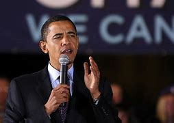

= eco 2020-08-01
:toc:

---

== Tearing up the welcome mat 小地毯；垫子 词汇解说

(eco 2020-8-01 / International / Migration after covid-19: Tearing up the welcome mat)

When covid-19 *recedes*, *will* global migration *start again*?

Many curbs on immigrants *could outlast*(v.)比…持续时间长 the pandemic

Aug 1st 2020 | DUBAI, JOHANNESBURG, SINGAPORE, SYDNEY, TOKYO AND WASHINGTON, DC

- mat +
image:../../+ img_单词图片/m/mat.jpg[100,100]

- *LAY, PUT, ROLL, ETC. OUT THE WELCOME MAT (FOR SB)* : ( especially NAmE ) to make sb feel welcome; to try to attract visitors, etc. 使感到受欢迎；设法吸引（客人等）

- 撕掉欢迎地毯
当covid-19消退时，全球移徙是否会再次开始?
许多对移民的约束限制, 可能会比疫情更持久

EVERY WEEKEND `the removal 搬迁；迁移 vans`  搬家卡车 *come to* a leafy suburb of Dubai. Expatriates 居住在国外的人；侨民 *are packing up* 打点（行装）. The United Arab Emirates (UAE), of which Dubai *is* part, *will lose* 10% of its population this year, *reckons* Nasser al-Shaikh, an `ex-finance minister` 前财政部长. Covid-19 *has devastated* 彻底破坏；摧毁；毁灭 the Gulf’s trade-and-transport hub. Emirates, Dubai’s airline, *says* it *may cut* 30% of its roughly 100,000 staff.

- 每个周末，搬家车都会来到绿树成荫的迪拜郊区。外籍人士正在收拾行装。据前财政部长Nasser al-Shaikh估计，包括迪拜在内的阿拉伯联合酋长国(UAE), 今年的人口将减少10%。Covid-19摧毁了海湾地区的贸易和运输枢纽。迪拜的阿联酋航空公司(Emirates)表示，它可能会在大约10万名员工中裁员30%。

Nearly all of those (*losing their jobs* in the UAE) *are* migrants, who are almost 90% of the population. Without a job, they *have to leave the country*. *This is irksome(a.)  使人烦恼的；令人生气的 enough* if they *are* bankers 银行老板（或要员）；银行家 or architects 建筑师. For those who *used to wash(v.) dishes* in hotels /or *lay(v.)（尤指轻轻地或小心地）放置，安放，搁; （在某物上）摊开，涂，敷；用一层…覆盖 bricks* on building sites that *are now shuttered*(v.)以百叶窗遮闭, it *can be a nightmare*. Some 500,000 Indians in the UAE *have registered to be evacuated* （把人从危险的地方）疏散，转移，撤离; less than half *have been*.

- irksome : irk·some  adj.   /ˈɜːksəm/
( formal ) annoying or irritating 使人烦恼的；令人生气的
SYN tiresome +
=> irk,愤怒，-some,形容词后缀。来自中古英语irken,厌倦的，厌恶的，可能来自PIE*werg,工作，词源同work,organ.词义激怒可能是受ire的影响。 +
.. I found the restrictions *irksome*. 我对那些限制感到很烦。

- 在阿联酋，几乎所有失去工作的人, 都是移民，他们几乎占人口的90%。没有工作，他们不得不离开这个国家。如果他们是银行家或建筑师，这就够烦人的了。对于那些曾经在酒店洗盘子, 或在现在已经关闭的建筑工地砌砖的人来说，这简直是一场噩梦。大约50万在阿联酋的印度人, 已经登记准备撤离; 其中有不到一半的人已经离开了。

Many blue-collar 从事体力劳动的；蓝领的 migrants *have waited so long for flights*(n.) (that they *have blown 炸开;吹 their savings* 储蓄；存款). Asad (*not* his real name) *got a $1,100 pay-off*  辞退金；遣散费;回报；报偿 when he *lost his construction job* in April, but *has had to spend nearly all of it on food and other necessities*, which *are far costlier* 昂贵的；代价高的 in Dubai *than* back home in Pakistan. This week *he was huddling* （通常因寒冷或害怕）挤在一起 outside the airport *for a cigarette* before a flight to Lahore 巴基斯坦一城市名. “Two years [and] *I go home with almost nothing*,” he says. Some of his friends *are even worse off* 恶化，情况更坏；愈加贫穷的；每况愈下的: they *still owe(v.)欠（债）；欠（账） money to* the labour brokers 经纪人；掮客 who *brought them to the Gulf* in the first place.

- 许多蓝领移民等待航班的时间太长，以至于他们花光了自己的积蓄。今年4月，阿萨德(化名)失去了建筑工作，得到了1100美元的补偿，但他不得不将这笔钱几乎全部花在食品和其他必需品上，这些东西在迪拜比在巴基斯坦要贵得多。本周，在飞往拉合尔(Lahore)的航班前，他挤在机场外, 吸了支烟。“两年了，我回家时几乎一无所有，”他说。他的一些朋友的情况甚至更糟:他们仍然欠劳工经纪人的钱，是他们当初把他们带到海湾地区的。

Covid-19 *has immobilised 使不动；使不能正常运作 the world*. Planes *are grounded*  使停飞；阻止…起飞, borders *are closed*, people *are hunkered 蹲；蹲坐；蹲下 down at home*. Every country *has restricted travel* because of the coronavirus -- *issuing more than 65,000 rules* in total. Some countries *are starting to open up* but *it will be a long time* before people *can globetrot(v.)环球旅行 as freely as before*.

- *hunker DOWN* : /ˈhʌŋkər/  (1) ( especially NAmE ) to sit on your heels with your knees bent up in front of you 蹲；蹲坐；蹲下 / (2) to prepare yourself to stay somewhere, keep an opinion, etc. for a long time 准备长期待在某处（或坚持某观点等） /
(3) to refuse to change an opinion, way of behaving, etc. 拒绝改变观点（或行为方式等） +
=> 来自苏格兰语，词源不详，或同huckster. +
.. He *hunkered down* beside her. 他挨着她蹲下。 +
image:../../+ img_单词图片/hunker/hunker.jpg[100,100]

- Covid-19使世界停滞不前。飞机停飞，边境关闭，人们被迫呆在家里。每个国家都因为冠状病毒而限制旅行——总共颁布了超过65,000条规则。一些国家已经开始重新开放，但人们还需要很长时间, 才能像以前那样自由地环球旅行。

[For tourists who *have to take a domestic holiday* instead of a glamorous foreign one], `主` global immobility `系` *is annoying*. For would-be migrants, *it can be life-shattering* 令人非常惊愕难过的；给人以极大打击的. `主` Millions (who *would have set off* 启程; 出发 *to start a new life* this year) `谓` *cannot*. `主` Workers who *might have quadrupled 使成4倍; 成为4倍 their wages* `谓` *will remain poor*. `主` Students who *might have stretched their minds* on foreign campuses `谓` *will stay at home*.

- 对于那些不得不在国内度假, 而不是享受迷人的外国假期的游客来说，无法出国是很闹人的。对于想要移民的人来说，这可能会毁掉他们的生活。数百万本可以在今年开始新生活的人, 现在却没法这样做了。那些工资本来将要翻两番的工人, 现在只能依然处于贫穷状态中。那些本可以在国外学校开拓自己思想的学生, 只能留在国内。

`主` Tens of millions of migrants who *have already moved* `谓` now *face deportation* 驱逐出境, *having lost their job*, *according to* the International Labour Organisation. Millions *have gone home to places* like the Philippines, India and Ukraine. Millions more *are stranded*(v.)使滞留;使搁浅, sometimes [in crowded conditions that *foster* the spread of the virus].

- 根据国际劳工组织(International Labour Organisation)的数据，已经迁移的数千万移民, 现在面临被驱逐出境，失去工作。数百万人已经回到老家, 如菲律宾、印度和乌克兰等地。还有数百万人被滞留在国外，有时处在拥挤的条件下，这种条件会助长病毒的传播。

Locals *are not always sympathetic*. `主` Malaysia, which *used to welcome* Muslim Rohingya refugees, `谓` *has started* pushing(v.) their vessels 大船；轮船 back into the sea. Italy *has stepped up 增加(数量等);提高(速度、强度等) efforts* to turn(v.) back  (使)返回;(使)折回 boatloads 一船的装载量；一船人；一船物品 of Africans. A Kuwaiti actress *suggested that* migrant workers, who are 70% of the labour force in Kuwait, *be thrown into* the desert *to free up* space in hospitals.

- Rohingya 罗兴亚族（ 缅甸的一个穆斯林族群）

- 当地人并不总是充满同情。过去一直欢迎穆斯林罗兴亚难民的马来西亚, 已经开始将他们的船只推回大海。意大利已经加紧努力, 将满载非洲人的船只返回回去。一位科威特女演员, 建议把占科威特劳动力70%的移民工人, 扔到沙漠里，以便给医院腾出空间。

`主` Global remittance(n.)汇款金额;汇付；汇款 flows, which are over three times bigger than `foreign aid to poor countries`, `谓` *will fall by 20%* this year, *predicts* the World Bank. `主` Families (that *used to rely on* cash (from a migrant son or aunt 姑母；姨母；伯母；婶母；舅母) *to see 送；护送;帮助（或支持）某人度过 them through* hard times) `谓` *are finding that* {times *are suddenly much harder*} and {`主` the flow of cash from abroad `谓` *has dried up*}.

- remittance : /rɪˈmɪtns/ =>  re-回,向后 + -mitt-送,派 + -ance名词词尾

- aunt : the sister of your father or mother; the wife of your uncle 姑母；姨母；伯母；婶母；舅母

- see : v. [ VN + adv./prep. ] to go with sb to help or protect them 送；护送
.. I *saw* the old lady *across (= helped her cross) the road*. 我护送老太太穿过马路。

- *see sb through | see sb through sth* : ( not used in the progressive tenses 不用于进行时 ) to give help or support to sb for a particular period of time 帮助（或支持）某人度过
.. Her courage and good humour *saw her through*. 她靠着顽强的勇气和乐观的性格挺了过来。
.. I only have $20 *to see me through the week*. 我只有20元来维持我这一周了。

-  世界银行预测，今年全球汇款流量将下降20%，而(作为"扶贫资金"最大来源的)全球汇款流量, 是外国对贫困国家援助的三倍多。那些过去依靠 移民到国外的儿子, 或父母的姐妹们, 所提供的现金, 来度过难关的家庭, 他们发现，生活情况突然变得更加艰难，同时来自海外的汇款流入也已枯竭。

`主` Businesses that *depend on* mobile labour `谓`  *have been hobbled*  蹒跚；跛行;阻止；妨碍. Pokka Singapore, a drinks-maker, *employs*(v.) about 120 Malaysians who *used to commute* （乘公共汽车、火车、汽车等）上下班往返，经常往返（于两地） across the border *to Singapore*. When the borders *closed*, more than half *decided to remain in* Malaysia, says Rieko Shofu, the firm’s boss. She *has gone without* 缺少（所需之物）；没有（常有之物等） half her Malaysian workforce [for months], with no end in sight.

-  *go without* : (PHRASAL VERB) 缺少（所需之物）；没有（常有之物等） If you *go without* something that you need or usually have or do, you do not get it or do it.
.. I have known what it is like *to go without food for days*...
我知道几天没有东西吃是什么滋味了。

- 依赖流动性劳动力的企业, 已经举步维艰。Pokka Singapore是一家饮料制造商，雇佣了大约120名马来西亚人，他们过去经常往返于边境和新加坡之间来上班。该公司的老板Rieko Shofu说，当边境关闭时，超过半数的人决定留在马来西亚。她已经失去了一半的马来西亚劳工, 好几个月了，而且看不到结束的迹象。

Travel curbs(n.) *have made* cross-border investment *harder*. Before *committing(v.) money to a venture*, you *need to be “able to walk* the factory floor” and “*physically validate* what you *read* in the PowerPoint presentation 提出（或展示、解释等）的方式,” *says* Stephen Forshaw of Temasek, Singapore’s `sovereign-wealth fund` 主权财富基金. Now, if you *are not* already there, you can’t.

- validate : /ˈvælɪdeɪt/ v. to prove that sth is true 证实；确认；确证 / to state officially that sth is useful and of an acceptable standard 批准；确认…有效；认可 +
=> -val-强壮,价值 + -id形容词词尾. 词源同 value.引申词义有效的。 +
.. *to validate a theory* 证实理论
.. Check that their courses *have been validated* by a reputable organization. 要确保他们的课程获得有声望机构的承认。

- presentation :[ U ] the way in which sth is offered, shown, explained, etc. to others 提出（或展示、解释等）的方式
.. Improving *the product's presentation* (= the way it is wrapped, advertised, etc.) should increase(v.) sales. 改进产品的装潢将会提高销售量。
.. I admire *the clear, logical presentation* of her arguments. 我很欣赏她的论证，言辞清晰且有条理。

- 新加坡主权财富基金淡马锡(Temasek)的斯蒂芬•福肖(Stephen Forshaw)表示，在投资一家企业之前，你需要“能够在工厂里实地考察”，并“切实验证你在PowerPoint演示文稿中所读到的内容的真假性”。现在，如果你还做不到这一点，你就无法投资。

*Even if* tourism 旅游业；观光业 and business travel *return to something resembling 看起来像；显得像；像 normal* [as the pandemic *fades*], some restrictions on migration *may remain*. Where people *had* `a settled 不大可能变动的；稳定的 settled right` *to move* which *was temporarily suspended* for health reasons, within the European Union for example, that right *will surely be restored*. But where `主` permission (to move) `谓` *is granted*  （尤指正式地或法律上）同意，准予，允许 by the host government 东道国政府, it *may become permanently harder*.

- settled : a. not likely to change or move 不大可能变动的；稳定的 / comfortable and happy with your home, job, way of life, etc. 舒适自在的；（对住所、工作、生活方式等）习惯的 +
.. *settled weather* 持续不变的天气
.. *a settled way* of life 安定的生活方式

- 随着疫情的消退，即使旅游业和商务旅行恢复到类似正常的水平，对移民的一些限制仍可能保留。在那些"人们有着稳定的权力能自由迁移"的地方, 例如欧盟, 虽然这些地方因疫情原因而暂时封禁, 但自由迁移的权力将来必定会恢复. 但在那些迁移自由需要东道国政府批准的地方，自由迁移就可能永久地比较困难.

Much *will depend on* how covid-19 *affects* people’s view of immigrants. Fear *could make them more hostile*. Many *will conclude that* letting(v.) in foreigners *is* a health risk (though the vast majority of travellers *are not* migrants). Because the virus *originated in China*, bigots （种族、宗教或政治的）顽固盲从者，偏执者 in many countries *have mistreated* 虐待 people who *look* Chinese. Bigots in China, meanwhile, *have evicted* （尤指依法从房屋或土地上）驱逐，赶出，逐出 black immigrants *from* their homes and *barred them from hotels*, after *hearing a rumour* that Africans *were likely to be infected*. Future migrants *will not quickly forget* footage （影片中的）连续镜头，片段 of `a no-blacks sign` on a McDonald’s in Guangzhou.

- bigot :  /ˈbɪɡət/ n. a person who has very strong, unreasonable beliefs or opinions about race, religion or politics and who will not listen to or accept the opinions of anyone who disagrees （种族、宗教或政治的）顽固盲从者，偏执者 +
=> 来自口语by god , 形容某些常常以神之名拿神说事的人。

- evict : v. /ɪˈvɪkt/  *~ sb (from sth)* to force sb to leave a house or land, especially when you have the legal right to do so （尤指依法从房屋或土地上）驱逐，赶出，逐出 +
=> e-, 向外。-vict,胜利，词源同victory,convince. 即胜利赶走，驱逐。

- 这在很大程度上将取决于新冠肺炎如何影响人们对移民的看法。恐惧可能会让他们更具敌意。许多人会得出结论，让外国人入境会带来健康风险(尽管绝大多数的旅行者不是移民)。由于病毒起源于中国，许多国家中的偏执的人, 对看起来像中国人的人, 施加了虐待。与此同时，在听到非洲人可能会受到感染的传言后，中国的偏执分子也将黑人移民赶出了家园，并禁止他们入住酒店。未来的外来移民, 是不会很快忘记广州麦当劳上的"禁止黑人进入"的标识的。

*With economies reeling* 踉跄；摇摇晃晃地挪动；蹒跚;似乎在不停旋转；仿佛天旋地转, many *will also conclude that* it is time *to stop* immigrants *from competing(v.) with* natives 本地人；当地人;本地人；当地人 *for* scarce(a.)缺乏的；不足的；稀少的 jobs. In countries where lots of migrants *have been laid off* （通常指因工作岗位不足而）辞退，解雇，使下岗 and *are allowed to live on the dole*  失业救济金, locals *may resent* 愤恨；感到气愤；愤愤不平 the expense.

- dole : /doʊl/ => 词源同deal, 分发，分配，发配。引申义施舍或失业救济金。

- 随着经济的摇摇欲坠，许多人也会得出结论，现在是时候阻止移民来与当地人争夺稀缺的工作了。在许多移民被解雇并被允许靠救济金生活的国家，当地人可能会对这笔费用的支出感到不满。

The pandemic *might also hurt* `illicit 非法的；违法的 migrants`. `主` Some of `the snooping 窥探；打探；探听 tools` that governments *have introduced* to trace(v.) the spread of covid-19 `谓` *could outlast 比…持续时间长 it*, *making it harder* to work(v.) in the shadows. In China, *to take the most extreme example*, malls and subways *often deny(v.) entry to* those who lack(v.) an app on their phone *to show* they are healthy, which *no one can get* without a formal address. “It *may become virtually 几乎；差不多；事实上；实际上 impossible* to live(v.) without papers 证明；证件,” *writes* Roberto Castillo of AfricansInChina.net.

- 疫情还可能伤害非法移民。各国政府为了追踪covid-19的传播, 而采用的一些监视工具, 可能会长存下去，这些监视会在明面上运行。在中国，举个最极端的例子， 对于那些手机上没有app来显示自己健康与否的人,
商场和地铁经常拒绝他们进入，没有正式居住地址的人, 是无法进入的。AfricansInChina.net的罗伯托·卡斯蒂略写道:“你没有健康证明的话, 几乎是无法在中国生活下去的。”

In other ways, however, the pandemic *could make* people *friendlier 更友好 towards* immigrants, many of whom *have risked their lives* to do(v.) essential work during the crisis (see chart 1). Health services in rich countries *could not function* without them (see chart 2). Roughly half the doctors in Australia and Israel *are foreign-born*. In America migrants *were* 14% of the population in 2018 but 29% of doctors. `主` Medical research, of the sort (that *will* one day *yield*(v.)出产（作物）；产生（收益、效益等）；提供 a vaccine 疫苗；菌苗), `谓` *depends on* teams of `the most talented minds from around the world` *getting together and collaborating*. Some 40% of `medical and life scientists` in America *are foreign-born*. `主` The Oxford Vaccine Group, which *unveiled* 为…揭幕；揭开…上的覆盖物；拉开…的帷幔;（首次）展示，介绍，推出；将…公之于众 `promising(a.) vaccine trial results`(n.) in July, `谓` *includes* scientists from practically 几乎；差不多；很接近 everywhere.

- 然而，在其他方面，疫情可能会让人们对移民更加友好，他们中的许多人, 在危机期间冒着生命危险做了重要的工作(见表1)。富国中的医疗服务, 离不开他们(见图表2)。澳大利亚和以色列中, 大约有一半的医生是在外国出生的. 2018年时, 美国的移民占总人口的14%，但却占了医生总数的29%。有朝一日会生产出疫苗的那种医学研究，有赖于来自世界各地的最有才华的团队, 聚集在一起合作。在美国，大约40%的医学和生命科学家, 是外国出生的。牛津疫苗集团(Oxford Vaccine Group)在7月份公布了前景看好的疫苗的试验结果，该组织也包括了来自世界几乎各地的科学家。

Immigrants *also do* a big share of the jobs *that “make it possible* for the rest of us *to work safely from home*,” *observes* Doris Meissner of the Migration Policy Institute, a think-tank. They *grow food* (42% of farm workers in America *are foreign-born*), *deliver(v.) things* (18% of industrial truckers) and *disinfect(v.)给…消毒 floors* (47% of `hotel maids` 酒店女仆 and 25% of janitors 看门人). More than half of American `tech giants` *were founded by* immigrants or their children. That *includes* Zoom, Amazon and Google, [without whose products] `remote working` *would be tricky* 难办的；难对付的.

- janitor :  /ˈdʒænɪtər/ N-COUNT A janitor is a person whose job is to take care of a building. 看门人;清洁工;门房 +
=> January（一月）来自古罗马的门户之神Janus的名字，而该神名则来自拉丁语ianua（门）；同样来自这个拉丁语的单词是janitor（门卫）。一月是一年的门户，通过理解January的本义得到词根-jan-“门”，这样janitor应该好记些。 +

- 移民政策研究所 -- 一个智库-- 的Doris Meissner说, 移民做了很大一部分工作，真是因为他们的工作, 才“使我们其他人能够在家中安全地工作”。他们种植粮食(42%的美国农场工人, 是外国出生的)，送货(18%的工业卡车司机是移民), 和楼层消毒(47%的酒店服务员和25%的门卫是移民)。超过一半的美国科技巨头, 是由移民或他们的子女创立的。包括Zoom、亚马逊(Amazon)和谷歌，如果没有它们的产品，远程工作就很难实现。

[With covid-19 *rife*(a.)（坏事）盛行，普遍; 充斥，充满（坏事）], immigration policy *is not at the top of the agenda* anywhere. But *it is bubbling up* （感情）变得越来越强烈. Europe *seems more hostile to* migrants (*crossing* the Mediterranean 地中海). In Australia the opposition Labor Party’s immigration spokeswoman *said* the country *should move away from* its “lazy” reliance(n.) on “cheap” foreign workers who *take “jobs* (Australians could do”).

- rife  /raɪf/ a.  *~ (with sth)* full of sth bad or unpleasant 充斥，充满（坏事） / if sth bad or unpleasant is rife in a place, it is very common there （坏事）盛行，普遍 +
=> 词源同 river,rift.通常用于形容坏事的盛行。

- 在covid-19肆虐的情况下，在任何地方, 移民政策都不列于首要议程。但它的确正越来越受关注。对穿越地中海而到来的移民, 欧洲似乎更加敌视。在澳大利亚，反对党工党的移民发言人表示，该国应该摆脱对“廉价”外国工人的“懒惰”依赖，这些人抢走了“澳大利亚人本可以做的工作”。

Among rich countries the debate *is playing out （使）（戏剧性的事件）逐渐发生；（使）展开 most dramatically* in America. Long before covid-19 *was discovered*, Mr Trump *associated* immigrants *with* germs 微生物；细菌；病菌. He *spoke of* 提起；讲述 “tremendous 巨大的；极大的 `infectious disease` 传染病 … *pouring across the border*” with Mexico. Stephen Miller, a hardline 强硬的；不妥协的 adviser, *had long argued that* public health *could provide a legal justification* 正当理由 for *shutting them out* 把…关在门外;使…不能进入. After the coronavirus *struck*, Mr Trump *enacted* 通过（法律）;颁布；制定法律 a wishlist 意愿清单 of restrictions.

- justification : jus·ti·fi·ca·tion n.   /ˌdʒʌstɪfɪˈkeɪʃn/   n. *~ (for sth/doing sth)* a good reason why sth exists or is done 正当理由
.. *I can see no possible justification* for any further tax increases. 我看不出还能提出什么理由来进一步加税了。

- 在富裕国家中，这场辩论在美国上演得最为戏剧化。早在新冠肺炎被发现之前，特朗普就将移民与细菌联系在一起。他谈到了“巨大的传染性疾病……正越过与墨西哥的边境”。强硬派顾问斯蒂芬•米勒(Stephen Miller)长期以来一直认为，公共卫生可以提供法律依据, 来"将他们(移民)拒之门外"。冠状病毒爆发后，特朗普通过了一系列限制措施的法律。

He *banned* foreign travellers from China. This *did not protect America* since Americans *were free* to return home from covid-19 hotspots. Nonetheless 尽管如此，但是, Mr Trump *praised* his own decisiveness （作出的）决定，抉择. “I *banned* China,” he *repeated*, often.

- 他禁止来自中国的外国游客。这并没有保护到美国，因为美国人可以自由地从其他covid-19热点地区返回美国。尽管如此，特朗普还是称赞了自己的抉择。“我封禁了中国，”他经常重复说。

Immigration to the United States *was falling* even before the pandemic, *thanks to* `① aggressive 好斗的；挑衅的；侵略的；富于攻击性的;气势汹汹的；声势浩大的；志在必得的 enforcement`  执行, ② `reduced(a.) quotas`(n.)定额；限额；配额 and ③ `the eloquence` 口才；雄辩；雄辩术；修辞 with which Mr Trump *tells* migrants `they are not wanted`. The `net increase` in the foreign-born population *was* a mere 200,000 in 2017-18, *down from* over 1m in 2013-14. Mr Trump *seems* eager *to lower*(v.) that number *to* zero.

- quota : /ˈkwəʊtə/ n.
[ C ] the limited number or amount of people or things that is officially allowed 定额；限额；配额 +
-> *a quota system* for accepting refugees 接收难民的限额制度 +
[ C ] an amount of sth that sb expects or needs to have or achieve 定量；定额；指标 +
-> I'm going home now -- *I've done my quota of work* for the day. 我现在要回家了—我已完成了今天的工作指标。 +
=> 来自拉丁语quot,多少，来自PIE*kwo,疑问代词词干，词源同quality,quantity.用于指战士或士兵的供给定额或配额，后词义通用化。

- eloquence :  /ˈelə-kwəns/ +

- 甚至疫情流行之前，美国的移民数量就已经在下降了，这要归功于积极的执法、减少的移民配额, 以及特朗普的雄辩, 告诉移民说不需要他们了。美国的外国出生人口(即移民)的净增长, 从2013-14年的逾100万, 下降到2017-18年的区区20万。看上去特朗普急于将这一数字降至零。

In June he *issued* a “Proclamation 宣言；公告；声明 (*Suspending* `Entry(n.) of Aliens` `Who *Present* a Risk *to* the US Labour Market` *Following* the Coronavirus *Outbreak*)”. It *froze* four types of visa [for the rest of the year]: H-1Bs (for `highly skilled workers`); H-2Bs (for `less-skilled workers`); J visas, for `au pairs`, ``temporary summer workers ``and some academics; and L visas, for professionals who *are moved* within the same company.

- au pairs : /ˌoʊ ˈper/ n. 互惠换工生（以帮做家务、照顾小孩等换取食宿和学习语言的外国年轻人） / adj. 互惠的，换工的

- 今年6月，他发布了一项“公告，在冠状病毒爆发后，暂停"对美国劳动力市场构成风险的外国人"入境”。在今年余下的时间里，它冻结了四种类型的签证: +
.. H-1Bs(高技能工人签证); +
.. H-2Bs(针对低技能工人); +
.. J签证(给互惠换工生、临时暑期工人和一些学者);  +
.. L签证(适用于随着同一家公司进入美国工作的专业人员)。

With every word, they *drop* knowledge

These new rules, *combined with* a near `total shutdown` of `visa offices`, *will destroy* American jobs, *not create* them. Holders of H-1B visas *mostly work in* information technology, where there *is* a skills shortage. Adam Ozimek of Upwork, a freelancing 当自由职业者 platform, *estimates that* `主` the use of IT *to enable* `remote working` `谓` *has reduced* the risk of `job losses` *by between a third and a half*. And a new paper by Britta Glennon of the Wharton School *finds that* when America *restricts* H-1B visas, multinationals 跨国公司 *do not hire* more Americans. They *shift* operations *to* Canada, India and China.

- freelance  : a. earning money by selling your work or services to several different organizations rather than being employed by one particular organization 特约的；自由职业（者）的 / [ V ] to earn money by selling your work to several different organizations 做特约工作；从事自由职业 +
=>  free, 自由的。lance, 矛。原指自由作战的战士，雇佣兵。后用来指自由撰稿人，自由职业者。

- 这些新规定，加上"签证办公室"的几乎全部关闭，将会摧毁而不是创造美国的就业机会。持有H-1B签证的人, 大多在信息技术行业工作，而这一行业存在技能短缺问题。自由职业平台Upwork的亚当•奥兹梅克(Adam Ozimek)估计，利用IT来实现远程工作, 能将失业风险降低三分之一到一半。沃顿商学院(Wharton School)的布丽塔•格伦农(Britta Glennon)的一篇新论文发现，当美国限制H-1B签证时，跨国公司不但不会雇佣更多的美国人。他们反而将业务转移到加拿大、印度和中国。

`主` *Curbing* 控制，抑制，限定，约束（不好的事物） the flow of talent `谓` *will constrict* 限制；限定；抑制；约束 economic growth. *Consider* `the baffling 令人困惑的 decision` *to stop* intra-company 公司内部的 transfers 搬迁；转移；调动；变换. Multinationals *routinely bring in* 引入；请来；邀请 key managers or technicians *from abroad* to solve(v.) bottlenecks （尤指工商业发展的）瓶颈，阻碍，障碍. If they *cannot do this*, their businesses *are less likely to succeed* -- so they *will be less likely to invest in America at all*. “About 80% of my portfolio （个人或机构的）投资组合，有价证券组合 *consists of* at least one founder(n.) who has immigrant roots,” says Joydeep Bhattacharyya, a `venture capitalist` 资本家 in Silicon Valley. “Many *have started* outside the United States, and then the entrepreneur *has moved over* 转变;变更;让位;离职, *employing* a lot of American workers. This year it’*s completely stopped*. *No matter* how well they’re doing, they can’t come.”

- baffle : /ˈbæfl/ v. to confuse sb completely; to be too difficult or strange for sb to understand or explain 使困惑；难住 / n.( technical 术语 ) a screen used to control or prevent the flow of sound, light or liquid （控制声、光、液体等流动的）隔板，挡板，反射板 +
=> 拟声词。 +
.. *I'm baffled* why she hasn't called. 我不明白她为什么没打电话。 +
image:../../+ img_单词图片/b/baffle.jpg[100,100]

- *move over* : ① (PHRASAL VERB) 转变;变更 If you move over to a new system or way of doing something, you change to it. +
-> The government is having to introduce some difficult changes, particularly in *moving over to a market economy*.
政府不得不推行一些艰难的变革，尤其是向市场经济体制的转变。  +
② (PHRASAL VERB) 让位;离职 If someone moves over, they leave their job or position in order to let someone else have it. +

- 限制人才流动, 将限制经济增长。想想"阻止公司内部调动"这样的令人困惑的决定吧。跨国公司通常从国外引进关键管理人员或技术人员, 来解决瓶颈问题。如果他们做不到这一点，他们的生意就不太可能成功——所以他们根本就不太可能在美国投资。硅谷风险投资家乔伊迪普•巴塔查里亚(Joydeep Bhattacharyya)表示:“在我的投资组合中，大约有80%, 其创始人中至少有一位有移民血统。”他说:“许多企业家在美国以外的地方开始创业，然后这些企业家就转移到美国，雇用了很多美国工人。但这种现象今年它完全停止了。因为不管他们做得有多好，他们都无法进入美国。”

*Banning* au pairs *won’t create(v.) jobs for Americans*, either. On the contrary: by *providing* cheap child care, au pairs *make it easier* for American parents *to go out to work*. `主` Families that *couldn’t afford a nanny* （儿童家中的）保姆;奶奶；姥姥 `谓` *can often afford* an au pair because `主` part of the au pair’s compensation  补偿（或赔偿）物；（尤指）赔偿金，补偿金；赔偿 `系` *is* a place to stay /and a chance to learn English.

- 禁止互惠生, 也不会为美国人创造就业机会。相反，通过提供廉价的托儿服务，互惠生能让美国父母更方便外出工作。那些请不起保姆的家庭通常也能请得起互惠生，因为互惠生的部分报酬, 是只要提供他们以住宿和学习英语的机会。

Jason Patwell, a defence contractor  承包人；承包商, *is* a single father of three boys, one of whom *has special needs*  （智力或身体障碍者的）特殊需求. He *was aghast*(a.)惊恐；惊骇 when he *realised that* an au pair *would not be coming*. “I *would love to （表示喜欢，愿意）很想 say* I *have a back-up plan*, but I don’t. I *can throw money at （在某事上）白扔钱 the problem*, and *go into debt*. I’*ll survive* until the end of the summer,” he says.

- aghast :  /əˈɡæst/ a. *~ (at sth)* filled with horror and surprise when you see or hear sth 惊恐；惊骇 +
=> 前缀a-, 加强。-ghast同ghost, 见鬼了。 +
.. Erica *looked at him aghast*(a.). 埃丽卡惊恐地望着他。

-  *THROW MONEY AT STH* : ( disapproving ) to try to deal with a problem or improve a situation by spending money on it, when it would be better to deal with it in other ways （在某事上）白扔钱
.. It is inappropriate simply *to throw money at these problems*. 只是用钱去处理这些问题, 是不适当的。

- 国防承包商杰森·帕特韦尔(Jason Patwell)是三个男孩的单亲父亲，其中一个孩子还需要特殊照顾。当他意识到互惠生不来的时候，他惊呆了。“我真的很想说我有后备计划，但我没有。我可以在这个问题上白白花钱, 然后陷入负债。我能活到夏末”他说。

In worse-off 恶化，情况更坏；愈加贫穷的；每况愈下的 countries, where the state *lacks(v.) the cash* to cushion(v.)（跌倒或碰撞时）起缓冲作用，缓和冲击 the economic shock of covid-19, the debate about migration *is even more fraught*(a.)充满（不愉快事物）的. *Consider* South Africa, where xenophobia(n.)仇外，惧外（对外国人的厌恶或惧怕） *was common*, sometimes lethally 致命地；危害地；极具威胁地 so, even before the pandemic. Like America, South Africa *shares* `a long, porous 多孔的；透水的；透气的 land border` with a large continent 大陆；陆地；洲 where *wages are much lower*. Workers and traders *flock(v.)群集；聚集；蜂拥 there from all over Africa*. The World Bank *estimates that* each one *creates [on average] two jobs* for natives, because migrants *import* skills, *start* businesses and *spend* money. But most South Africans *think otherwise* 不这样认为;有另外的想法. They *are nearly [twice] `as likely to say that* {immigrants *are* a burden}` *[than]* `*to say* {they *make the country stronger*}`, says a Pew poll. (In America, those figures *are reversed*  颠倒的；相反的.)

- fraught : adj.  /frɔːt/ *~ with sth* : filled with sth unpleasant 充满（不愉快事物）的 +
=> 来自freight的拼写变体，原指船只装满货物的，满载的。后来该词用于心理学术语，指心里面装满担子的，忧虑的。 +
.. There was *a fraught silence*. 有一阵令人焦虑的沉默。

- xenophobia : /ˌzenəˈfoʊbiə/ => xeno-,外国人，-phobia,仇视，词源同 claustrophobia.

- porous : /ˈpɔːrəs/ 多孔的；透水的；透气的 +
=> 来自pore,孔隙。词源解释见pore²词条 与词根-port-(运输)同源词根词缀： -por-(通过,通道) + -ous

- 在那些状况恶化的国家，它们缺乏资金来缓冲covid-19带来的经济冲击，关于移民的辩论也更充满令人不快的气氛。以南非为例，即使在疫情之前，仇外情绪已经很普遍，有时甚至充满了危害。与美国一样，南非与贫穷的(比南非工资低得多的)非洲大陆, 有着漫长而充满渗透性的边界. 工人和商人们从非洲各地涌向南非。据世界银行(World Bank)估计，由于移民能带进技能、开办企业, 并且花钱消费，所以每一个移民, 平均能为南非当地人创造两个工作机会。但大多数南非人却不这么想。皮尤(Pew)的一项民意调查显示，认为"移民是一种负担"的人数, 几乎两倍于认为"移民能使南非更强大"的人数。(在美国，这一数字正好相反。)

`主` One of the first things (South Africa’s government *did* to fight(v.) covid-19) `系` *was* to build(v.) a 40km fence 栅栏；篱笆；围栏 on the border with Zimbabwe 津巴布韦. It *has more holes* than a bagel 百吉饼（硬面包圈） warehouse 仓库；货栈；货仓. A local farmer *calls it* “a complete farce” 滑稽戏（剧本）；闹剧（剧本）；笑剧（剧本）. It *would not be* much of `a public-health measure` in any case. Covid-19 *has largely entered South Africa* by air, from Europe, and *is circulating widely*.

- bagel : /ˈbeɪɡl/ a hard bread roll shaped like a ring 百吉圈（硬面包） +
=> bag-,词源同bow,弯，-el,小词后缀。形容该面包外观。 +

- farce :  /fɑːrs/ n. [ CU ] a funny play for the theatre based on ridiculous and unlikely situations and events; this type of writing or performance 滑稽戏（剧本）；闹剧（剧本）；笑剧（剧本） / [ C ] a situation or an event that is so unfair or badly organized that it becomes ridiculous 荒唐的事情；闹剧 +
=> 来自拉丁语farcire, 塞进，填塞，词源同force-meat. 可能来自PIE*ger, 塞，充满，词源同cram, crowd. 后用于指大杂烩，闹剧。 +

- 南非政府对抗新冠肺炎的第一件事, 就是在与津巴布韦的边界上修建了个40公里长的围栏。它上面的洞比百吉饼仓库的还要多。当地一位农民称, 这是一场“彻头彻尾的闹剧”。在任何情况下，这都不会是一种公共卫生措施。新冠肺炎大部分是从欧洲乘飞机进入南非的，而且传播很广。

In March a minister *announced that* `主` foreign-owned shops, which *are* the only outlets 专营店；经销店;折扣品经销店;出口；排放管 in many areas and *are disproportionally 不均衡地；不相称地 owned* by Ethiopians and Somalis 索马里人, `谓` *would have to close*. Locals *were forced* to travel(v.) miles *to buy groceries* 杂货；食品；生活用品, which *helped spread the virus*. Enforcement *was relaxed* in April, but the hassles 困难；麻烦 *did not end*.

- outlet : ( business 商 ) a shop/store or an organization that sells goods made by a particular company or of a particular type 专营店；经销店
.. The business *has 34 retail outlets* in this state alone. 那家商号仅在本州就有34个零售店。

- hassle : /ˈhæsl/ n. a situation that is annoying because it involves doing sth difficult or complicated that needs a lot of effort 困难；麻烦 / v. [ VN ] ( informal ) to annoy sb or cause them trouble, especially by asking them to do sth many times （不断）烦扰，麻烦

- 今年3月，一位部长宣布，外资商店将不得不关闭，这些商店是许多地区唯一的经销店，由埃塞俄比亚人和索马里人不成比例地拥有。关店之后, 当地人被迫长途跋涉数英里来购买食品杂货，这助长了病毒的传播。在4月份, 执法有所放松，但麻烦并没有因此而结束。

`主` When the offices (that *issue* permits) `谓` *were closed*, the government *promised that* all expiring 到期; 失效 permits *would automatically be extended*, *first* until July 31st, *then* until October 31st. However, police and soldiers *have allegedly 依其申述；据说，据称 detained*  拘留；扣押 and *demanded bribes from* foreigners (with out-of-date papers). A few Zimbabweans *got on* 上车 privately organised `repatriation 遣送回国；调回本国 buses`. Upon *leaving* South Africa, some *were banned from returning* for five years, despite *promises to the contrary*. An overhaul 检修；大修；改造 of `immigration laws` *is due* 预定；预期；预计 later this year -- *to be drafted* by securocrats 〈南非〉军警官参政要员;可影响政府政策的人, *not* economists.

- securocrat : /sɪ'kjʊərə-kræt/ N a military or police officer who has the power to influence government policy (南非白人政权时期的政府官员, 军事官僚)可影响政府政策的人

- 当发放许可证的办公室关闭时，政府曾承诺, 所有即将到期的许可证将自动延期，先是延长至7月31日，然后延长至10月31日。然而，警察和士兵还是据称拘留了证件过期的外国人，并向他们索要贿赂。一些津巴布韦人登上了私人组织的遣返大巴。离开南非后，一些人被禁止在五年内返回，尽管政府做出相反的承诺。南非的移民法的全面改革, 将于今年晚些时候进行 -- 将由军警官参政要员起草，而不是经济学家。

Some countries *may emerge* [from the pandemic] *more open to* migration. [In Japan] covid-19 *may have spurred* 鞭策；激励；刺激；鼓舞;促进，加速，刺激（某事发生） the government *to make its pro-immigration policies more explicit*  （说话）清晰的，明确的；直言的；坦率的; 直截了当的；不隐晦的；不含糊的. The country *is ageing* and *needs* young foreigners *to clean(v.) hotels* and *staff(v.)在…工作；任职于；为…配备职员 shops*. The `polite fiction`(虚构的事；假想之物)客套话; 以避免冲突或尴尬 *was that* many of these foreign workers *were* “trainees”  实习生, *learning skills to bring back home*.

- trainee :  /ˌtreɪˈniː/

- 一些国家可能会从疫情中脱颖而出，而对移民更加开放。在日本，新冠肺炎可能促使该国政府更加明确地支持移民政策。这个国家正在老龄化，需要年轻的外国人来打扫酒店和在商店打工。客气的说就是, 这些外国工人有许多是“实习生”，在日本学习用以带回母国的技能。

*Got* a lot farther [*by* working(v.) a lot harder]

But [from April] the government *ditched 抛弃;丢弃 the requirement* (that these “trainees” 实习生 *stick with*  紧跟，不离开（某人，以便得到帮助） the firm (that *sponsored 主办；举办；促成 their visa*)). It *did not want to deport(v.)把（违法者或无合法居留权的人）驱逐出境，递解出境 migrants* who *had lost jobs* in one sector (eg hotels) when others (eg hospitals) *were crying out for them*. So it *announced that* they *could switch employers*. *By doing so*, it *has dropped the pretence* 假象；伪装；虚伪的表现 that `主` the trainee programme `系` *is* about anything *more than* coping with `Japan’s own labour shortage`, *argues* Menju Toshihiro of the Japan Centre for International Exchange, a non-profit. Indeed, migrant workers *are [so] valuable [that]* `主` calls(n.) (*to exclude* them *from* the government’s covid-19 `stimulus package` 经济刺激方案) `谓` *fell on deaf 聋的 ears* 不被理睬；不被注意；被置若罔闻.

- *stick with sb/sth* : [ no passive ] ( informal )
(1) to stay close to sb so that they can help you 紧跟，不离开（某人，以便得到帮助） +
(2) to continue with sth or continue doing sth 持续；坚持
.. They decided *to stick with their original plan*. 他们决定继续执行原来的计划。

- sponsor : [ VN ] to arrange for sth official to take place 主办；举办；促成 / [ VN ] to support sb by paying for their training or education 资助（某人的培训或教育）
.. The US *is sponsoring negotiations* between the two sides. 美国正在安排双方的谈判。

- pretence : /ˈpriːtens/ n. [ Using. ] *~ (of sth/of doing sth) |~ (that...)* the act of behaving in a particular way, in order to make other people believe sth that is not true 假象；伪装；虚伪的表现

- *FALL ON DEAF EARS* : to be ignored or not noticed by other people 不被理睬；不被注意；被置若罔闻
.. Her advice *fell on deaf ears*. 她的忠告没有受到重视。

- 通过更加努力的工作，我们走得更远. +
但从4月份开始，日本政府取消了要求这些“实习生”必须留在为他们提供签证的公司的规定。它不想驱逐那些"在一个部门(如酒店)失去工作, 但在其他部门(如医院)却迫切需要他们"的移民。因此，政府宣布他们可以更换打工公司。日本国际交流中心(一家非营利性机构)的Menju Toshihiro认为，通过这样做，日本就抛弃了假象外衣, 谎称实习生计划是出于"解决日本自身的劳动力短缺"之外的其他目的. 事实上，外来移民工人是如此的宝贵，以至于那些要想把他们(移民)排除在政府的刺激经济计划之外的呼声, 都被日本政府忽略掉了。

*Do they know* what you *overcame*?

[In Britain] anti-immigration sentiment （基于情感的）观点，看法；情绪 *peaked* 达到高峰；达到最高值 around the time of `the Brexit referendum`(n.)全民投票；全民公决 of 2016, but *has since subsided* 趋于平静；平息；减弱；消退. `主` Many (who *voted to leave the EU* because they *thought* there was too much migration) `谓` now *feel* Britain *has taken back control of* its borders. *In the wake of*  随…之后而来；跟随在…后 covid-19, views of immigration *will continue to mollify*(v.)使平静；抚慰, *predicts* Jonathan Portes of King’s College London. `主` A recent decision *to extend* residence rights *to up to* 3m Hong Kongers `谓` *passed without fuss* （为小事）大吵大闹，大发牢骚;无谓的激动（或忧虑、活动）；大惊小怪. Under `a proposed 被提议的，建议的 points-based 记点积分制 system`, EU nationals （某国的）公民 *will find* it harder to work(v.) in the UK, and few workers from anywhere *will be admitted* [if they *make less than £25,600 ($33,231)* a year]. But the rules *will be looser* for health workers. And voters 选民 *have noticed that* `主` many migrants who *make less than £25,600* `系` *have been indispensable* 不可或缺的；必不可少的 [of late 最近以来]. “`主` Care workers` （精神病人、残疾人、尤指住院治疗者的）护理员, bus drivers and `supermarket staff` all `谓` *fulfil 履行；执行；符合；具备;起…作用；目的是 essential functions*, and *it is far from obvious that* there *will be* public support for an immigration system that *excludes 排斥；拒绝接纳 them all* in favour of relatively 相当程度上；相当地；相对地 junior bankers,” *writes* Mr Portes.

- referendum : /ˌrefəˈrendəm/ n. *~ (on sth)* an occasion when all the people of a country can vote on an important issue 全民投票；全民公决 +
=> 来自拉丁语 referendum,参考对象，来自 referre,拿回，参考，词源同 refer.-end,动名词后缀， -um,中性格。后引申词义全民公决。

-  *in the wake of sb/sth* : coming after or following sb/sth 随…之后而来；跟随在…后
.. There have been demonstrations on the streets *in the wake of* the recent bomb attack. 在近来的炸彈袭击之后，大街上随即出现了示威游行。
.. A group of reporters *followed in her wake*. 一群记者跟随在她的身后。

- mollify : /ˈmɑːlɪfaɪ/ [ VN ] ( formal ) to make sb feel less angry or upset 使平静；抚慰 +
=> 来自拉丁语mollis,软的，词源同melt,-fy,使。即使软下来，引申词义使平静，抚慰。 +
-ify是动词后缀；主要看词根moll，比较两个同源词melt（融化；熔化）和mild（柔和的），三者主体形式一致，元音部分有些许变化，且都来自印欧词根*mel-（柔，软），“安抚”是使急躁的情绪变柔缓，“融化”是硬的东西变柔软，“柔和的”就无需多言了。 +

- 在英国，在2016年脱欧公投期间, 反移民情绪达到了顶峰，但此后有所减弱。许多人投票支持脱欧，因为他们认为有太多的移民进来了，但现在他们觉得英国已经夺回了对边境的控制。伦敦大学国王学院的乔纳森•波特斯预测，在covid-19爆发后，对移民的看法将继续缓和。最近一项将"居英权"扩展包含到香港300万人的决定, 无异议顺利通过。根据一项被提议的积分制，欧盟居民将发现, 他们更难去英国工作. 无论来自哪个国家，只要年收入低于2.56万英镑(合3.3231万美元)的人, 都不被英国允许入境。但是对卫生工作者的规则会比较宽松。英国选民们也注意到，许多年收入低于2.56万英镑的移民, 近来是不可或缺的。波特斯写道:“医护人员、公交司机和超市员工, 都提供着最基本的服务，因此公众不太可能(不明显)支持这样一个移民政策: 即排斥这些移民基本工人, 而去支持相对初级的银行家.

In America, *for all* 尽管；虽然 Mr Trump’s fist 拳头-waving, `主` the share of people who *think that* illegal immigration is a “very big problem” `谓` *has fallen markedly* 明显地；显著地；引人注目地 since the pandemic began, *from 43%* last year *to 28%* in June. This *could be because* the influx(n.)（人、资金或事物的）涌入，流入 *has dried up*, or because, *compared with* covid-19 itself, nothing *seems like* a “very big problem”. The country *is divided*. A new Economist/YouGov poll *finds* `主` Americans `谓` *roughly evenly split* 分裂，使分裂（成不同的派别） between ① *wanting* immigration *to resume* after the pandemic [at the same pace as before or faster (40%)] *versus* ② slower or *remaining frozen* (42%).

- *for all* :  despite 尽管；虽然 / used to say that sth is not important or of no interest or value to you/sb （表示对某人不重要、无价值或无所谓）
.. *For all* its clarity of style, the book is not easy reading. 这本书**虽然**文体清晰，但读起来并不容易。
.. You can do what you like, *for all I care*. 你想干什么就可以干什么，我才不管呢。

- influx : /ˈɪnflʌks/ n. *~ (of sb/sth) (into...)* : the fact of a lot of people, money or things arriving somewhere （人、资金或事物的）涌入，流入 +
=> in-,进入，使，-flu,流动，词源同fluid,flux. 即流进，流入。 +
.. *a massive/sudden influx* of visitors 游客的大量╱突然涌入

- 在美国，尽管特朗普挥舞着拳头，但自疫情开始以来，认为非法移民是一个“非常大的问题”的民意比例, 已经明显下降，从去年的43%, 降至6月份的28%。这可能是因为涌入美国的移民已经枯竭，也可能是因为，与新冠肺炎本身相比，似乎没有什么是“非常大的问题”。这个国家变得分裂。一项新的经济学人/YouGov民意调查发现，美国人的民意大致均分, 一派希望在疫情后移民恢复的速度, 能与之前相同, 或更快些(40%)，另一派则希望, 移民速度应该放慢, 或保持冻结(42%)。

Still, `主` `the inability` of populist 平民主义的; 民粹主义的 leaders such as Mr Trump and Brazil’s Jair Bolsonaro `*to cope with* covid-19` `谓` *could cost 使丧失；使损失 them their jobs* -- and thereby *usher(v.) in* 开创；开始；开启 `a less drawbridge （可开闭的）吊桥-up type` of government. The Economist’s `prediction model` *gives* Joe Biden *about a nine-in-ten chance* of *winning the American presidency* in November. He *would clearly be different*. He says “Trump *has waged(v.)开始，发动，进行，继续（战争、战斗等） an unrelenting 持续的；不缓和的；势头不减的;不留情的 assault 攻击；突击；袭击 on* `our values` and `our history (as a nation of immigrants)`.” He *could immediately revoke* 取消；废除；使无效 Mr Trump’s executive orders  行政命令 and *stop separating* （使）分开，分离；分割；划分 migrant children *from their parents*. He *vows ① to promote laws* to increase(v.) the number of skilled migrants, ② *create an easier path to* citizenship and ③ *let* cities (with labour shortages) *petition(v.) for* （向法庭）请求，申请; 祈求；请求；请愿 more migrants.

- usher : /ˈʌʃər/ v. [ VN + adv./prep. ] to take or show sb where they should go 把…引往；引导；引领 +
=> 来自 PIE*os,嘴，词源同 oral,osculate.用来指迎宾。 +
.. The secretary *ushered(v.) me into his office*. 秘书把我领进他的办公室。 +

- *usher(v.) sth in*
( formal ) to be the beginning of sth new or to make sth new begin 开创；开始；开启
.. The change of management *ushered(v.) in* fresh ideas and policies. 更换领导班子带来了新思想和新政策。

- drawbridge +

- *Drawbridges up*  : The new divide in rich countries is not between left and right but between open and closed.  +富裕国家的新鸿沟不是左与右，而是开放与封闭

- 尽管如此，特朗普和巴西总统贾尔·博尔索纳罗(Jair Bolsonaro)等民粹主义领导人, 无力应对新冠肺炎，可能会让他们下台 -- 从而迎来一个不那么依赖"吊桥政策"(锁国)的政府。根据“经济学人”的预测模型，乔·拜登在11月赢得美国总统大选的可能性, 约为十分之九。他显然会有所不同。他说，“特朗普对我们的价值观, 和我们作为移民国家的历史, 发起了无情的攻击。” 他可以立即撤销特朗普的行政命令，并停止将移民儿童与父母分开。他誓言要推动法律, 来增加技术移民的数量，给移民创造一条更容易获得公民身份的途径，并让劳动力短缺的城市能申请更多的移民。

Covid-19 *has shown that* `主` the freedom to migrate, which *was always constrained*, `谓` *can be cancelled [at will]* when people are scared(a.)害怕；恐惧；畏惧；担心. *Consider* Subha Nawer Pushpita’s experiences. She is a Bangladeshi 孟加拉人 *studying computer science* at the Massachusetts Institute of Technology. America *was built by people* like her: immigrants at MIT *have won more Nobel prizes* than China. So *she was gobsmacked(a.)瞠目结舌的；目瞪口呆的 to learn*, on July 6th, *that* she *might be deported*  把（违法者或无合法居留权的人）驱逐出境，递解出境. The government *said that* `主` foreigners at American universities *who take only remote classes* `谓` *would have to leave the country*.

- gobsmacked : adj.   /ˈɡɒbsmækt/
( BrE informal ) so surprised that you do not know what to say 瞠目结舌的；目瞪口呆的 +
=> gob, 嘴。smack, 打嘴，掌掴。 +

- 新冠肺炎表明，一直受到限制的迁徙自由，在人们感到害怕时可以随意取消。想想普什皮塔的经历吧。她是一名孟加拉国人，在麻省理工学院学习计算机科学。美国是由她这样的人建立起来的:麻省理工学院的移民获得的诺贝尔奖比中国还要多。因此，7月6日得知自己可能会被驱逐出境时，她大吃一惊。政府表示，在美国大学只上远程课程的外国人, 将不得不离开美国。

Eighteen states *sued 控告；提起诉讼 to have the rule scrapped* 废弃；取消；抛弃；报废. The week after, it was. “I *felt incredibly relieved 感到宽慰的；放心的；显得开心的 and excited*. I *called my mom* and *I was shouting*,” *recalls* Ms Pushpita. She *will be able to study*. But many others *won’t*. On July 24th the Trump administration *said that* `主` new foreign students *who have not yet reached America* `谓` *will be barred* if their classes *are taught remotely*. “*As long as* 只要 he’s in office, something else *will pop up*,” sighs Ms Pushpita.

- *as/so long as* : only if 只要 +
-> We'll go *as long as the weather is good*.
只要天气好我们就去。 +
since; to the extent that 既然；由于；就…来说 +
-> *So long as* there is a demand for these drugs, the financial incentive for drug dealers will be there.
只要对这些毒品有需求，也就存在着对贩毒者的经济诱因。

- 18个州提起了诉讼，要求废除这项规定。在那之后的一周，该法案被废除(it was scrapped)。“我感到无比欣慰和兴奋。我打电话给我妈妈，我大喊道，“普什皮塔女士回忆道。她能够继续学习。但其他许多人却不能够了。7月24日，特朗普政府表示，如果上了远程授课，那些还没有到进入美国的新外国学生, 将被禁止进入美国。Pushpita女士叹息道：“只要他(特朗普)在任，就会有其他事情冒出来。”

---

== Tearing up the welcome mat

When covid-19 recedes, will global migration start again?

Many curbs on immigrants could outlast the pandemic

Aug 1st 2020 | DUBAI, JOHANNESBURG, SINGAPORE, SYDNEY, TOKYO AND WASHINGTON, DC

EVERY WEEKEND the removal vans come to a leafy suburb of Dubai. Expatriates are packing up. The United Arab Emirates (UAE), of which Dubai is part, will lose 10% of its population this year, reckons Nasser al-Shaikh, an ex-finance minister. Covid-19 has devastated the Gulf’s trade-and-transport hub. Emirates, Dubai’s airline, says it may cut 30% of its roughly 100,000 staff.

Nearly all of those losing their jobs in the UAE are migrants, who are almost 90% of the population. Without a job, they have to leave the country. This is irksome enough if they are bankers or architects. For those who used to wash dishes in hotels or lay bricks on building sites that are now shuttered, it can be a nightmare. Some 500,000 Indians in the UAE have registered to be evacuated; less than half have been.

Many blue-collar migrants have waited so long for flights that they have blown their savings. Asad (not his real name) got a $1,100 pay-off when he lost his construction job in April, but has had to spend nearly all of it on food and other necessities, which are far costlier in Dubai than back home in Pakistan. This week he was huddling outside the airport for a cigarette before a flight to Lahore. “Two years [and] I go home with almost nothing,” he says. Some of his friends are even worse off: they still owe money to the labour brokers who brought them to the Gulf in the first place.

Covid-19 has immobilised the world. Planes are grounded, borders are closed, people are hunkered down at home. Every country has restricted travel because of the coronavirus—issuing more than 65,000 rules in total. Some countries are starting to open up but it will be a long time before people can globetrot as freely as before.

For tourists who have to take a domestic holiday instead of a glamorous foreign one, global immobility is annoying. For would-be migrants, it can be life-shattering. Millions who would have set off to start a new life this year cannot. Workers who might have quadrupled their wages will remain poor. Students who might have stretched their minds on foreign campuses will stay at home.

Tens of millions of migrants who have already moved now face deportation, having lost their job, according to the International Labour Organisation. Millions have gone home to places like the Philippines, India and Ukraine. Millions more are stranded, sometimes in crowded conditions that foster the spread of the virus.

Locals are not always sympathetic. Malaysia, which used to welcome Muslim Rohingya refugees, has started pushing their vessels back into the sea. Italy has stepped up efforts to turn back boatloads of Africans. A Kuwaiti actress suggested that migrant workers, who are 70% of the labour force in Kuwait, be thrown into the desert to free up space in hospitals.

Global remittance flows, which are over three times bigger than foreign aid to poor countries, will fall by 20% this year, predicts the World Bank. Families that used to rely on cash from a migrant son or aunt to see them through hard times are finding that times are suddenly much harder and the flow of cash from abroad has dried up.

Businesses that depend on mobile labour have been hobbled. Pokka Singapore, a drinks-maker, employs about 120 Malaysians who used to commute across the border to Singapore. When the borders closed, more than half decided to remain in Malaysia, says Rieko Shofu, the firm’s boss. She has gone without half her Malaysian workforce for months, with no end in sight.

Travel curbs have made cross-border investment harder. Before committing money to a venture, you need to be “able to walk the factory floor” and “physically validate what you read in the PowerPoint presentation,” says Stephen Forshaw of Temasek, Singapore’s sovereign-wealth fund. Now, if you are not already there, you can’t.

Even if tourism and business travel return to something resembling normal as the pandemic fades, some restrictions on migration may remain. Where people had a settled right to move which was temporarily suspended for health reasons, within the European Union for example, that right will surely be restored. But where permission to move is granted by the host government, it may become permanently harder.

Much will depend on how covid-19 affects people’s view of immigrants. Fear could make them more hostile. Many will conclude that letting in foreigners is a health risk (though the vast majority of travellers are not migrants). Because the virus originated in China, bigots in many countries have mistreated people who look Chinese. Bigots in China, meanwhile, have evicted black immigrants from their homes and barred them from hotels, after hearing a rumour that Africans were likely to be infected. Future migrants will not quickly forget footage of a no-blacks sign on a McDonald’s in Guangzhou.

With economies reeling, many will also conclude that it is time to stop immigrants from competing with natives for scarce jobs. In countries where lots of migrants have been laid off and are allowed to live on the dole, locals may resent the expense.

The pandemic might also hurt illicit migrants. Some of the snooping tools that governments have introduced to trace the spread of covid-19 could outlast it, making it harder to work in the shadows. In China, to take the most extreme example, malls and subways often deny entry to those who lack an app on their phone to show they are healthy, which no one can get without a formal address. “It may become virtually impossible to live without papers,” writes Roberto Castillo of AfricansInChina.net.

In other ways, however, the pandemic could make people friendlier towards immigrants, many of whom have risked their lives to do essential work during the crisis (see chart 1). Health services in rich countries could not function without them (see chart 2). Roughly half the doctors in Australia and Israel are foreign-born. In America migrants were 14% of the population in 2018 but 29% of doctors. Medical research, of the sort that will one day yield a vaccine, depends on teams of the most talented minds from around the world getting together and collaborating. Some 40% of medical and life scientists in America are foreign-born. The Oxford Vaccine Group, which unveiled promising vaccine trial results in July, includes scientists from practically everywhere.

Immigrants also do a big share of the jobs that “make it possible for the rest of us to work safely from home,” observes Doris Meissner of the Migration Policy Institute, a think-tank. They grow food (42% of farm workers in America are foreign-born), deliver things (18% of industrial truckers) and disinfect floors (47% of hotel maids and 25% of janitors). More than half of American tech giants were founded by immigrants or their children. That includes Zoom, Amazon and Google, without whose products remote working would be tricky.

With covid-19 rife, immigration policy is not at the top of the agenda anywhere. But it is bubbling up. Europe seems more hostile to migrants crossing the Mediterranean. In Australia the opposition Labor Party’s immigration spokeswoman said the country should move away from its “lazy” reliance on “cheap” foreign workers who take “jobs Australians could do”.

Among rich countries the debate is playing out most dramatically in America. Long before covid-19 was discovered, Mr Trump associated immigrants with germs. He spoke of “tremendous infectious disease…pouring across the border” with Mexico. Stephen Miller, a hardline adviser, had long argued that public health could provide a legal justification for shutting them out. After the coronavirus struck, Mr Trump enacted a wishlist of restrictions.

He banned foreign travellers from China. This did not protect America since Americans were free to return home from covid-19 hotspots. Nonetheless, Mr Trump praised his own decisiveness. “I banned China,” he repeated, often.

Immigration to the United States was falling even before the pandemic, thanks to aggressive enforcement, reduced quotas and the eloquence with which Mr Trump tells migrants they are not wanted. The net increase in the foreign-born population was a mere 200,000 in 2017-18, down from over 1m in 2013-14. Mr Trump seems eager to lower that number to zero.

In June he issued a “Proclamation Suspending Entry of Aliens Who Present a Risk to the US Labour Market Following the Coronavirus Outbreak”. It froze four types of visa for the rest of the year: H-1Bs (for highly skilled workers); H-2Bs (for less-skilled workers); J visas, for au pairs, temporary summer workers and some academics; and L visas, for professionals who are moved within the same company.

With every word, they drop knowledge

These new rules, combined with a near total shutdown of visa offices, will destroy American jobs, not create them. Holders of H-1B visas mostly work in information technology, where there is a skills shortage. Adam Ozimek of Upwork, a freelancing platform, estimates that the use of IT to enable remote working has reduced the risk of job losses by between a third and a half. And a new paper by Britta Glennon of the Wharton School finds that when America restricts H-1B visas, multinationals do not hire more Americans. They shift operations to Canada, India and China.

Curbing the flow of talent will constrict economic growth. Consider the baffling decision to stop intra-company transfers. Multinationals routinely bring in key managers or technicians from abroad to solve bottlenecks. If they cannot do this, their businesses are less likely to succeed—so they will be less likely to invest in America at all. “About 80% of my portfolio consists of at least one founder who has immigrant roots,” says Joydeep Bhattacharyya, a venture capitalist in Silicon Valley. “Many have started outside the United States, and then the entrepreneur has moved over, employing a lot of American workers. This year it’s completely stopped. No matter how well they’re doing, they can’t come.”

Banning au pairs won’t create jobs for Americans, either. On the contrary: by providing cheap child care, au pairs make it easier for American parents to go out to work. Families that couldn’t afford a nanny can often afford an au pair because part of the au pair’s compensation is a place to stay and a chance to learn English.

Jason Patwell, a defence contractor, is a single father of three boys, one of whom has special needs. He was aghast when he realised that an au pair would not be coming. “I would love to say I have a back-up plan, but I don’t. I can throw money at the problem, and go into debt. I’ll survive until the end of the summer,” he says.

In worse-off countries, where the state lacks the cash to cushion the economic shock of covid-19, the debate about migration is even more fraught. Consider South Africa, where xenophobia was common, sometimes lethally so, even before the pandemic. Like America, South Africa shares a long, porous land border with a large continent where wages are much lower. Workers and traders flock there from all over Africa. The World Bank estimates that each one creates on average two jobs for natives, because migrants import skills, start businesses and spend money. But most South Africans think otherwise. They are nearly twice as likely to say that immigrants are a burden than to say they make the country stronger, says a Pew poll. (In America, those figures are reversed.)

One of the first things South Africa’s government did to fight covid-19 was to build a 40km fence on the border with Zimbabwe. It has more holes than a bagel warehouse. A local farmer calls it “a complete farce”. It would not be much of a public-health measure in any case. Covid-19 has largely entered South Africa by air, from Europe, and is circulating widely.

In March a minister announced that foreign-owned shops, which are the only outlets in many areas and are disproportionally owned by Ethiopians and Somalis, would have to close. Locals were forced to travel miles to buy groceries, which helped spread the virus. Enforcement was relaxed in April, but the hassles did not end.

When the offices that issue permits were closed, the government promised that all expiring permits would automatically be extended, first until July 31st, then until October 31st. However, police and soldiers have allegedly detained and demanded bribes from foreigners with out-of-date papers. A few Zimbabweans got on privately organised repatriation buses. Upon leaving South Africa, some were banned from returning for five years, despite promises to the contrary. An overhaul of immigration laws is due later this year—to be drafted by securocrats, not economists.

Some countries may emerge from the pandemic more open to migration. In Japan covid-19 may have spurred the government to make its pro-immigration policies more explicit. The country is ageing and needs young foreigners to clean hotels and staff shops. The polite fiction was that many of these foreign workers were “trainees”, learning skills to bring back home.

Got a lot farther by working a lot harder

But from April the government ditched the requirement that these “trainees” stick with the firm that sponsored their visa. It did not want to deport migrants who had lost jobs in one sector (eg hotels) when others (eg hospitals) were crying out for them. So it announced that they could switch employers. By doing so, it has dropped the pretence that the trainee programme is about anything more than coping with Japan’s own labour shortage, argues Menju Toshihiro of the Japan Centre for International Exchange, a non-profit. Indeed, migrant workers are so valuable that calls to exclude them from the government’s covid-19 stimulus package fell on deaf ears.

Do they know what you overcame?

In Britain anti-immigration sentiment peaked around the time of the Brexit referendum of 2016, but has since subsided. Many who voted to leave the EU because they thought there was too much migration now feel Britain has taken back control of its borders. In the wake of covid-19, views of immigration will continue to mollify, predicts Jonathan Portes of King’s College London. A recent decision to extend residence rights to up to 3m Hong Kongers passed without fuss. Under a proposed points-based system, EU nationals will find it harder to work in the UK, and few workers from anywhere will be admitted if they make less than £25,600 ($33,231) a year. But the rules will be looser for health workers. And voters have noticed that many migrants who make less than £25,600 have been indispensable of late. “Care workers, bus drivers and supermarket staff all fulfil essential functions, and it is far from obvious that there will be public support for an immigration system that excludes them all in favour of relatively junior bankers,” writes Mr Portes.

In America, for all Mr Trump’s fist-waving, the share of people who think that illegal immigration is a “very big problem” has fallen markedly since the pandemic began, from 43% last year to 28% in June. This could be because the influx has dried up, or because, compared with covid-19 itself, nothing seems like a “very big problem”. The country is divided. A new Economist/YouGov poll finds Americans roughly evenly split between wanting immigration to resume after the pandemic at the same pace as before or faster (40%) versus slower or remaining frozen (42%).

Still, the inability of populist leaders such as Mr Trump and Brazil’s Jair Bolsonaro to cope with covid-19 could cost them their jobs—and thereby usher in a less drawbridge-up type of government. The Economist’s prediction model gives Joe Biden about a nine-in-ten chance of winning the American presidency in November. He would clearly be different. He says “Trump has waged an unrelenting assault on our values and our history as a nation of immigrants.” He could immediately revoke Mr Trump’s executive orders and stop separating migrant children from their parents. He vows to promote laws to increase the number of skilled migrants, create an easier path to citizenship and let cities with labour shortages petition for more migrants.

Covid-19 has shown that the freedom to migrate, which was always constrained, can be cancelled at will when people are scared. Consider Subha Nawer Pushpita’s experiences. She is a Bangladeshi studying computer science at the Massachusetts Institute of Technology. America was built by people like her: immigrants at MIT have won more Nobel prizes than China. So she was gobsmacked to learn, on July 6th, that she might be deported. The government said that foreigners at American universities who take only remote classes would have to leave the country.

Eighteen states sued to have the rule scrapped. The week after, it was. “I felt incredibly relieved and excited. I called my mom and I was shouting,” recalls Ms Pushpita. She will be able to study. But many others won’t. On July 24th the Trump administration said that new foreign students who have not yet reached America will be barred if their classes are taught remotely. “As long as he’s in office, something else will pop up,” sighs Ms Pushpita.

