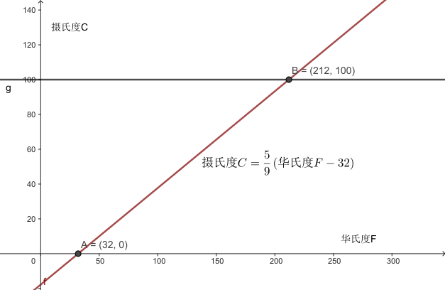

= 原子, 热
:sectnums:
:toclevels: 3
:toc: left
''''

== 热: 源自分子/原子的震动

搓你的手, 你的手感觉更暖和了, 你把动能（运动能量）转化成了热。事实上，*热就是动能，分子产生的动能。你的手之所以感觉更温暖，就是因为揉搓后分子来回振动的速度比之前更快了。这就是热的本质：原子和分子速度很快而幅度极小的振动。*

所有物质都是由原子组成的，而原子只有约92种 (元素周期表 Periodic table of elements 中所列). 到2007年为止，总共有118种元素被发现，其中94种是存在于地球上。

**为什么要说“约”？有一些已知元素具有放射性，会发生衰变，所以在自然界中非常稀有，甚至无法持续存在。**其中有两种是锝（原子序数43）和钚（原子序数94）。

**元素周期表中的每个原子都带有一个数字，叫作"原子序数"。该数字代表原子中的质子数，（通常来说）也是原子中的电子数。** 氢的原子序数是1，氦的原子序数是2，碳是6，氧是8，而铀是92。

**任何材料中的分子都在不停地振动。振动越剧烈，材料就越热。**当你把手放在一起揉搓时，你使手内部的分子振动得更快了。有多快？*这种振动的速度常常接近声速.* 但是这些粒子（至少在固体中）不会跑得很远。它们会撞上自己的邻居再弹回来。 所以虽然它们移动得的确很快，但是像环形跑道上的跑步者一样，总体来看它们的位置并没有改变。

==== 原子的直径

典型原子的直径约为 stem:[10^{-8}]厘米stem:[=10^{-4}]微米。

- 如果你沿着一根人类头发的切面直径（通常为25微米）从一头走到另一头，你将会遇到12.5万个原子。
- 一个红血球的直径（8微米）上, 可以并排放40000个原子。
- 有一些分子非常大（比如DNA），足以被显微镜观察到，但是这种分子中的单个原子，还是无法被人分辨出来。

==== 布朗运动 Brownian Motion, Brownian movement

虽然你看不到原子，但是你可以看到它们的振动, 对微小而可见的粒子造成的影响。在显微镜下，你可以看到小块浮尘（直径1微米）在自由移动。这种现象被称为布朗运动。 **会出现这种现象，是因为浮尘的分子被包围在其周围的空气分子撞击。**如果灰尘足够小的话，这种撞击最终不会达到平衡。

布朗运动, 是指悬浮在"液体"或"气体"中的微粒, 所做的永不停息的无规则运动。作布朗运动的微粒的直径, 一般为stem:[ 10^(-5)]~stem:[10^(-3)]厘米. 这些小的微粒处于液体或气体中时，由于液体分子的热运动，**微粒受到来自各个方向液体"分子"的碰撞，**因此微粒的运动不断地改变方向, 而使微粒出现不规则的运动。

*布朗运动的剧烈程度, 随着流体的温度升高而增加。*

==== 热使电子持续运动

收音机在换台时经常会发出滋滋声。老式电视机屏幕上会显示雪花的跳动白点。雪花和嘶嘶声都是同一种东西造成的：在你的电子设备里上窜下跳的电子。**热使得这些电子持续运动，**当没有其他信号时，你就能看到（或听到）它们移动了。虽然它们不是分子，但是也有振动的能量。

降低温度可以减少这样的噪声，而高灵敏电子设备需要经过冷却, 才能降低嘶嘶声和雪花。但是冷却过度会让设备停止工作. 因为晶体管工作时, 需要借助电子在室温下拥有的动能. 没有这种动能，电子就被困住了，而电流就无法流动。

现在，我们已经把热描述成了分子（有时也是电子）的动能.

== 声速

*分子的速度和声速极其相近*，这是巧合吗？不是—— *声音在空气中的传播, 就是通过分子彼此之间的撞击完成的。所以声速是由分子运动的速度决定的。声音在气体中的传播速度不会比气体分子更快。就好比接力棒赛跑的最终速度, 不会比单人跑到终点更快!*

在固体中，声音行进的速度比在空气中快，因为固体分子之间的接触相对更紧密。它们不必移动, 就能把力传给下一个分子。

**组成本书的大部分分子的速度, 都是声速，但是这些分子的移动方向却是随机的。**假设我让所有分子都朝一个方向移动。那么本书就会以声速（760英里/时）移动，但是能量总和不会变化。

我们没什么好办法能改变振动的方向，让所有分子一起移动。

== 光速

普通计算机, 只需要约十亿分之一秒（1纳秒或1ns）的时间就能完成一次计算。在这十亿分之一秒的时间里，光只能传播约1英尺（30厘米）.

== 熵 entropy

当动能转变成热时，我们可以将这个过程, 视为"连贯而规律的运动"转变成"随机运动"。分子能量从最开始的“整齐有序”（所有分子沿着相同方向移动）变为“无序”。无序的程度可以被量化，而这个值被命名为熵（entropy）。当一个物体受热时，它的熵（分子运动的随机性）就增加了。

== 温度

*温度, 就是对隐藏的分子动能的度量。 “隐藏的分子动能”，指通常无法观察到的快速（声速）而微观（就移动距离而言）的振动所承载的能量.*

*当分子的平均振动能量增大时，温度就升高了.* 我们之所以要说平均，是因为在任何时刻，某些分子都可能会比其他分子运动得更快，而有一些则会偏慢. *如果两个物体的温度相同，它们分子的振动动能就是相同的.*

*假设有两个棒状物体，一个由铁制成，一个由铜制成，它们的"温度"相同。那么，总体来看，它们的分子"动能"肯定是相同的。那铁分子和铜分子的平均速度是相同的吗？答案是不，铁分子更轻，平均来说振动得更快。*

原因是: 根据动能公式: stem:[ E=1/2 mv^2]。铜和铁的分子质量m不同。所以要想"动能E"相同，(质量m大的)较重的铜分子的"速度v"必然要更小.

*所以记住：温度相同时，较轻的分子, 比较重的分子移动得更快（平均而言）.*

==== 热力学第零定律 : 彼此接触的两个物体, 趋向于达到相同温度.

**把热的铁质物体, 放到冷的铜质物体上。由于互相接触，铁中的快分子现在撞上了铜中的慢分子。铁分子失去了能量，而铜分子获得了能量。铁的温度下降了，铜的温度则上升了。只有当温度相同时，能量的传递才会停止。热的“流动”其实是在分享动能。**温度较高的材料将热（动能）传给温度较低的材料。*这种流动只有在两种材料温度相同时才会停止。*

这就意味着如果你把一堆东西放进同一个房间，然后等待，最终所有东西都会达到相同温度。

一个房间里的所有物品都应该达到相同的温度。但是如果你拿起一个玻璃杯，它给人的感觉比塑料杯要更冷。

.标题
====
氢是宇宙中最充足的元素。组成太阳的原子中90%都是氢原子，对大体积行星如木星和土星来说也是如此。但是在地球的大气中，氢气几乎是完全不存在的。为什么？我们的氢哪儿去了？

答案就藏在"热力学第零定律"中。地球曾经有很多氢，但是散失到太空中去了。**地球大气中的氢气, 会达到与氮气和氧气相同的温度，所以氢分子平均拥有与这些气体相同的"动能"。但是根据动能公式, 因为氢是最轻的元素（它的原子质量是氧的1/16），所以氢分子的速度必然更快。** "动能E"相同的情况下, "质量m"和"速度v"的平方成反比。氢气质量小, 所以速度大，氢分子的速度肯定是氧分子的4倍。这么高的平均速度足以使氢气像火箭一样逃离地球！

氢分子的平均速度不足以使它们逃离，但是某些氢分子的速度远高于平均值，而我们丢失的就是这些氢分子。我们也因为同样的原因丢失了一些氮分子和氧分子。但是因为它们的平均速度比氢分子慢得多，所以它们的流失量可以忽略不计。

而太阳和木星的引力比地球大得多，所以它们留住了氢。地球之所以丢失了氢气是因为我们的引力太弱了。
====

.标题
====
恒星很热，而太空中的分子很冷。根据"热力学第零定律", 最后宇宙中的一切最终会达到相同温度。通过跟踪记录所有
物体的温度，我们可以计算出最终的温度是多少。如果忽略宇宙的膨胀，那么宇宙的平均温度将会达到–270℃。因为宇宙正在膨胀，所以最终温度可能会更低。
====

==== 温标

人们之所以能制作出示数统一的温度计，或多或少是因为（正如"第零定律"所说的）无论温度计的材料是什么都没关系。

有两种常用的温标： 华氏温标, 和百分温标。

[options="autowidth"]
|===
|Header 1 |Header 2

|华氏温标 Fahrenheit : ℉
|其发明者德国人华伦海特 Gabriel Daniel Fahrenheit 发现液体金属水银, 比酒精更适宜制造温度计. 所以他以水银为测温介质，发明了玻璃水银温度计.

选取氯化铵和冰水的混合物的冰点温度, 为温度计的零度，人体温度为温度计的100度(超过100度就是发烧了)。在标准大气压下，冰的熔点为32℉，水的沸点为212℉. 中间有180等分，每等分为华氏1度，记作“1℉”。

|百分温标 Centigrade,  +
即 摄氏度 Celsius : ℃
|
|===

==== 绝对零度

如果分子真的停下来，**"动能"为零时**会怎样？如果分子的一切运动都停止，**我们就说材料温度处于“绝对零度”。**此时温度为 –273℃= –459℉。

借由这个事实，我们可以定义一种新的温标，即"绝对温标"或"开尔文温标".

开尔文温标非常好用，因为它能简化公式。比如，*如果我们使用开尔文温标，那么每个分子的"平均动能E", 就可以用一个非常简单的公式来表示：*
\begin{align}
E = 2 \cdot 10^{-23} \cdot T_k
\end{align}

91
