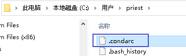
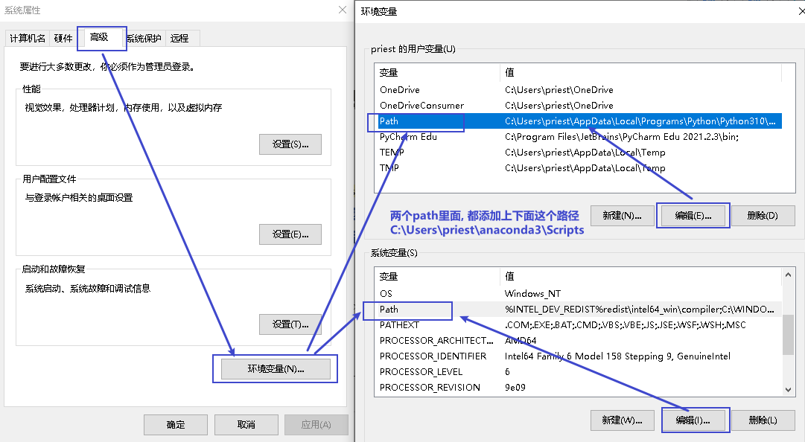
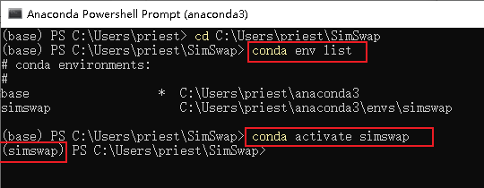

title:: main_Anaconda

- Anaconda 官网安装地址
  collapsed:: true
	- https://www.anaconda.com/products/individual
	- > ▶ anaconda  水蚺（南美洲蟒蛇）
	-
- 安装完后, 验证是否成功 -> ==conda list==
  collapsed:: true
	- 打开 anaconda powershell prompt, 输入命令 ==conda list==, 看是否有内容输出. 输出的内容, 就是anaconda 帮你已经集成的库, 比如 pandas库
	- > ▶ prompt  /prɑːmpt/（给演员的）提词，提示 /提示符
- 在 anaconda的命令行窗口中, 安装新的库 -> ==conda install 库名==
  background-color:: #264c9b
- 在 anaconda的命令行窗口中, 更新已存在库的版本 -> ==conda update 库名==
  background-color:: #264c9b
- anaconda 添加 清华镜像源
  background-color:: #787f97
  collapsed:: true
	- 在你的 C:\Users\priest 目录下, 新建一个文件, 取名 "==.condarc==".
	  Windows 用户无法直接创建名为 .condarc 的文件，可先执行命令: conda config --set show_channel_urls yes , 生成该文件之后再修改。
		- 
	- 然后, 给它输入以下内容:
	- #+BEGIN_QUOTE
	  channels:
	    - defaults
	  show_channel_urls: true
	  default_channels:
	    - https://mirrors.tuna.tsinghua.edu.cn/anaconda/pkgs/main
	    - https://mirrors.tuna.tsinghua.edu.cn/anaconda/pkgs/r
	    - https://mirrors.tuna.tsinghua.edu.cn/anaconda/pkgs/msys2
	  custom_channels:
	    conda-forge: https://mirrors.tuna.tsinghua.edu.cn/anaconda/cloud
	    msys2: https://mirrors.tuna.tsinghua.edu.cn/anaconda/cloud
	    bioconda: https://mirrors.tuna.tsinghua.edu.cn/anaconda/cloud
	    menpo: https://mirrors.tuna.tsinghua.edu.cn/anaconda/cloud
	    pytorch: https://mirrors.tuna.tsinghua.edu.cn/anaconda/cloud
	    pytorch-lts: https://mirrors.tuna.tsinghua.edu.cn/anaconda/cloud
	    simpleitk: https://mirrors.tuna.tsinghua.edu.cn/anaconda/cloud
	  #+END_QUOTE
	- 该内容在清华镜像的官网上也有: https://mirror.tuna.tsinghua.edu.cn/help/anaconda/
	- 运行 ==conda clean -i== 清除索引缓存，保证用的是镜像站提供的索引。
	-
	-
- 将 conda 命令, 添加到 cmd中
  collapsed:: true
	- 将 C:\Users\priest\anaconda3\Scripts 这个路径, 添加到 "高级系统设置"的"环境变量"中.
	- 
	-
	-
- pip 命令 下载 加速 -> 在正常的 pip命令后, 加上 ==-i https://pypi.tuna.tsinghua.edu.cn/simple==, 即通过-i参数指定镜像地址（这里用清华镜像的）。(亲测可行)
  background-color:: #264c9b
	- pip install 模块名 -i https://pypi.tuna.tsinghua.edu.cn/simple
	- > 如: pip install insightface==0.2.1 onnxruntime moviepy -i https://pypi.tuna.tsinghua.edu.cn/simple
- 将conda 创建的虚拟环境, 复制到另一台电脑 (未验证)
  collapsed:: true
	- 打开你 conda的安装目录, 即C:\\Users\\priest\\anaconda3, 里面有两个文件夹: envs和pkgs, 我们所有的conda环境和conda install 和 pip install 安装的包, 都在里面. 只要把anaconda3 的整个目录拷贝到另一台电脑即可.
	-
- ---
- simswap 网上说明
	- https://www.jianshu.com/p/158481c483f4
	- https://blog.csdn.net/ddrfan/article/details/119144500
	-
- simswap 安装
	- 在 conda 命令行中, 输入命令: git clone https://github.com/neuralchen/SimSwap.git
	- 然后在 conda 命令行中, 输入:  ==conda create -n simswap python=3.6==
	  意思是 创建一个conda虚拟环境, 名叫 simswap, python为3.6的版本
	- 再进入 你下载下来的 simswap 项目目录中, 命令是 ==cd C:\Users\priest\SimSwap==
	- 输入命令: ==conda env list== , 来查看当前处于哪个conda虚拟环境中? 发现默认是处在base环境中, 我们要把它改成进入 之前新建的 simswap虚拟环境中. 输入命令: ==conda activate simswap==
		- 
		-
	- > 以此输入以下命令:
	  conda create -n simswap python=3.6
	  conda activate simswap
	  conda install pytorch==1.8.0 torchvision==0.9.0 torchaudio==0.8.0 cudatoolkit=10.2 -c pytorch
	  (option): pip install --ignore-installed imageio
	  pip install insightface==0.2.1 onnxruntime moviepy
	  (option): pip install onnxruntime-gpu  (If you want to reduce the inference time)(It will be diffcult to install onnxruntime-gpu , the specify version of onnxruntime-gpu may depends on your machine and cuda version.)
	- 这些命令, 在simswap 的github 官网上有 https://github.com/neuralchen/SimSwap/blob/main/docs/guidance/preparation.md
	-
	-
-
-