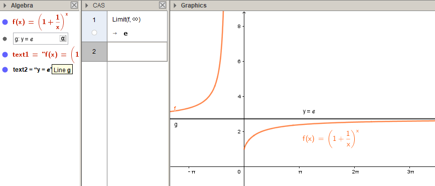
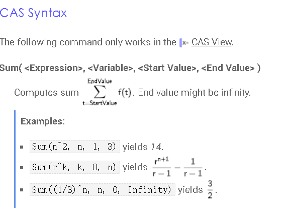

:toc:
:toclevels: 3
:sectnums:

---

== 分段函数

用 "if(区间段1, 函数体2, 区间段2, 函数体2)" 语句来输入分段函数.

....
f(x) = If(-π < x < 0, 1 / (1 + cos(x)), x ≥ 0, x ℯ^(-x²))
....

---

== 求极限

要在CAS Calculator 中 输入： Limit(函数, x趋向的值)

---

== 求导数 -> 直接输入 : 函数名' 即可

比如你的函数名叫 f = ..., 则:

- 1次导, 就输入  f'
- 2次导, 就输入  f''
- 3次导, 就输入  f'''

---

== 用Σ累加

官网文档 +
https://wiki.geogebra.org/en/Sum_Command

---
